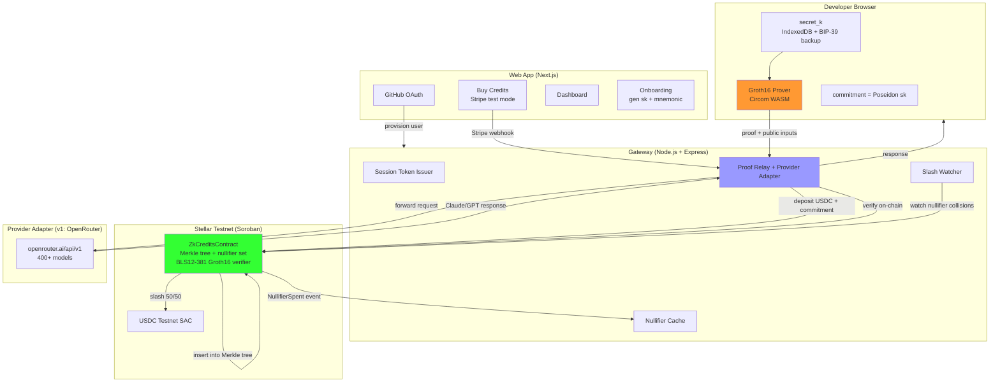

# System Design & Architecture

## Architecture Overview
**What is the high-level system structure?**



**Key components and responsibilities:**
- **Browser (developer side):** holds `secret_k` in IndexedDB (WebCrypto non-extractable), generates Groth16 proofs via Circom WASM, derives commitment, backs up via BIP-39 mnemonic. Gateway never sees `secret_k`.
- **Web App (Next.js):** GitHub OAuth sign-in, Stripe test-mode credit purchase, dashboard (balance/usage/nullifier history read from contract), onboarding (generates `secret_k`, shows mnemonic).
- **Gateway (Node.js + Express):** OpenAI-compatible `/v1/chat/completions` endpoint, session token issuance, proof relay to Soroban contract, provider adapter (OpenRouter in v1), in-memory nullifier cache (fast reject), slash watcher (submits slash proofs on nullifier collisions).
- **Provider Adapter (pluggable upstream layer):** v1 ships one adapter — OpenRouter (400+ models, OpenAI-compatible). The adapter interface is intentionally generic (`forwardRequest(auth, payload) → response`) so v2+ can add direct integrations (Polygon.io, Nansen, Glassnode, etc.) without changing the proof/contract layer. See `docs/roadmap.md` for the expansion path.
- **Stellar Testnet (Soroban):** `ZkCreditsContract` holds Merkle tree of commitments, nullifier set, deposit registry, and a BLS12-381 Groth16 verifier (CAP-0059). Slash is permissionless.
- **Upstream provider (v1: OpenRouter):** the gateway holds one provider API key; the provider sees the gateway's wallet, never the developer's. For non-LLM APIs in v2+, the same property holds — the provider sees the gateway, not the end user.

**Technology stack rationale:**
| Choice | Why |
|---|---|
| Stellar testnet | Native BLS12-381 Groth16 verification live today (CAP-0059, Protocol 22+). Canton lacks on-chain ZK. Base/Ethereum BN254 is gated on CAP-0074-equivalent work. |
| Circom + snarkjs `-p bls12381` | Only toolchain that produces on-chain-verifiable proofs on Stellar today. |
| Rust + soroban-sdk | Canonical Stellar contract language. |
| OpenRouter | One integration, 400+ models, 70+ providers. Avoids per-provider admin work. |
| Next.js + next-auth | Developer-audience auth (GitHub OAuth), standard React stack. |
| Stripe test mode | Web2 card UX without real money. |
| Node.js + Express | OpenRouter SDK + fetch proxy, TypeScript end-to-end. |

**Flows:**

**Path 1 — Onboarding + deposit:**
1. Developer signs in with GitHub (web app)
2. Browser generates 32-byte `secret_k` via `crypto.getRandomValues`, derives `commitment = Poseidon(secret_k)`, stores `secret_k` in IndexedDB (WebCrypto non-extractable), shows 12-word BIP-39 mnemonic backup
3. Developer buys $5 credits via Stripe test mode
4. Stripe webhook → gateway mints on-chain deposit: transfers USDC to `ZkCreditsContract.deposit(developer_address, commitment, amount)`
5. Contract inserts commitment into Merkle tree, emits `Deposited` event
6. Gateway issues `sk-zk-...` API key + base URL to developer

**Path 2 — Per-call (cached proof, common case):**
1. Developer sets `OPENAI_BASE_URL=https://gateway.zk-credits.xyz/v1` and `OPENAI_API_KEY=sk-zk-...`
2. Runs `claude "write a haiku"` — agent sends OpenAI-format request to gateway
3. Browser generates Groth16 proof once per session (private: `secret_k`, merkle path; public: `root`, `nullifier`, `signal`, `epoch`), caches it
4. Gateway receives request + proof, checks nullifier cache (fast reject if seen), relays proof to `ZkCreditsContract.spend()`
5. Contract verifies proof on-chain (BLS12-381 pairing check), checks nullifier fresh, inserts nullifier, emits `NullifierSpent`
6. Gateway forwards request to OpenRouter → Claude responds → gateway returns response to agent

**Path 3 — First-call (browser proving, ~2-5s):**
1. Same as Path 2 but proof generation happens inline
2. Browser loads Circom WASM prover, generates witness + proof (~2-5s for RLN-sized circuit)
3. Proof cached for rest of session (nullifier bound to `epoch` + `ticketIndex`)
4. Subsequent calls reuse cached proof if `ticketIndex` hasn't advanced past quota

**Path 4 — Slash (nullifier collision → secret reveal):**
1. Developer's 101st call attempts to reuse a nullifier (over-quota)
2. Two nullifier shares with same `epoch` → RLN math extracts `secret_k`
3. Anyone (gateway slash watcher, or a permissionless third party) submits slash proof to `ZkCreditsContract.slash()`
4. Contract verifies slash proof, looks up deposit by `commitment(extracted_secret_k)`, marks slashed, transfers 50% USDC to treasury + 50% to submitter
5. Emits `Slashed` event with `extracted_secret_k` (secret burned publicly)

**Path 5 — Withdrawal:**
1. Developer requests withdrawal from dashboard
2. Browser generates proof of commitment membership + ownership of `secret_k`
3. Gateway relays to `ZkCreditsContract.withdraw(commitment, recipient)`
4. Contract verifies proof, checks not slashed, transfers remaining USDC to recipient
5. Emits `Withdrawn` event

## Data Models
**What data do we need to manage?**

### Onchain: ZkCreditsContract (Soroban, Rust)

```rust
#[contracttype]
pub struct Deposit {
    pub amount: i128,        // USDC base units (7 decimals)
    pub depositor: Address,  // developer's Stellar account (gateway-provisioned)
    pub commitment: Fr,      // Poseidon(secret_k), public
    pub slashed: bool,
    pub withdrawn: bool,
}

#[contracttype]
pub struct NullifierRecord {
    pub epoch: u64,
    pub spent_at_ledger: u32,
}

// Contract state
pub struct ZkCreditsContract {
    current_root: Fr,                      // current Merkle tree root
    leaf_count: u32,                       // number of deposits
    deposits: Map<Fr, Deposit>,            // commitment -> Deposit
    nullifiers: Map<Fr, NullifierRecord>,  // nullifier -> record
    roots: Map<u32, Fr>,                   // historical roots (TTL-bumped)
    treasury: Address,                     // receives 50% of slash
    // Verifier key fixed at deploy time (constructor)
}
```

### Offchain: Session Token (browser → gateway)

```typescript
interface SessionToken {
  commitment: string;     // Poseidon(secret_k), public
  epoch: bigint;          // current epoch (UTC day number)
  ticketIndex: bigint;    // strictly increasing per session
  validUntil: bigint;     // ledger number, 0 = no expiry
  signature: string;      // signed with secret_k (WebCrypto Ed25519)
}
// Stored in browser IndexedDB, sent as Authorization: Bearer header
```

### Offchain: Browser secret_k + commitment

```typescript
// Generated once during onboarding, stored in IndexedDB (WebCrypto non-extractable)
interface BrowserKeyMaterial {
  secretK: Uint8Array;        // 32 bytes, never leaves browser
  commitment: string;         // Poseidon(secretK), hex
  mnemonic: string[];         // 12-word BIP-39 backup (shown once, user writes down)
  merklePath: bigint[];       // cached after first deposit, updated on tree changes
}
```

### Circom circuits (3, all compiled with `-p bls12381`)

**1. `deposit_membership.circom`** (~20k constraints)
- Private: `secret_k`, `path_elements[]`, `path_indices[]`
- Public: `root`, `commitment`
- Constraints: `Poseidon(secret_k) == commitment` AND Merkle path verifies to `root`

**2. `rln_nullifier.circom`** (~25k constraints) — the RLN core
- Private: `secret_k`, `merkle_path`
- Public: `root`, `epoch`, `nullifier`, `signal` (signal = hash of request)
- Constraints:
  - `commitment = Poseidon(secret_k)` and Merkle membership
  - `nullifier = Poseidon(secret_k, epoch)` — same nullifier across calls in same epoch = double-spend detected
  - `share = a * x + b` where `a = secret_k`, `b = Poseidon(secret_k, epoch)`, `x = hash(signal)` — RLN polynomial share
- **Slash math:** two shares with same `b` (same epoch) → solve linear system → recover `a = secret_k`

**3. `slash.circom`** (~30k constraints)
- Public inputs: `share1.x, share1.y, share2.x, share2.y, epoch`
- Public output: `extracted_secret_k`
- Constraints: verify both shares have same `b = Poseidon(secret_k, epoch)`, solve for `a`
- If `extracted_secret_k` hashes to a deposit's commitment, slash fires

**Circuit sizes (rough):** deposit_membership ~20k constraints, rln_nullifier ~25k, slash ~30k. Browser proving ~2-5s each (WASM). Cache proofs per session to amortize.

## API Design
**How do components communicate?**

### Gateway: `POST /v1/chat/completions` (OpenAI-compatible)

```
POST /v1/chat/completions
Authorization: Bearer sk-zk-...
X-ZK-Proof: <base64 groth16 proof>
X-ZK-Public-Inputs: <root, nullifier, signal, epoch>
Content-Type: application/json

{
  "model": "anthropic/claude-opus-4.8",
  "messages": [{"role": "user", "content": "write a haiku about ZK"}]
}

Response 200: (standard OpenAI chat completion response)
Response 402: { "error": "insufficient_credits" }
Response 403: { "error": "invalid_proof" | "nullifier_spent" | "over_quota" }
```

**Pipeline:**
1. Verify session token signature (off-chain, <10ms)
2. Check nullifier cache (reject if seen, <1ms)
3. Submit proof to Soroban contract (on-chain verify, async after off-chain fast-path)
4. Forward request to OpenRouter
5. Return OpenRouter response to agent

### Gateway: `POST /v1/slash` (permissionless slash submission)

```
POST /v1/slash
Content-Type: application/json

{
  "slashProof": "...",
  "publicInputs": { "share1": {...}, "share2": {...}, "epoch": 1234 }
}

Response 200: { "slashed": true, "txHash": "..." }
Response 400: { "error": "invalid_proof" | "already_slashed" }
```

### Provider Adapter interface (pluggable upstream)

The upstream layer is abstracted behind a `ProviderAdapter` interface so v2+ integrations (financial/data APIs) slot in without touching the proof or contract layer. v1 ships one adapter: OpenRouter.

```typescript
interface ProviderAdapter {
  // Unique adapter identifier (e.g. "openrouter", "polygon", "nansen")
  id: string;

  // Forward a verified request to the upstream provider.
  // `userPayload` is the raw request body the agent sent (OpenAI-format for v1).
  // `providerAuth` is the gateway's own API key for this provider.
  // Returns the upstream response to relay back to the agent.
  forwardRequest(
    userPayload: unknown,
    providerAuth: string,
  ): Promise<Response>;

  // Optional: per-provider pricing hook (v1 uses flat $0.001/call;
  // v2 adapters for paid data APIs may have per-call or per-tier pricing).
  computeCost?(userPayload: unknown): bigint;
}
```

**v1 implementation:** `OpenRouterAdapter` implements `ProviderAdapter` by proxying to `openrouter.ai/api/v1` with the OpenAI Chat Completions format. `computeCost` returns flat 1000 USDC base units ($0.001) for v1.

**v2+ adapters (per roadmap):** `PolygonAdapter` (market data), `NansenAdapter` (on-chain analytics), `GlassnodeAdapter`, etc. Each implements the same interface. The proof/contract/slash layer is unchanged — the gateway just routes to a different adapter based on the request path or model string.

**Admin-curated provider addition (v2):** users request new providers via the dashboard; admin evaluates demand + ToS + pricing; admin implements a new `ProviderAdapter` and deploys. Each integration is 1–5 days of work but is a defensible moat — you're the only anonymous path to that API.

**Self-serve provider onboarding (v3):** providers integrate themselves to reach anonymous buyers. You become the distribution channel, not the beggar. This is when the protocol becomes a platform. See `docs/roadmap.md`.

### Web App routes

- `GET /` — landing page
- `GET /sign-in` — GitHub OAuth (next-auth)
- `GET /dashboard` — balance, calls today, nullifier history (read from contract), slash status
- `POST /dashboard/buy` — Stripe Checkout session ($5 / $20 / $50 test-mode presets)
- `GET /dashboard/keys` — generate/view `sk-zk-...` API key + base URL
- `GET /dashboard/setup` — shell snippet to paste
- `GET /onboarding` — first-run: generate `secret_k`, show mnemonic, confirm backup

### Soroban contract interface

```rust
fn deposit(env, depositor, commitment, amount) -> ()
fn spend(env, proof, pub_signals: {root, nullifier, signal, epoch}) -> ()
fn slash(env, slash_proof, pub_signals: {share1, share2, epoch, extracted_secret_k}) -> ()
fn withdraw(env, commitment, recipient) -> ()
fn get_deposit_status(commitment) -> Deposit
fn get_nullifier_status(nullifier) -> bool
```

## Component Breakdown
**What are the major building blocks?**

### 1. ZkCreditsContract (Soroban, Rust)
- Merkle tree of commitments (Poseidon, arity-2, in-circuit hashing only)
- Nullifier set (public, on-chain)
- Deposit registry (commitment → Deposit)
- BLS12-381 Groth16 verifier (CAP-0059 host functions)
- Slash logic (50% treasury, 50% submitter)
- Withdrawal (requires proof of commitment ownership)

### 2. Circom circuits + trusted setup (BLS12-381)
- `deposit_membership.circom`, `rln_nullifier.circom`, `slash.circom`
- Powers-of-tau + phase-2 setup (single-contributor, documented as dev-only for MVP)
- Outputs: `.wasm`, `.zkey`, `verification_key.json`

### 3. On-chain Groth16 verifier (CAP-0059)
- BLS12-381 pairing check via `env.crypto().bls12_381()`
- Verifying key fixed at contract deploy time (constructor)
- Public inputs bound to context (root, epoch, nullifier, signal) to prevent replay

### 4. Gateway (Node.js + Express + TypeScript)
- `auth/` — GitHub OAuth, session cookies
- `stripe/` — Stripe webhook → mint deposit on Stellar
- `stellar/` — Soroban RPC client, deposit/spend/slash/withdraw submission
- `openrouter/` — v1 provider adapter: proxy to `openrouter.ai/api/v1`, OpenAI-compatible. Implements the generic `ProviderAdapter` interface (`forwardRequest(auth, payload) → response`) so v2+ adapters (financial/data APIs) slot in without touching the proof/contract layer.
- `session/` — session token issuance, ticket index tracking
- `proof-relay/` — receive browser proof → submit to contract → forward to provider adapter
- `nullifier-cache/` — in-memory nullifier set (fast reject before on-chain check), TTL + event subscription for invalidation
- `slash/` — slash watcher (monitors for nullifier collisions, submits slash proofs)

### 5. Browser crypto (WebCrypto + Circom WASM)
- `secret_k` generation (32 bytes, `crypto.getRandomValues`)
- Poseidon hash (`@noble/hashes`)
- Groth16 prover (Circom WASM via `ffjavascript`)
- IndexedDB storage (WebCrypto non-extractable key)
- BIP-39 mnemonic backup (12 words from `secret_k`)

### 6. Web App (Next.js 14, App Router)
- `app/(auth)/sign-in/` — GitHub OAuth
- `app/dashboard/` — balance, usage, nullifier history, slash status
- `app/onboarding/` — `secret_k` generation, mnemonic backup, deposit
- `lib/crypto/` — browser Poseidon, Groth16 prover
- `lib/stellar/` — Soroban client (browser-side, reads contract events)

## Design Decisions
**Why did we choose this approach?**

| Decision | Choice | Rationale | Alternatives considered |
|---|---|---|---|
| Chain | Stellar testnet | Native BLS12-381 Groth16 verification live today (CAP-0059) | Canton (no on-chain ZK), Base (BN254 gated on CAP-0074-equivalent) |
| ZK curve | BLS12-381 | Only curve with on-chain host functions on Stellar today | BN254 (Circom default, gated on CAP-0074) |
| ZK toolchain | Circom + snarkjs `-p bls12381` | Only toolchain that verifies on-chain today | Noir/Barretenberg (BN254, not yet), Risc0 (BN254 wrap, not yet) |
| Hash function | Poseidon (in-circuit only) | ZK-friendly; CAP-0075 not live so hash off-chain-only, on-chain stores roots | Pedersen (older), SHA256 (not ZK-friendly) |
| Upstream LLM | OpenRouter (v1 provider adapter) | One integration, 400+ models, 70+ providers; adapter interface stays generic for v2+ non-LLM APIs (financial/data) | Direct Anthropic/OpenAI (more admin), user-supplied keys (breaks anonymity) |
| Auth | GitHub OAuth (next-auth) | Developer audience, lowest friction | Email/passkey (broader, more work), wallet-based (not web2-friendly) |
| Payments (onramp) | Stripe test mode | Web2 card UX without real money | Real USDC on-ramp (more work, more trust), crypto-only (not web2) |
| Payments (on-chain) | USDC testnet (Circle faucet) | Real stablecoin, credible demo | Synthetic test token (less credible), real mainnet USDC (out of v1 scope) |
| Rate limit scope | Per-epoch (UTC midnight reset) | Simple circuit, familiar mental model | Per-session (more granular, more complex) |
| Rate limit default | 100 calls/day (demo) | Easier to trigger slash live during demo | 1000 (too high for demo), 10 (too restrictive for real use) |
| Slash economics | 50% treasury + 50% reporter | Incentivizes permissionless slash monitoring, matches RLN design intent | 100% treasury (no watchtower incentive), 100% reporter (griefing risk), burn (no incentive) |
| Pricing | Flat $0.001/call (demo) | Simple metering; demo doesn't need accurate per-model pricing | Pass-through OpenRouter pricing (accurate but complex metering), tiered (middle ground, deferred) |
| Verification path | Off-chain fast-path + async on-chain | 5s ledger close is brutal for interactive agents; off-chain verify gives instant response, on-chain submit gives slash protection | On-chain only (5s latency per call, demo-killer), off-chain only (no slash protection, ZK is theater) |
| Custody | Custodial v1 (gateway holds USDC, user holds secret_k) | Web2 onboarding forces this; gateway cannot spend without user's proof (contract enforces) | Self-custody (not web2-friendly, v2) |
| Browser crypto storage | WebCrypto non-extractable + BIP-39 mnemonic | `secret_k` never leaves browser; mnemonic enables recovery | Session-derived encryption (weaker), plain IndexedDB (XSS risk) |
| Session token format | Custom signed JWT (secret_k-derived) | Simple, browser-native, no wallet dependency | EIP-191 (Ethereum-specific, wrong chain), Stellar auth entries (heavier) |
| Withdrawal | Allowed, requires secret_k proof | Users should reclaim unused credits; honest custodial model | Session-deplete only (traps funds, bad UX) |

## Non-Functional Requirements
**How should the system perform?**

**Performance:**
- Onboarding (sign-in → first Claude response): < 90 seconds (excluding card entry)
- Cached call latency: < 500ms gateway overhead on top of OpenRouter's response time
- First-call latency (with browser proving): < 6 seconds including proof generation
- Slash fires within 1 ledger of nullifier collision detection (~5s on Stellar)
- Browser Groth16 proving: ~2-5s first call per session, cached after
- Off-chain proof verification (gateway fast-path): < 100ms
- On-chain proof verification (Soroban): ~300k gas, ~$0.00009 on testnet, 5s ledger close

**Privacy:**
- Gateway sees proofs + nullifiers but cannot link a call to a deposit (ZK enforced; contract is the verifier, not the gateway)
- Nullifier set is public on-chain; anyone can audit spend history
- `secret_k` never leaves the browser (WebCrypto non-extractable)
- OpenRouter sees gateway's wallet + IP, not developer's — payment-layer privacy, not network-layer
- **Honest caveat:** network identity (IP) is NOT hidden in v1. A determined adversary correlating timing + IP could link. Full network privacy (Tor/client-side relay) is v2.

**Security:**
- Double-spend: mathematically impossible without revealing `secret_k` (RLN)
- Slash: permissionless, anyone can submit; 50% reporter incentive drives watchtower monitoring
- `secret_k` storage: WebCrypto non-extractable, BIP-39 mnemonic backup
- Contract: Checks-Effects-Interactions, auth on deposit/withdraw, replay protection via epoch + nullifier binding
- Trusted setup: single-contributor dev setup for MVP; documented as dev-only (production needs real MPC ceremony)
- Front-running slash: public nullifier set means anyone can front-run the slash submission; 50% reporter incentive makes this a feature, not a bug

**Cost (testnet, $0 real money):**
- Deposit: ~150k gas (~$0.0003 equivalent)
- Spend: ~300k gas (~$0.00009 per call)
- Slash: ~300k gas (~$0.00009)
- Withdraw: ~150k gas (~$0.0003)
- For 1000 calls/day: ~$0.09/day gas — fine for testnet; production needs nullifier batching or off-chain caching

**Scalability:**
- On-chain: O(log n) Merkle proof verification per call
- Off-chain: O(1) nullifier lookup (in-memory cache + on-chain hash map)
- Browser proving: parallelizable across agents (v2 multi-agent); v1 is single-user single-browser
- Gateway: stateless proof relay, horizontally scalable

**Reliability:**
- Off-chain verify + async on-chain submit means the gateway can return a response even if the ledger close is slow
- If on-chain submit fails (ledger race), gateway retries; nullifier cache is invalidated on contract event
- OpenRouter fallback: if one model is down, gateway can fall back to another (v2; v1 just errors)
- Browser IndexedDB loss: mnemonic recovery path; without mnemonic, funds unrecoverable (documented honestly)

## Honest Caveats (to be documented in README)

1. **Custodial v1:** Gateway holds USDC; user holds `secret_k`. Gateway cannot spend without user's proof (contract enforces), but if the gateway disappears, user needs an independent withdrawal path (v2: self-custody).
2. **Eventual slash protection:** Off-chain verify + async on-chain submit means there's a ~5s window where a determined attacker could double-spend before the nullifier lands on-chain. The slash still fires, but the timing isn't instant.
3. **Single-gateway:** Cross-gateway unlinkability (the real multi-agent privacy story) is v2. v1 has one gateway, so the gateway itself is a trust hub for linking — though it cannot link cryptographically, it could log patterns.
4. **Testnet only:** Real USDC mainnet is a separate security/ops lift. Trusted setup is dev-only.
5. **Browser proving latency:** ~2-5s first call per session. Acceptable for demo, may need optimization (cached proofs, smaller circuits) for production.
6. **Network identity not hidden:** v1 hides payment identity, not IP. OpenRouter sees the gateway's IP. A determined adversary correlating timing + IP across sessions could link. Full network privacy (Tor/client-side relay) is v2.
