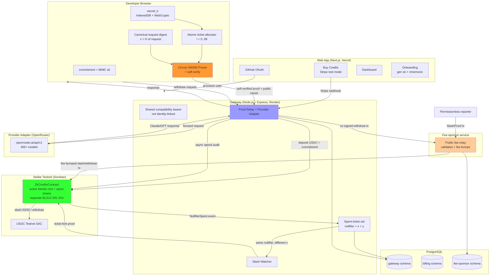

# System Design & Architecture

## Architecture Overview
**What is the high-level system structure?**



**Key components and responsibilities:**
- **Browser (developer side):** holds `secret_k` and atomic ticket reservations in IndexedDB, derives `x` from the canonical API request, generates one indexed-ticket Groth16 proof per call, **verifies it locally before submit**, and backs up the identity via a 24-word BIP-39 mnemonic. Gateway never sees `secret_k` or private ticket index `i`.
- **Web App (Next.js, Vercel):** GitHub OAuth, Stripe test-mode credit purchase, dashboard, onboarding. Public URL.
- **Gateway (Node.js + Express, Render):** OpenAI-compatible `/v1/chat/completions`, shared non-user-specific transport credential, canonical-request verification, OpenRouter adapter, **PostgreSQL-backed** spent-ticket set + idempotent response records + settlement queue, and ticket-fork watcher. Public URL.
- **Fee-sponsor service:** public fee-relay endpoint; validates submitted transactions call a valid contract method (slash/withdraw only) and wraps them in Stellar fee bump transactions signed by the sponsor's XLM account. Fee-only authority.
- **Stellar Testnet:** `ZkCreditsContract` - active membership root, spent-ticket set, deposit registry, and separate immutable BLS12-381 Groth16 verification keys for spend, slash/removal, and membership transitions (CAP-0059). Slash is permissionless; withdrawal remains gateway-mediated for testnet.
- **PostgreSQL:** isolated schemas (gateway, billing, fee-sponsor) for all durable state.

**Technology stack rationale:**

| Choice | Why |
|---|---|
| Stellar testnet + Soroban | Existing v1 codebase; native BLS12-381 Groth16 verification (CAP-0059). |
| Render (gateway) + Vercel (web) | Current public deployment; managed HTTPS and environment configuration. |
| PostgreSQL | Durable storage replacing in-memory state; isolated schemas per service; same engine as the Mina track for shared operational knowledge. |
| Stellar fee bump (SEP-0041-style) | Native fee sponsorship without controlling transaction effects; gasless UX for permissionless slash/withdraw. |
| Circom + snarkjs `-p bls12381` | Existing circuits; only toolchain that verifies on Stellar today. |

## Data Models
**What data do we need to manage?**

### Private local identity and ticket allocator
```ts
type LocalIdentity = {
  mnemonic: string;              // 24-word BIP-39, local only
  secret: bigint;                // 32-byte, derived locally
  commitment: bigint;            // MiMCSponge(secret)
  nextTicketIndex: number;       // monotonic local allocator, 0..99
  reservedTicketIndices: number[]; // crash-safe reservations; never reused
  consumedTicketIndices: number[]; // accepted/idempotently confirmed tickets
  skippedTicketIndices: number[];  // ambiguous/crashed reservations, never reused
};
```

### Gateway durable state (PostgreSQL `gateway` schema)
```ts
type AcceptedCall = {
  proofHash: string;       // diagnostic/audit only; proof bytes are randomized
  nullifier: string;       // H(H(secret_k, private ticket index))
  signalX: string;         // H(canonical request)
  signalY: string;         // secret_k + H(secret_k, i) * signalX
  requestDigest: string;   // server-recomputed canonical request digest
  canonicalizationVersion: 1;
  acceptedAt: Date;
  encryptedResponse: string | null; // short-TTL exact-retry cache; no prompt stored
  providerGenerationId: string | null;
  providerReceipt: ProviderReceipt | null; // redacted OpenRouter metadata, no prompt/completion
  onChainSpendTxHash: string | null;  // per-call async on-chain spend tx (Stellar v1 does per-call spend, not batch settlement)
};

type ProviderReceipt = {
  generationId: string;
  model: string;
  provider: string;
  promptTokens: number;
  completionTokens: number;
  totalCost: number;
  latencyMs: number;
  fetchedAt: Date;
};

type SpentTicketRecord = {
  nullifier: string;       // primary key
  signalX: string;
  signalY: string;
  requestDigest: string;
  firstProofHash: string;  // diagnostics only; never used to classify retry vs fork
  state: 'accepted' | 'spent_on_chain' | 'fork_detected';
  spentAt: Date | null;
};

type CompatibilityCredential = {
  keyHash: string;         // shared transport credential, not authorization
  scope: 'public-demo';
  commitment: never;       // structurally impossible to link to a deposit
};
```

The durable call and spent-ticket tables MUST NOT contain a deposit commitment, checkout identity, private ticket index, or per-user bearer. Billing may know the checkout commitment, but the anonymous relay path has no credential or database join that maps a call to it.

The idempotency identity is the deterministic `(nullifier, signalX, signalY, requestDigest)` tuple, not `proofHash`: Groth16 proof randomness can produce different proof bytes for the same witness. Provider receipts are fetched by the gateway with its OpenRouter credential and omit prompt/completion content. They are useful for operator reconciliation but are not signed or publicly independently verifiable.

## Paper-Aligned Fixed-Cost Ticket Statement
**How is the paper specialized without changing its privacy or double-spend construction?**

The launch implements the fixed-cost special case of *ZK API Usage Credits: LLMs and Beyond*. There are no refunds in the launch proof (`R = 0`). The only offered plan has a fixed deposit denomination `D = 100 * C_demo`; successful registration in the membership tree therefore proves ownership of 100 fixed-cost tickets.

| Paper primitive | Launch specialization | Compatibility |
|---|---|---|
| User secret `k` and commitment `H(k)` | Browser-held `secret_k` and Merkle membership commitment | Unchanged |
| Deposit `D` and maximum call cost `C_max` | One fixed denomination with `D = 100 * C_demo` | Fixed-cost special case |
| Strictly increasing private ticket index `i` | Atomic browser allocator with `i in [0,99]` | Unchanged |
| Refund total `R` | `R = 0` | Refund branch explicitly deferred |
| `a = H(k,i)`, `Nullifier = H(a)` | BLS12-381-field MiMCSponge implementation | Unchanged statement |
| `x = H(M)`, `y = k + a*x` | Canonical OpenAI request digest constrained into `x` | Unchanged statement, explicit request binding |
| ZK proof of membership and solvency | Groth16/BLS12-381 proof of membership and `(i+1)*C_demo <= D` via `i < 100` | Proof-system adaptation for Stellar CAP-0059 |

The proof-system change from the proposal's generic ZK-STARK description to Groth16/BLS12-381 does not change the ticket, solvency, unlinkability, or fork-slashing statement; it is the Stellar-compatible realization of that statement.

For private ticket index `i`, where the circuit enforces `0 <= i < 100`:

```text
a          = MiMCSponge(secret_k, i)
nullifier  = MiMCSponge(a)
x          = MiMCSponge(field(SHA-256(canonical_request)))
y          = secret_k + a * x
```

The RLN proof's public signals are `[root, nullifier, x, y]`; `secret_k`, commitment, and `i` remain private. The gateway independently canonicalizes the OpenAI-shaped request and recomputes `x` before accepting the proof. The contract fixes the Starter deposit denomination and indexed-ticket verification key, validates the root, and stores each accepted ticket nullifier once. Slash/removal and membership-update proofs are verified with their own keys and exact public-signal layouts; no key is reused across statements.

Ticket handling is deliberately asymmetric:

- unseen nullifier: durably accept, then forward to OpenRouter;
- same nullifier + same `x` + same `y`/request digest: idempotent retry, return the stored result/status even if proof bytes differ, never slash;
- same nullifier + different `x`: reject before OpenRouter, retain both shares, recover/verify `secret_k` through the slash circuit, and enqueue permissionless slash evidence.
- same nullifier + same `x` + different `y`: reject before OpenRouter and record an integrity/hash-collision alert; it is not an exact retry and does not provide the two distinct points required for secret recovery.

This is the paper's ticket-fork construction. The removed epoch behavior (`H(secret_k, epoch)`) was a one-signal RLN variant and is not the launch protocol.

For a fork with common nullifier and distinct points `(x1,y1)` and `(x2,y2)`, the slash statement reconstructs:

```text
a = (y1 - y2) / (x1 - x2)
k = y1 - a * x1
```

The slash circuit requires `x1 != x2`, proves both shares use the recovered `a`, proves `nullifier = H(a)`, proves `commitment = H(k)`, and proves/removes that commitment from the active root. The contract then looks up the fixed-denomination deposit, marks it slashed, updates the root, and distributes the 50/50 split.

## Active Membership and Root Lifecycle
**How does the anonymous call path prove that its deposit is still funded?**

The call path cannot look up a commitment through an API key without defeating payment unlinkability. Instead, membership in the current active root is the funding authorization:

1. `deposit` accepts only the fixed Starter denomination and inserts the commitment into the active membership tree.
2. The browser proves membership against the current root. The gateway and contract reject arbitrary roots.
3. A short bounded root-grace window may cover proofs generated immediately before an additive deposit update, but grace roots are tagged by generation and expiry.
4. `slash` proves the forked secret/commitment and a valid tree removal transition; `withdraw` likewise removes the commitment. Both revoke every grace root that still contains the removed member.
5. A slashed or withdrawn identity therefore cannot keep spending against historical membership.

For the testnet implementation, the gateway remains the tree operator and publishes the transition inputs, but the contract validates the proof and root transition before changing the active root. Trustless multi-operator tree maintenance remains outside launch scope.

### Fee-sponsor durable state (PostgreSQL `fee-sponsor` schema)
```ts
type FeeRelayRequest = {
  txHash: string;          // inner transaction hash (idempotency key)
  method: 'slash' | 'withdraw';
  submittedAt: Date;
  feeBumpedTx: string;     // the wrapped fee bump transaction
  status: 'signed' | 'broadcast' | 'confirmed' | 'rejected';
};
```

### Billing durable state (PostgreSQL `billing` schema)
```ts
type StripeEvent = {
  eventId: string;         // Stripe event ID (idempotency key)
  commitment: string;
  amount: number;
  processedAt: Date;
  depositTxHash: string | null;
};
```

## API Design
**How do components communicate?**

### Gateway (public)

| Endpoint | Method | Auth | Description |
|---|---|---|---|
| `/health` | GET | None | Health check |
| `/v1/chat/completions` | POST | Shared compatibility bearer + `X-ZK-Proof` | OpenAI-compatible chat; indexed-ticket proof required; gateway re-verifies and checks `x` against the canonical body |
| `/v1/api-keys` | POST | Web session | Return/provision the shared demo compatibility credential; MUST NOT accept or persist a commitment |
| `/v1/spent-tickets` | GET | None | Paginated/global snapshot of accepted-pending and on-chain ticket nullifiers for local recovery; accepts no candidate nullifier or commitment query |
| `/v1/status/:commitment` | GET | None | Funding/deposit status only; MUST NOT derive calls or remaining tickets by joining anonymous calls to this commitment |
| `/v1/provider-receipt/:generationId` | GET | None | Return cached/redacted OpenRouter generation metadata for a generation produced by this gateway; no prompt/completion content and no upstream credential exposure |
| `/v1/contract-status` | GET | None | On-chain contract state |
| `/v1/slash` | POST | None | Submit slash proof (legacy stub; prefer on-chain via fee-relay) |
| `/v1/withdraw` | POST | Web session + withdrawal proof | Gateway validates, builds + co-signs the withdraw contract call as the on-chain depositor, forwards to the fee-relay for fee-bumping, and returns the broadcast result. This identity-bearing route is separate from anonymous LLM calls. |

### Fee-sponsor (public)

| Endpoint | Method | Description |
|---|---|---|
| `POST /v1/fee-relay` | POST | Accepts a serialized Stellar transaction (slash or withdraw) with a proof; validates it calls a valid contract method on the configured contract; wraps in a fee bump signed by the sponsor and returns the fee-bumped transaction for the caller to broadcast. Idempotent on inner tx hash. Slash: submitted by the reporter directly (permissionless). Withdraw: submitted by the gateway after depositor co-signing (gateway-mediated). Errors: `400` malformed/non-contract-method tx, `403` method not slash/withdraw, `503` fee-sponsor unavailable. |

### Web App (public)

| Route | Description |
|---|---|
| `/` | Landing page |
| `/sign-in` | GitHub OAuth |
| `/dashboard` | Dashboard (funding status, browser-local used/reserved/remaining tickets, buy credits, LLM playground) |
| `/onboarding` | Generate secret_k + mnemonic backup |
| `/api/checkout` | Stripe Checkout session |
| `/api/webhooks/stripe` | Stripe webhook (durable) |
| `/api/keys` | Return/provision the shared demo compatibility credential; never accepts a commitment |
| `/api/dashboard/status` | Dashboard status (proxies to gateway) |

## Component Breakdown
**What are the major building blocks?**

- **`ts/` (gateway):** Node.js + Express + TypeScript; OpenAI-compatible endpoint, canonical request verifier, OpenRouter adapter, PostgreSQL-backed spent-ticket/idempotency records + per-call async on-chain audit queue, fork watcher, and **withdrawal co-signer**. Deployed to Render.
- **`services/fee-sponsor` (new):** public fee-relay endpoint; validates Stellar transactions target valid contract methods (slash/withdraw); wraps in fee bumps; holds the sponsor XLM key (environment-separated). PostgreSQL `fee-sponsor` schema for idempotency. Slash: the reporter submits the proof tx directly (permissionless). Withdraw: the gateway submits the depositor-co-signed tx (gateway-mediated); the fee-sponsor only fee-bumps.
- **`web/` (Next.js):** GitHub OAuth, Stripe test checkout, dashboard, onboarding. Deployed to Vercel.
- **`zk-credits-contract/` (Stellar smart contract):** upgraded `ZkCreditsContract` (Rust + `soroban-sdk`); fixed-denomination deposit, indexed-ticket spend, fork slash/removal, withdraw/removal, active-root lifecycle, and separate BLS12-381 Groth16 VKs per statement.
- **`circuits/` (Circom):** paper-aligned indexed-ticket membership/RLN/slash circuits; compiled `-p bls12381`; single-contributor trusted setup (dev-only). The legacy epoch circuit is replaced and all artifacts/VKs are regenerated together.
- **`packages/zk-credits-shared` (new, optional):** isomorphic browser+Node canonical request hashing, BLS12-381-field MiMCSponge witness calculation, Circom WASM proving, and self-verification shared by `web/` and `ts/`.
- **PostgreSQL:** isolated schemas (gateway, billing, fee-sponsor).

## Design Decisions
**Why did we choose this approach?**

| Decision | Chosen approach | Alternatives rejected |
|---|---|---|
| Launch scope | Public testnet launch (Render + Vercel + Stellar testnet), Stripe test mode, no real money. | Mainnet launch (real USDC, MPC, audit - next phase); testnet-only localhost (not a launch). |
| Parallelism | Separate `feature-stellar-launch` branch/worktree; no shared runtime with Mina. | Dual-chain shared core (conflicts with Mina migration's non-goal); shared runtime. |
| Fee sponsorship | Stellar fee bump via dedicated fee-sponsor service + public fee-relay; fee-only authority. | Gateway pays all (re-introduces trusted intermediary for permissionless slash); caller-pays (breaks gasless UX). |
| Durable storage | PostgreSQL with isolated schemas (gateway, billing, fee-sponsor); spent-ticket records reconciled with on-chain events. | Redis + Postgres (two engines); in-memory + WAL (PRXVT anti-pattern). |
| Credit accounting | Paper-aligned fixed-cost indexed tickets: `R = 0`, `D = 100*C_demo`, private `i in [0,99]`. | Full variable-cost refund/HE state (too large for launch); epoch nullifier (only one safe call per epoch). |
| Request binding | Canonical OpenAI request digest is constrained into `x = H(M)` and independently recomputed by the gateway. | Random signal value (not bound to what OpenRouter executes). |
| Anonymous call credential | Shared compatibility bearer plus per-call ZK authorization; no bearer-to-commitment mapping. | Stable per-user API key mapped to commitment (links calls and deposit). |
| Retry/fork semantics | Same nullifier, `x`, `y`, and request digest is idempotent; same nullifier and different `x` is slashable. | Reject every repeated nullifier as `nullifier_spent` (cannot distinguish retry from abuse). |
| Funding authorization | Membership in the current active fixed-denomination root; slash/withdraw remove membership and revoke unsafe grace roots. | API-key-to-commitment lookup (links payment identity to calls); unbounded historical roots (removed users can keep spending). |
| Usage display | Browser-local ticket allocator reconciled with public spent events. | Gateway call count by commitment (re-links anonymous calls). |
| Provider evidence | Display the upstream generation ID and gateway-fetched redacted OpenRouter metadata; link to OpenRouter Logs for operator reconciliation and label the authenticated trust boundary. | Claiming the account-only OpenRouter logs are a public cryptographic receipt. |
| Client self-verification | Browser verifies each Groth16 proof locally before submit; gateway re-verifies. | Gateway-only verification (PRXVT anti-pattern). |
| Code isomorphism | Isomorphic browser+Node via dependency injection / environment detection; shared `packages/zk-credits-shared`. | `globalThis.window` hack (PRXVT anti-pattern); duplicated divergent code paths. |
| Type safety | Full TypeScript strict mode; no `@ts-nocheck` / `any` across gateway, web, fee-sponsor. | `@ts-nocheck` (PRXVT anti-pattern). |
| Trusted setup | Single-contributor, dev-only, honestly labeled. | Minimal MPC (weeks for testnet faucet funds); dummy setup (undermines credibility). |
| Withdrawal auth | Gateway-mediated: browser provides a self-verified membership-removal proof, gateway co-signs as depositor, fee-sponsor fee-bumps. Honest caveat: gateway disappearance blocks withdrawal. | Fully permissionless submission (future UX upgrade); caller-pays (breaks gasless UX). |

## Non-Functional Requirements
**How should the system perform?**

### Security and privacy
- The browser verifies each Groth16 proof locally before submitting it to the gateway; the gateway re-verifies as defense in depth and never trusts client verification alone. (Prevents the PRXVT/sdk anti-pattern of no client-side self-verification.)
- All packages compile under TypeScript strict mode with no `// @ts-nocheck` or `any`-escape hatches. (Prevents the PRXVT/sdk anti-pattern of `@ts-nocheck` across core modules.)
- Browser and Node.js code paths are isomorphic via dependency injection or environment detection; no `globalThis`/`window` pollution. (Prevents the PRXVT/sdk anti-pattern of global hacks.)
- The fee-sponsor service validates that every submitted transaction calls a valid contract method (slash or withdraw) on the configured contract before signing the fee bump; it rejects arbitrary transfers. The fee bump does not alter the inner transaction's effects; contract auth gates all state changes. The fee-payer key is environment-separated.
- The gateway schema must not contain checkout customer IDs, commitments linked to calls, or local bearer mappings (privacy boundary preserved from v1).
- `secret_k` never leaves the browser (WebCrypto non-extractable); the gateway sees proofs + nullifiers but cannot link a call to a deposit (ZK enforced by on-chain verifier).
- The call path never uses a stable user-specific API key. A shared compatibility bearer is transport metadata only; possession does not authorize a call without a valid unspent ticket proof.
- The gateway MUST recompute `x` from the exact canonical request it forwards. A proof with an `x` that does not match the request is rejected before persistence or OpenRouter forwarding.
- Only current or explicitly valid short-grace membership roots are accepted. Slash/withdraw revocation invalidates every root that still authorizes the removed commitment.
- The browser calls the gateway directly without forwarding GitHub/Stripe session cookies. Billing and dashboard routes remain identity-bearing and separate from the anonymous relay route.
- The gateway captures OpenRouter's generation ID, fetches redacted generation metadata with the operator credential, and never exposes that credential or stored prompt/completion content. The UI explicitly labels this as provider-reported operational evidence, not a signed/public receipt.
- Honest caveat: network identity (IP) is NOT hidden; a single gateway could log timing patterns. Cryptographic unlinkability is guaranteed; heuristic pattern-linking is out of scope (same as v1 + Mina track).

### Reliability and performance
- An accepted request is recorded durably (PostgreSQL) before forwarding upstream; the gateway reconstructs spent-ticket state + accepted-call records + spend-submission queue from durable rows on restart. (The "settlement queue" is the queue of accepted calls pending per-call async on-chain `spend()` submission — Stellar v1 does per-call on-chain spend, not batch settlement.)
- The browser reserves ticket indices atomically before proving. Reserved indices are never automatically reused after a crash or ambiguous response; recovery computes the spent status of all 100 candidate nullifiers locally from public events.
- Exact proof retries are idempotent and return the previously stored response/status, so a lost HTTP response does not consume another ticket.
- The exact-retry response cache is encrypted at rest, stores no prompt body, and expires after a short operational window (target 15 minutes); only digest/provider ID/settlement metadata remains afterward.
- Spent-ticket acceptance is transactionally serialized by nullifier. Concurrent first-use/fork requests cannot both forward upstream; the winning first share is preserved and the losing different-`x` share becomes slash evidence.
- Dashboard usage is local-first: consumed + reserved + skipped ticket state comes from IndexedDB and public nullifier events. The gateway never returns a per-commitment call count.
- The spent-ticket set is reconciled by subscribing to on-chain `NullifierSpent` events; a local miss falls back to an on-chain read without treating a mere seen-nullifier result as sufficient fork evidence.
- Browser Groth16 proving: circuit artifacts are cached after first load, but every request generates and self-verifies a fresh proof; target warm proof time is <=5s on a supported desktop browser.
- Off-chain proof verification (gateway fast-path): < 100ms.
- On-chain proof verification (Soroban): ~300k gas, 5s ledger close.
- Fee-relay idempotency on inner transaction hash; retries do not double-sponsor.

### Cost (testnet, $0 real money)
- Deploy contract: ~200k gas; deposit ~150k; spend ~300k; slash ~300k; withdraw ~150k. All testnet (no real cost).

### Honest caveats (documented in README + landing page)
1. Custodial testnet: gateway holds USDC; user holds `secret_k`. Withdrawal is gateway-mediated (the contract requires the depositor's signature = the gateway); if the gateway disappears, the user cannot withdraw unused test credits (testnet only, no real value at risk).
2. Testnet only: no real money; USDC is testnet faucet.
3. Single-contributor trusted setup: dev-only, honestly labeled; not production-grade ZK.
4. Single gateway: cross-gateway unlinkability is future; one gateway could log timing patterns.
5. Browser proving latency: ~2-5s first call.
6. Network identity not hidden: v1 hides payment identity, not IP.
7. Fixed-cost paper specialization: one Starter denomination and 100 tickets; variable-cost refund accounting is deferred.
8. Testnet settlement deviation: the gateway asynchronously submits each accepted ticket on-chain for public audit. This does not block the LLM response, but it is less scalable than the paper's off-chain spent-ticket database/batched settlement direction and must be revisited before mainnet.
9. Provider receipt boundary: OpenRouter generation metadata and Logs are bearer-authenticated operator records, not public cryptographic attestations. The demo exposes the generation ID and redacted metadata but does not claim independent provider verification.

## Research Basis and Conformance Boundary

- [ZK API Usage Credits: LLMs and Beyond](https://ethresear.ch/t/zk-api-usage-credits-llms-and-beyond/24104) is normative for the indexed-ticket, solvency, request-share, nullifier, and fork-recovery construction.
- [Proposal v2](https://hackmd.io/3da7PaYmTqmNTTwqxVidRg) and the [RLN protocol documentation](https://rate-limiting-nullifier.github.io/rln-docs/rln.html) support the same two-share recovery model.
- [Stellar CAP-0059](https://github.com/stellar/stellar-protocol/blob/master/core/cap-0059.md) supplies BLS12-381 host operations. Groth16/BLS12-381 changes the proof-system realization, not the paper's ticket/nullifier statement.
- [OpenRouter's generation endpoint](https://openrouter.ai/docs/api/api-reference/generations/get-request-&-usage-metadata-for-a-generation) requires bearer authentication and returns generation/provider/usage metadata. [OpenRouter Logs](https://openrouter.ai/docs/guides/overview/report-feedback) can reconcile a generation ID within the operator account; neither is treated as a signed public receipt.
