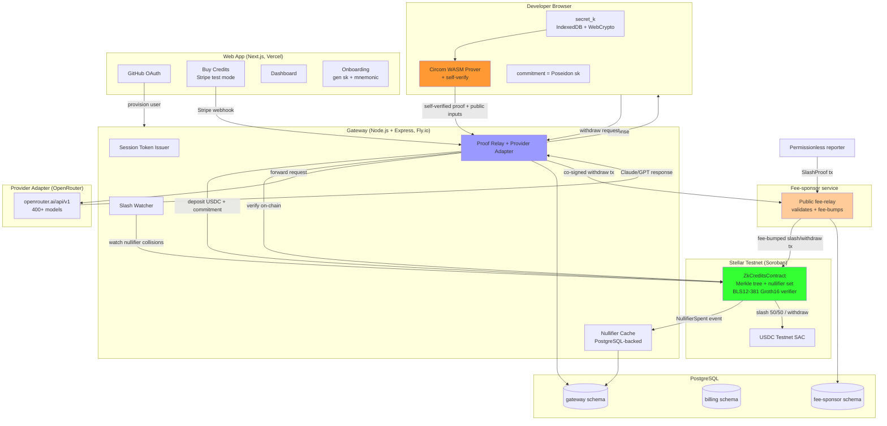

# System Design & Architecture

## Architecture Overview
**What is the high-level system structure?**



**Key components and responsibilities:**
- **Browser (developer side):** holds `secret_k` in IndexedDB (WebCrypto non-extractable), generates Groth16 proofs via Circom WASM, **verifies each proof locally before submit**, derives commitment, backs up via 12-word BIP-39 mnemonic. Gateway never sees `secret_k`.
- **Web App (Next.js, Vercel):** GitHub OAuth, Stripe test-mode credit purchase, dashboard, onboarding. Public URL.
- **Gateway (Node.js + Express, Fly.io):** OpenAI-compatible `/v1/chat/completions`, session token issuance, proof relay to Soroban, OpenRouter adapter, **PostgreSQL-backed** nullifier cache + call counts + settlement queue, slash watcher. Public URL.
- **Fee-sponsor service:** public fee-relay endpoint; validates submitted transactions call a valid contract method (slash/withdraw only) and wraps them in Stellar fee bump transactions signed by the sponsor's XLM account. Fee-only authority.
- **Stellar Testnet (Soroban):** `ZkCreditsContract` - Merkle tree of commitments, nullifier set, deposit registry, BLS12-381 Groth16 verifier (CAP-0059). Slash and withdraw are permissionless.
- **PostgreSQL:** isolated schemas (gateway, billing, fee-sponsor) for all durable state.

**Technology stack rationale:**

| Choice | Why |
|---|---|
| Stellar testnet + Soroban | Existing v1 codebase; native BLS12-381 Groth16 verification (CAP-0059). |
| Fly.io (gateway) + Vercel (web) | Existing v1 deployment plan; public hosting with minimal ops. |
| PostgreSQL | Durable storage replacing in-memory state; isolated schemas per service; same engine as the Mina track for shared operational knowledge. |
| Stellar fee bump (SEP-0041-style) | Native fee sponsorship without controlling transaction effects; gasless UX for permissionless slash/withdraw. |
| Circom + snarkjs `-p bls12381` | Existing circuits; only toolchain that verifies on Stellar today. |

## Data Models
**What data do we need to manage?**

### Private local identity (unchanged from v1)
```ts
type LocalIdentity = {
  mnemonic: string;      // 12-word BIP-39, local only
  secret: bigint;        // 32-byte, derived locally
  commitment: bigint;    // Poseidon(secret)
  localBearer: string;   // sk-zk-... API key, local compatibility metadata
};
```

### Gateway durable state (PostgreSQL `gateway` schema)
```ts
type AcceptedCall = {
  proofHash: string;       // SHA-256 of proof + public inputs (replay key)
  nullifier: string;       // H(secret_k, epoch)
  epoch: number;           // UTC day
  slot: number;            // 0..99
  nonceHash: string;       // request nonce hash
  acceptedAt: Date;
  onChainSpendTxHash: string | null;  // per-call async on-chain spend tx (Stellar v1 does per-call spend, not batch settlement)
};

type NullifierRecord = {
  nullifier: string;       // primary key
  epoch: number;
  slot: number;
  spentAt: Date;           // from on-chain NullifierSpent event
};

type ApiKeyRecord = {
  keyHash: string;         // SHA-256 of the sk-zk-... key
  commitment: string | null; // NOT stored linked to calls (privacy); issuance audit only
  issuedAt: Date;
  revokedAt: Date | null;
};
```

### Fee-sponsor durable state (PostgreSQL `fee-sponsor` schema)
```ts
type FeeRelayRequest = {
  txHash: string;          // inner transaction hash (idempotency key)
  method: 'slash' | 'withdraw';
  submittedAt: Date;
  feeBumpedTx: string;     // the wrapped fee bump transaction
  status: 'signed' | 'broadcast' | 'confirmed' | 'rejected';
};
```

### Billing durable state (PostgreSQL `billing` schema)
```ts
type StripeEvent = {
  eventId: string;         // Stripe event ID (idempotency key)
  commitment: string;
  amount: number;
  processedAt: Date;
  depositTxHash: string | null;
};
```

## API Design
**How do components communicate?**

### Gateway (public)

| Endpoint | Method | Auth | Description |
|---|---|---|---|
| `/health` | GET | None | Health check |
| `/v1/chat/completions` | POST | API key + `X-ZK-Proof` | OpenAI-compatible chat; ZK proof required + self-verified by client; gateway re-verifies |
| `/v1/api-keys` | POST | Gateway secret | Generate API key |
| `/v1/status/:commitment` | GET | None | User stats (calls, quota, keys) |
| `/v1/contract-status` | GET | None | On-chain contract state |
| `/v1/slash` | POST | None | Submit slash proof (legacy stub; prefer on-chain via fee-relay) |
| `/v1/withdraw` | POST | API key | Accepts a WithdrawalProof + recipient from the user; gateway validates, builds + co-signs the withdraw contract call as the on-chain depositor, forwards to the fee-relay for fee-bumping, and returns the broadcast result. Gateway-mediated (not permissionless). |

### Fee-sponsor (public)

| Endpoint | Method | Description |
|---|---|---|
| `POST /v1/fee-relay` | POST | Accepts a serialized Stellar transaction (slash or withdraw) with a proof; validates it calls a valid contract method on the configured contract; wraps in a fee bump signed by the sponsor and returns the fee-bumped transaction for the caller to broadcast. Idempotent on inner tx hash. Slash: submitted by the reporter directly (permissionless). Withdraw: submitted by the gateway after depositor co-signing (gateway-mediated). Errors: `400` malformed/non-contract-method tx, `403` method not slash/withdraw, `503` fee-sponsor unavailable. |

### Web App (public)

| Route | Description |
|---|---|
| `/` | Landing page |
| `/sign-in` | GitHub OAuth |
| `/dashboard` | Dashboard (status, keys, buy credits) |
| `/onboarding` | Generate secret_k + mnemonic backup |
| `/api/checkout` | Stripe Checkout session |
| `/api/webhooks/stripe` | Stripe webhook (durable) |
| `/api/keys` | API key generation (proxies to gateway) |
| `/api/dashboard/status` | Dashboard status (proxies to gateway) |

## Component Breakdown
**What are the major building blocks?**

- **`ts/` (gateway):** Node.js + Express + TypeScript; OpenAI-compatible endpoint, proof relay, OpenRouter adapter, PostgreSQL-backed nullifier cache + call counts + per-call async on-chain spend queue, slash watcher, and **withdrawal co-signer** (co-signs withdraw tx as the on-chain depositor in the custodial model). Deployed to Fly.io.
- **`services/fee-sponsor` (new):** public fee-relay endpoint; validates Stellar transactions target valid contract methods (slash/withdraw); wraps in fee bumps; holds the sponsor XLM key (environment-separated). PostgreSQL `fee-sponsor` schema for idempotency. Slash: the reporter submits the proof tx directly (permissionless). Withdraw: the gateway submits the depositor-co-signed tx (gateway-mediated); the fee-sponsor only fee-bumps.
- **`web/` (Next.js):** GitHub OAuth, Stripe test checkout, dashboard, onboarding. Deployed to Vercel.
- **`zk-credits-contract/` (Soroban):** existing `ZkCreditsContract` (Rust + soroban-sdk); deposit/spend/slash/withdraw; BLS12-381 Groth16 verifier.
- **`circuits/` (Circom):** existing deposit_membership, rln_nullifier, slash circuits; compiled `-p bls12381`; single-contributor trusted setup (dev-only).
- **`packages/zk-credits-shared` (new, optional):** isomorphic browser+Node crypto + proof code (Poseidon, witness calc, Circom WASM prover, self-verify) shared by `web/` and `ts/` to enforce isomorphism.
- **PostgreSQL:** isolated schemas (gateway, billing, fee-sponsor).

## Design Decisions
**Why did we choose this approach?**

| Decision | Chosen approach | Alternatives rejected |
|---|---|---|
| Launch scope | Public testnet launch (Fly.io + Vercel + Soroban testnet), Stripe test mode, no real money. | Mainnet launch (real USDC, MPC, audit - next phase); testnet-only localhost (not a launch). |
| Parallelism | Separate `feature-stellar-launch` branch/worktree; no shared runtime with Mina. | Dual-chain shared core (conflicts with Mina migration's non-goal); shared runtime. |
| Fee sponsorship | Stellar fee bump via dedicated fee-sponsor service + public fee-relay; fee-only authority. | Gateway pays all (re-introduces trusted intermediary for permissionless slash); caller-pays (breaks gasless UX). |
| Durable storage | PostgreSQL with isolated schemas (gateway, billing, fee-sponsor); nullifier cache invalidated by on-chain events. | Redis + Postgres (two engines); in-memory + WAL (PRXVT anti-pattern). |
| Client self-verification | Browser verifies each Groth16 proof locally before submit; gateway re-verifies. | Gateway-only verification (PRXVT anti-pattern). |
| Code isomorphism | Isomorphic browser+Node via dependency injection / environment detection; shared `packages/zk-credits-shared`. | `globalThis.window` hack (PRXVT anti-pattern); duplicated divergent code paths. |
| Type safety | Full TypeScript strict mode; no `@ts-nocheck` / `any` across gateway, web, fee-sponsor. | `@ts-nocheck` (PRXVT anti-pattern). |
| Trusted setup | Single-contributor, dev-only, honestly labeled. | Minimal MPC (weeks for testnet faucet funds); dummy setup (undermines credibility). |
| Withdrawal auth | Gateway-mediated: user requests via gateway endpoint, gateway co-signs as depositor, fee-sponsor fee-bumps. Honest caveat: gateway disappearance blocks withdrawal. | ZK-proof-authorized withdrawal (requires contract redeploy + circuit work; breaks "preserve core product unchanged"); caller-pays (breaks gasless UX). |

## Non-Functional Requirements
**How should the system perform?**

### Security and privacy
- The browser verifies each Groth16 proof locally before submitting it to the gateway; the gateway re-verifies as defense in depth and never trusts client verification alone. (Prevents the PRXVT/sdk anti-pattern of no client-side self-verification.)
- All packages compile under TypeScript strict mode with no `// @ts-nocheck` or `any`-escape hatches. (Prevents the PRXVT/sdk anti-pattern of `@ts-nocheck` across core modules.)
- Browser and Node.js code paths are isomorphic via dependency injection or environment detection; no `globalThis`/`window` pollution. (Prevents the PRXVT/sdk anti-pattern of global hacks.)
- The fee-sponsor service validates that every submitted transaction calls a valid contract method (slash or withdraw) on the configured contract before signing the fee bump; it rejects arbitrary transfers. The fee bump does not alter the inner transaction's effects; contract auth gates all state changes. The fee-payer key is environment-separated.
- The gateway schema must not contain checkout customer IDs, commitments linked to calls, or local bearer mappings (privacy boundary preserved from v1).
- `secret_k` never leaves the browser (WebCrypto non-extractable); the gateway sees proofs + nullifiers but cannot link a call to a deposit (ZK enforced by on-chain verifier).
- Honest caveat: network identity (IP) is NOT hidden; a single gateway could log timing patterns. Cryptographic unlinkability is guaranteed; heuristic pattern-linking is out of scope (same as v1 + Mina track).

### Reliability and performance
- An accepted request is recorded durably (PostgreSQL) before forwarding upstream; the gateway reconstructs nullifier cache + call counts + spend-submission queue from durable rows on restart. (The "settlement queue" is the queue of accepted calls pending per-call async on-chain `spend()` submission — Stellar v1 does per-call on-chain spend, not batch settlement.)
- The nullifier cache is invalidated by subscribing to on-chain `NullifierSpent` events; a stale cache falls back to an on-chain read.
- Browser Groth16 proving: ~2-5s first call per session, cached after.
- Off-chain proof verification (gateway fast-path): < 100ms.
- On-chain proof verification (Soroban): ~300k gas, 5s ledger close.
- Fee-relay idempotency on inner transaction hash; retries do not double-sponsor.

### Cost (testnet, $0 real money)
- Deploy contract: ~200k gas; deposit ~150k; spend ~300k; slash ~300k; withdraw ~150k. All testnet (no real cost).

### Honest caveats (documented in README + landing page)
1. Custodial testnet: gateway holds USDC; user holds `secret_k`. Withdrawal is gateway-mediated (the contract requires the depositor's signature = the gateway); if the gateway disappears, the user cannot withdraw unused test credits (testnet only, no real value at risk).
2. Testnet only: no real money; USDC is testnet faucet.
3. Single-contributor trusted setup: dev-only, honestly labeled; not production-grade ZK.
4. Single gateway: cross-gateway unlinkability is future; one gateway could log timing patterns.
5. Browser proving latency: ~2-5s first call.
6. Network identity not hidden: v1 hides payment identity, not IP.
