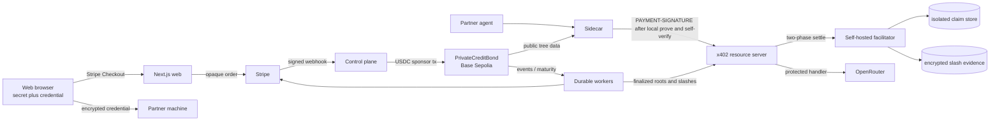
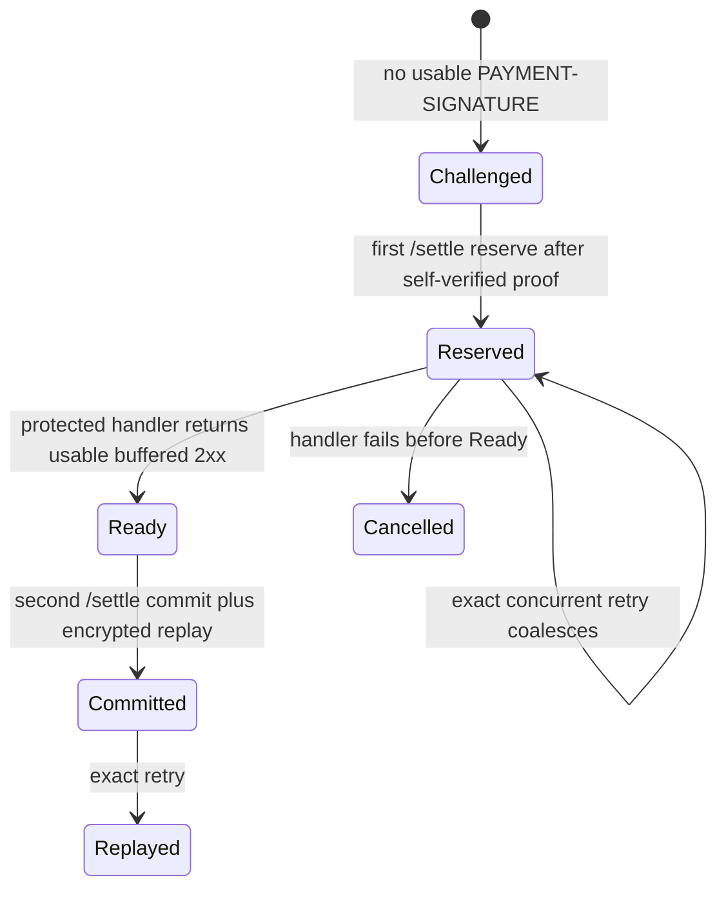

# Base private API credits design

Date: 2026-09-20  
Design review status: approved 2026-09-20 on
[Review the reconciled pilot design and implementation plan](../../wayfinder/base-zk-credits-pilot/tickets/05-reconcile-pilot-docs.md).

The custom x402 scheme uses the normative two-settlement `escrow` flow.
Per-call settlement remains off-chain. Base is used for bundle funding,
release, and slashing only. Current compiled circuits and the live contract
source still implement the rejected share equation; they are not the
approved construction.

## Architecture



The web and Stripe plane owns accounts, orders, and refunds. The spend plane
stores only nullifier, signal hash, claim state, reservation generation,
timing, and encrypted replay metadata. The gateway never joins a spend row
to account, purchase, wallet, or commitment data.

Spend proofs are generated only in the sidecar process on the operator
machine. There is no remote proving service, shared prover pool, browser
proving path, or same-host proving helper. The resource server and
facilitator verify and settle only. They never prove, never serve a Merkle
path for a named leaf or commitment, and never host WASM or proving keys at
runtime.

The facilitator is self-hosted because a public facilitator cannot interpret
or settle `zk-prepaid`. It may run in the gateway trust boundary, but its
mutating endpoints are private and authenticated; only `/supported` is safe
for public capability discovery.

## Credit unit and economic envelope

One credit is one successfully committed response from service class
`coding-deepseek-v4-flash-v1` (`deepseek/deepseek-v4-flash` via OpenRouter
Chat Completions). It is not an arbitrary API call.

Class boundary:

- Accept text messages, tool definitions, and tool calls, with one generated
  choice.
- Reject streaming, images, files, audio, web plugins, model fallback,
  client-selected routing, and unknown cost-affecting fields.
- Cap input at 16,000 UTF-8 bytes of text and tool payload, output at 4,000
  tokens, request body at 256 KiB, encrypted replay at 1 MiB, and upstream
  timeout at 120 seconds.
- Reject an input whose conservative byte unit count exceeds the class limit
  before reserve.
- Set OpenRouter `provider.max_price` to $0.90 / M input and $1.80 / M
  output, and an effective provider-cost ceiling of $0.025 per dispatch
  including the OpenRouter platform fee.
- If the model is unavailable or no eligible route fits the ceilings, fail
  closed and pause new checkout. A replacement is a new service-class
  version.

Charging: validate locally, reserve before dispatch, commit and consume one
credit only after a provider 2xx is structurally valid, within the replay
limit, fully buffered, encrypted, and durably committed. A valid provider
refusal in such a 2xx is chargeable. Local validation failures, non-2xx,
timeouts, malformed or oversized responses, and failures before commit
cancel the reservation and consume no credit. An exact retry of a committed
claim returns the encrypted replay. A client disconnect after commit still
consumes the credit. Ambiguous commit state remains fenced.

At most two upstream dispatches per nullifier. After two failed dispatches,
leave the claim cancelled until an operator confirms a provider incident and
explicitly resets it. Do not retry against a fallback model.

Pilot-wide provider spend is capped at $40 per UTC day and $200 per rolling
30 days. Hitting either cap cancels without consuming a credit, returns a
retryable service-unavailable response, pauses new checkout, and alerts.

Contribution at class ceilings (bond is not revenue):

| Item | Normal full bundle | Two-dispatch worst case |
| --- | ---: | ---: |
| Service-fee revenue | $20.00 | $20.00 |
| Stripe fee on $40 checkout | ($1.46) | ($1.46) |
| Provider usage including 5.5% OpenRouter fee | ($5.70) | ($11.39) |
| Support allowance | ($3.00) | ($3.00) |
| Gateway, proof verification, and RPC | ($0.50) | ($0.50) |
| Replay storage and egress | ($0.10) | ($0.10) |
| Fraud and operational-risk allowance | ($1.00) | ($1.00) |
| Remaining contribution | **$8.24 (41.2%)** | **$2.55 (12.7%)** |

## Contract

`PrivateCreditBond` is non-upgradeable. Constructor values for USDC,
sponsor, refund vault, treasury, verifier(s), deployment domain, and the
single funded tier are immutable. USDC uses six decimals and `SafeERC20`.

A depth-20 append-only Poseidon tree stores leaves
`Poseidon(commitment, tier_id, expiry)` with `commitment = Poseidon(secret)`.
Known historical roots remain usable for proof races.

The pilot compiles one funded tier whose in-circuit allowance is 250. The
5000 / 25000 / 75000 table is not compiled into the pilot circuit.
Additional SKUs require a new tier row and a new freeze.

`fundBundle` is sponsor-only. `slashBundle` verifies two Groth16 proofs,
requires the same nullifier and different signals, recovers slot blinding
then secret under the restored algebra, requires
`Poseidon(slotBlinding) == nullifier` and `Poseidon(secret) == commitment`,
marks the bundle terminal, and pays the reporter and treasury equally.
`releaseBond` is permissionless after expiry plus seven days and sends the
bond to the refund vault. Released and slashed are mutually exclusive.

On-chain slash checks: known root, matching deployment domain,
`timestamp <= block.timestamp`, `timestamp < expiry`, two valid proofs.
Slash does not require a live 402 or the 300-second spend window.

Historical roots are append-only, so a slash cannot remove the old leaf.
Every compatible gateway treats `BondSlashed` as a revocation event. The
event worker obtains the two public statements from the slash transaction,
derives the forfeited secret, computes remaining slot nullifiers for the
250-slot tier, and adds them to the rejection set before advancing the
finalized event cursor. Loss of anonymity after provable double spending is
an intentional protocol penalty.

The HTTP payload never carries a commitment or account identifier. The
slash reporter may name the recovered commitment on chain.

## Circuit and proof protocol

Circom 2, BN254 Groth16. Public ABI is exactly six outputs, in this order,
shared by circuit, TypeScript, gateway, verifier adapter, fixtures, and
manifest:

`[root, timestamp, domain, requestSignal, nullifier, share]`

Private witness: secret, slot blinding, slot, tier, expiry, Merkle path and
directions (48 private inputs). `main` must not also mark the challenge
values public. Verifiers use Groth16 `fullProve` `publicSignals` as-is.

Algebra:

- `slotBlinding = Poseidon(secret, slot, domain)` — private
- `nullifier = Poseidon(slotBlinding)` — public
- `requestSignal` — public; existing canonical hash-to-field
- `share = secret + slotBlinding * requestSignal` — public

The rejected equation `share = secret * requestSignal + nullifier` must not
ship. One transcript does not reveal secret or slot blinding. Two transcripts
with the same nullifier and different request signals recover
`slotBlinding = (share1 - share2) / (x1 - x2)`, then
`secret = share1 - slotBlinding * x1`.

The circuit proves membership in a known depth-20 root, `slot < 250` for
the funded tier, `timestamp < expiry`, matching deployment domain, and
rejects `secret == 0`, `slotBlinding == 0`, and `requestSignal == 0`. The
gateway also rejects a zero request signal.

Public `timestamp` is the gateway-issued `issuedAt`, not a client-chosen
value.

### Spend authorization versus slash evidence

Spend authorization is short-lived permission to reserve a claim. `402`
`extra.issuedAt` is unix seconds. Public timestamp must equal it.
`issuedAt` must lie in `[now - 300s, now + 5s]` (`maxTimeoutSeconds` 300).
The request signal must match this HTTP request. Same nullifier and signal
coalesces; a different signal is conflict evidence and fail-closed. Cached
402s die when `issuedAt` leaves the window.

Slash evidence does not require a live 402 or that window. Encrypted first
transcripts are retained until bundle expiry plus seven days, then deleted.
The 24-hour exact-retry replay ciphertext is not slash evidence. A reporter
may submit any two valid conflicting transcripts.

### Paid-traffic gate

Before onboarding paid partners or claiming unlinkability:

- written security statement and threat model reviewed by an independent
  cryptographer, covering this statement and the implemented artifacts;
- R1CS inspection of 6 public / 48 private;
- negative tests for witness disclosure, stale spend proofs, post-expiry
  spend, cross-domain replay, reordered public signals, malformed field
  encodings, historical roots, zero request signal, and zero slot blinding;
- an end-to-end generated proof verified by the real Solidity verifier and
  adapter on Base Sepolia;
- a two-transcript recovery test: one share is harmless; duplicate use with
  a different request signal recovers and slashes.

Development proving keys are allowed on Sepolia. No production ceremony in
this map.

## Prover topology and SLOs

Development WASM and zkey are installed out of band and hash-pinned in the
sidecar manifest. Hash mismatch is a proof failure; the sidecar refuses to
prove. The sidecar computes its own Merkle path from public tree data.

Local Groth16 self-verify is required before attaching `PAYMENT-SIGNATURE`.
Verify mismatch is a proof failure; the sidecar must not send.

A prove miss, 10s abort, or failed self-verify is a **proof failure**: not a
claim, not a cancellation, not slash evidence. The slot stays unused. It is
counted only in the sidecar proof-failure metric.

The sidecar retries proving on the same in-flight request (same slot, same
signal, same `issuedAt`) until success or the remaining spend window is
≤ 10s. Each miss is a proof failure. Upstream dispatch retries stay at most
two and start only after reserve.

Hot prove time is wall time from membership witness, request signal, and
`issuedAt` in hand through `fullProve` and local self-verify. Cold start,
402 fetch, Merkle sync, gateway HTTP, and provider time are excluded.

| Item | Rule |
| --- | --- |
| Published proving SLO | p50 ≤ 1.5s, p95 ≤ 3.0s hot prove time |
| Accepted proving latency | Partner-written p95 on their sidecar host, not looser than 3.0s, before first paid claim |
| Per-attempt abort | 10s; no new attempt unless remaining `issuedAt` window > 10s |
| Founder gate | Frozen development artifacts, normal laptop, p95 ≤ 2.0s before any partner dry-run |
| Dry-run | Local unpaid: discard one cold start, 20 hot prove+self-verify cycles on pinned artifacts against a fixture challenge, nothing submitted to the live gateway. Fail → not activated |
| Continuation | Soak p95 ≤ that partner's written number |
| Concurrency | One `fullProve` at a time per sidecar process; two-agent concurrency is two processes |
| Evidence vault | At most 250 first-transcripts per bundle through expiry plus seven days |

Hardware class is the partner's own sidecar host. No lab substitution,
remote prove, or loosened cap. Partner-facing contract is the published
proving SLO only. Gateway verify and reserve are internal budgets.

## x402 v2 custom scheme

The reusable `@zk-credits/x402-zk-prepaid` package supplies canonical
requirements, Base64 header codecs, request-signal binding, adapters, and
payload validation. Describe the product as a **custom x402 v2 scheme
requiring the project adapter**, never as broadly “x402 compatible.”

```json
{
  "x402Version": 2,
  "resource": {
    "url": "https://<gateway>/v1/chat/completions",
    "description": "One private prepaid API credit",
    "mimeType": "application/json"
  },
  "accepts": [{
    "scheme": "zk-prepaid",
    "network": "eip155:84532",
    "amount": "1",
    "asset": "coding-deepseek-v4-flash-v1",
    "payTo": "<treasury address>",
    "maxTimeoutSeconds": 300,
    "extra": {
      "assetTransferMethod": "prepaid-claim",
      "paymentFlow": "escrow",
      "requirementsVersion": "zk-prepaid-v1",
      "circuit": "<circuit id>",
      "verifyingKey": "<verifying-key id>",
      "deploymentDomain": "<field element>",
      "contract": "<PrivateCreditBond address>",
      "issuedAt": "<unix seconds>"
    }
  }]
}
```

`amount: "1"` is one credit of the named service class, not one unit of
USDC or of the bond. Bundle identity is proven, not named in the challenge.
The client selects the matching `zk-prepaid` acceptance by `scheme`, never
`accepts[0]`.

`PAYMENT-SIGNATURE` payload: exact accepted requirements, Groth16 proof,
six public signals in ABI order, random request nonce, and response-
encryption public key only. Reject unknown or identifying fields. `payer`
is omitted.

Successful `PAYMENT-RESPONSE`:

```json
{"success":true,"transaction":"","network":"eip155:84532"}
```

Missing authorization produces `402` plus Base64 `PAYMENT-REQUIRED`.
Malformed Base64/JSON or a structurally invalid envelope produces `400`.
An invalid, expired, or stale proof produces `402` with a fresh challenge.

Compatibility matrix: project sidecar required; custom agents possible but
not a launch requirement; generic wallets, public facilitator, hosted
Bazaar, MCP, `/v1/responses`, Anthropic translation, and a standard `exact`
rail are out of scope.

### Escrow settlement state machine



Proof generation happens before Challenged→Reserved. A proof failure never
enters this machine.

Normative escrow:

1. The resource server does not call `/verify` on the paid path. Its first
   `/settle` validates the proof, checks `issuedAt`, and atomically reserves
   the nullifier.
2. The protected handler calls OpenRouter and buffers a successful response,
   capped at 1 MiB, before anything is sent to the client. Streaming is not
   a product path; settlement and replay must not diverge.
3. The second `/settle` atomically commits the reservation and encrypted
   replay before the resource server returns the response.
4. If the handler fails or returns no usable response, `settleOnCancel`
   cancels the reservation. Provider work may have started; not charging in
   that case is the accepted cost of standards-correct escrow. Local
   validation errors are rejected before the first settlement.

The server adapter declares `escrow` and uses `enrichSettlementPayload` to
add a server-controlled `reserve`, `commit`, or `cancel` phase. The client
cannot supply or override that phase. Mutating facilitator calls require
service authentication and an idempotency key derived from the
accepted-requirements digest, nullifier, signal, and reservation
generation.

Reservations use database uniqueness and fencing generations, not
process-local locks. The same nullifier and signal returns the same
reservation; a different signal records conflict evidence and fails closed.
A commit is idempotent. If the second settlement has an ambiguous outcome,
the reservation remains fenced and reconciliation retries the commit; it is
never blindly cancelled or reissued. Cancellation is valid only before a
commit attempt.

### Request binding

The signal is a domain-separated SHA-256 hash-to-BN254-field of
unambiguous, length-prefixed values: uppercase HTTP method, the advertised
absolute resource URL, SHA-256 of the exact request-body bytes, SHA-256 of
RFC 8785 canonical JSON for the complete accepted requirements, nonce, and
response key. Both sides hash the bytes actually sent. Requirements caches
are keyed by method, resource URL, and requirements digest, and a changed
challenge (including a new `issuedAt`) invalidates the cached entry.

## Privacy and replay

The sidecar caches stable requirements after the first 402 and invalidates
them when the challenge changes. Responses are encrypted to the per-request
public key. Replay ciphertext and the committed claim are stored atomically
and retained for 24 hours. Plaintext prompts, responses, secrets, proofs,
and account/order/wallet data are never logged or persisted by the spend
plane. Operational metrics use bounded labels and never include nullifiers,
signals, request bodies, response keys, or proof material.

Each partner sidecar keeps local aggregates and sends a weekly export: real
calls, p50/p95 prove time, proof failures, exact retries, replay bytes,
founder-assistance events, and week-1 return. No nullifiers, request
signals, prompts, remaining-credit fields, or per-credential history.

## Web and operations

GitHub OAuth remains primary. SIWE is an optional link; it is never a
purchase or request prerequisite. The dashboard shows Base Sepolia state,
contract/explorer links, bundle expiry, bond/refund/dispute state,
credential backup status, and Stripe state. It does not show call counts or
usage history.

Durable workers handle sponsorship, contract events, maturity, Stripe
refunds, disputes, and reconciliation with idempotency keys and
retry/backoff.

Every Base configuration validates chain ID `84532` and rejects other
chains. Production-like services use a dedicated HTTPS RPC. The transaction
path is viem-based with a shared ERC-8021 Builder Code `dataSuffix` on
application-originated funding, release, and reporting transactions.
Addresses, RPC credentials, signing keys, and Builder Code are deployment
inputs, never source defaults.

## Validation program

Recruit twelve interviews from named multi-agent operators and coding-agent
operators who already split keys, plus Ethereum Research / x402 builder
circles. No public campaign. Disqualify prompt-leakage, provider-blindness,
and network-anonymity incidents, anyone without a costly workaround plus
artifact, and anyone who would deploy a linkable session for the same job.

Week-1 kill unless at least four of twelve meet the incident-plus-artifact
bar, at least three will pay the live SKU, at least three already split
credentials or will in the soak, and a majority would not choose the
linkable session.

Then at most three paid design partners. Live SKU only. Activation is paid
SKU, sidecar on their machine, first real call, secret never handled by the
team. Two agents are not required at activation. Continuation requires two
of three with a two-agent deployment.

Calendar: days 1–7 interviews; day 7 week-1 sitting; days 8–14 concierge
after the paid-traffic gate; days 15–28 workload (not compressed below 14
days); day 28 stop/continue. Hold 8–28 if the circuit gate is late.
Absolute dates start on interview 1. The map owner owns stop/continue.
Sepolia R&D may continue after a missed production-continuation line.

## CROPS trust and escape review

- **Censorship resistance:** Stripe, GitHub, the sponsor, gateway,
  OpenRouter, RPC provider, and refund operator can each deny service.
  Credentials are portable to another compatible `zk-prepaid` gateway, and
  bond release is permissionless, but fiat refunds still depend on the
  refund vault and Stripe.
- **Openness:** contract, circuits, verifying keys, scheme package,
  transport rules, and deployment metadata are published under
  AGPL-3.0-or-later. A compatible gateway must operate its own claim store
  and accept the economic risk of cross-gateway double spend.
- **Privacy:** a normal spend hides account, order, wallet, commitment,
  tier, expiry, slot, and balance from the gateway. The gateway and
  OpenRouter still observe network timing and request content. The control
  plane knows the order-to-commitment mapping. Slashing deliberately
  reveals enough to recover the offending secret. The design promises
  cryptographic unlinkability of normal proofs, not traffic-analysis
  anonymity.
- **Security:** Base sequencing/RPC, the USDC issuer, Stripe, OpenRouter,
  sponsor/refund/treasury keys, development proving artifacts, verifier
  artifacts, and facilitator encryption/authentication remain trust
  dependencies. Immutable contract configuration, SafeERC20, isolated
  databases, authenticated settlement, required self-verify, finality-aware
  event indexing, and fail-closed reconciliation limit their authority.

The user escape hatch is the encrypted credential backup plus permissionless
use at another compatible gateway. There is no direct user-controlled
economic withdrawal: `releaseBond` pays the operator-controlled refund
vault. That is an accepted Base Sepolia compromise, not a mainnet-ready
property. Mainnet remains blocked until a later map adds a trust-minimized
user refund/claim path, completes an independent audit and production
ceremony, and documents key-loss, USDC freeze, sequencer, RPC, and
facilitator recovery procedures.

## Validation and rollout gates

Before claiming even custom-scheme conformance, tests must cover the
complete header envelopes, a real `@x402/core` adapter registration,
`/supported` negotiation, credit-asset `amount`/`asset` checks, scheme-based
acceptance selection, `issuedAt` freshness, phase injection rejection,
reserve/commit/cancel ordering, a read-only `/verify`, concurrent exact
retries, conflicting signals, lease fencing, commit ambiguity, encrypted
replay atomicity, buffered non-streaming responses, `transaction: ""` with
omitted `payer`, proof-failure non-claims, and hash-pinned local proving.

Base Sepolia rollout additionally requires finalized-root and slash-event
lag alarms, a tested revocation rebuild from chain history, signer
separation, dedicated RPC failover, verified contract and circuit
artifacts, founder p95 ≤ 2.0s, and ERC-8021 attribution verification.
Deployment remains blocked on the external inputs in the requirements
document; this design review authorizes no transaction.
