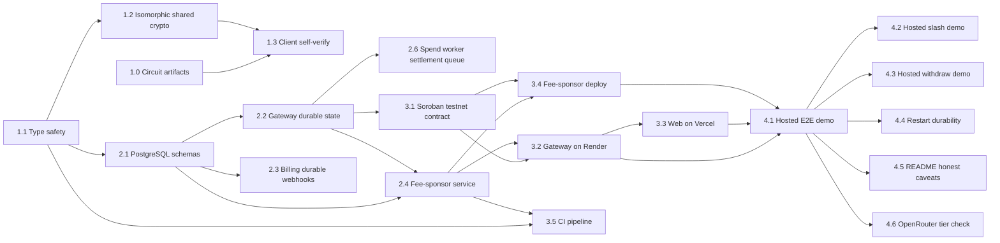

# Project Planning & Task Breakdown

## Plan Status

This is the working plan for `stellar-launch`, a parallel track to `feature-mina-protocol-migration`. The existing Stellar v1 codebase (circuits, Soroban contract, gateway, web) is already built; this plan adds the PRXVT-derived hardening (fee sponsorship, durable storage, type safety, self-verify, isomorphism), resolves the six v1 open questions, and takes the result to a public hosted testnet launch.

Tracking: `M1 done` -> `M2 CODE-COMPLETE (live testnet spike pending)` -> `M3 deployment DONE (Render/Vercel/CI)` -> `M4 IN PROGRESS (indexed-ticket launch gate)` -> `Web UI fix & browser verification DONE (W1–W7)`.

### Current Status (reconciled 2026-08-11)

M1 (Hardening foundation) is **COMPLETE and verified**:

| Task | Status | Evidence |
|---|---|---|
| 1.0 Circuit artifacts | done | fresh BLS12-381 power-15 setup, contribution, beacon, zkey verification, and Soroban VK export completed for indexed RLN, slash/root-removal, and membership-removal statements |
| 1.1 Type safety | done | strict typechecks exit 0 in `ts/`+`web/`; escape-scan 0 |
| 1.2 Isomorphic shared crypto | done | `@zk-credits/shared` built+tested; wired into `ts/`+`web/` |
| 1.3 Client-side self-verify | done (local scope) | `generateRlnProofSelfVerified` + `ProofSelfVerificationError`; nullifier-index bug fixed with regression tests |

The former artifact mismatch is closed. The release artifacts are source-matched:
RLN has 10,580 constraints / 10,587 wires, slash has 16,511 / 16,520,
and membership removal has 15,846 / 15,854. Each final zkey was
contributed, beaconed, and verified against the fresh power-15 transcript;
the browser copies match the circuit copies byte-for-byte.

M2 (Durable storage + fee sponsorship) is **CODE COMPLETE offline**: 2.1 done (PostgreSQL schemas + migrations + fails-closed config, verified against local Postgres 16); 2.2 done (gateway durable store + server wiring + restart reconstruction + stale-cache on-chain fallback); 2.3 done (billing webhook idempotency); 2.6 done (per-call async `spend()` worker, durable settlement queue); 2.4 done (fee-sponsor service + public fee-relay, method-validation gate, fee-bump + idempotency); 2.5 now requires a browser-generated membership-removal proof in addition to the gateway co-signature. **M2 code complete offline** — live transaction validation waits for fresh artifacts, a redeployed contract, and funded testnet accounts.

M3 (Hosted deployment) is **COMPLETE for deployment**:
- **3.5 CI** ✅ DONE 2026-08-05 (final verified run 31026106925 GREEN: all 6 jobs)
- **3.2 Gateway deployment** ✅ DONE — Render service `zk-credits-gateway` is live at https://zk-credits-gateway.onrender.com with shared Postgres; health and contract-status checks return 200, and the service runs the corrected `c02891c` revision.
- **3.4 Fee-sponsor deployment** ✅ DONE — Render service `zk-credits-fee-sponsor` is live at https://zk-credits-fee-sponsor.onrender.com and `/health` returns 200; live fee-bump behavior remains an M4 validation task.
- **3.1 Contract confirm** ✅ VERIFIED 2026-08-10 — the public Render gateway reports the deployed Soroban contract on `stellar:testnet`; corrected hosted spend calls produced `NullifierSpent` events.
- **3.3 Vercel web** ✅ DEPLOYED — https://feature-zk-api-credits.vercel.app serves the production web app; hosted dev-account sign-in, API-key issuance, Stripe test checkout, status proxy, and dashboard flow were exercised. GitHub OAuth acceptance remains an M4 external-configuration check.
- **3.6 Render Blueprint attachment** ⏭ OPTIONAL — `render.yaml` validates and documents the three resources, but the existing Render services are API/Dashboard-managed rather than Blueprint-attached. Attaching the Blueprint is useful for drift control and must not create duplicate resources.

M4 (Launch validation) is **IN PROGRESS**. The previous hosted epoch-flow evidence is retained as historical evidence only; it does not satisfy the revised indexed-ticket launch gate. The indexed-ticket source, fresh proving artifacts, and fresh on-chain fixtures are complete. The remaining gate is live deployment plus browser-to-gateway/OpenRouter acceptance.

Web UI fix track (user-directed 2026-08-06): **DONE** — W1–W7 implemented, committed in `ba47f4c`, and re-verified locally on 2026-08-09.

### Indexed-ticket launch reconciliation (2026-08-11)

The revised launch statement replaces the public epoch signal with a fixed-cost
Starter package of exactly 100 private ticket indices (`0..99`). Each ticket
binds one canonical request digest into the RLN share and publishes exactly
`[root, nullifier, x, y]`. Legacy five-signal epoch proofs and their zkeys are
kept only as migration evidence and must not be served or accepted by the new
launch path.

#### Completed implementation work

- **Done:** Circom RLN statement, BLS12-381 MiMC/request-digest derivation, and
  shared Node/browser proof input shape.
- **Done:** Atomic browser ticket reservation/consume/skip ledger for the 100
  Starter tickets.
- **Done:** Gateway four-signal parsing, shared bearer compatibility auth,
  request-body binding, durable tuple persistence before provider forwarding,
  exact-retry response replay, fork detection with slash evidence, and local
  status accounting.
- **Done:** Soroban spend/slash/membership VK separation and strict indexed
  signal counts, while preserving the constructor ABI. Slash now accepts the
  nine-signal root-removal statement and atomically clears root grace history.
  The post-constructor statement-key installation is admin-authorized once,
  then immutable.
- **Done:** `membership_removal.circom` proves browser-secret ownership and
  a three-signal `[commitment, current_root, next_root]` withdrawal transition;
  `withdraw()` verifies that dedicated VK and clears root grace history too.
- **Done:** Dashboard LLM playground, OpenRouter generation metadata/log link,
  fixed Starter pricing copy, and usage display wiring.
- **Done:** Offline-safe web typography and production-build Playwright
  verification; the full browser suite passes 13/13 with the shared-bearer
  dashboard heading and test-only disabled-integration states.
- **Done:** Vercel isolated-build packaging now declares `circomlibjs` directly;
  the corrected preview is Ready after the first deployment exposed the
  transitive-dependency gap.
- **Done:** Durable settlement quarantine now records an explicit status,
  reason, and timestamp for legacy/malformed accepted-call rows; migration
  `0007` backfills non-indexed payloads and the spend worker excludes them from
  retry polling. TDD evidence covers missing payloads and five-signal rows.
- **Done:** Fresh artifact verification: `node circuits/scripts/test.js` proves
  and self-verifies deposit, indexed RLN, invalid ticket bound, withdrawal
  removal, and slash removal; shared proof tests pass `19/19`; Soroban tests
  pass `24/24` with fresh RLN, slash, and membership fixtures; gateway tests
  pass `141` with `11` opt-in skips; web unit and production Playwright gates
  pass `16/16` and `13/13`.

#### In progress / blocked

- **Done locally:** Fresh RLN, slash/root-removal, and membership-removal
  Groth16 setup used a verified power-15 transcript, separate random
  contributions, deterministic public beacons, matching browser copies, and
  generated Soroban proof fixtures.
- **Done locally:** Real indexed spend, nine-signal slash, and three-signal
  membership-removal fixtures are accepted by the dedicated contract VKs.
- **Next local gate:** Run the manual Chrome Playwright flow against the built
  app to observe landing, onboarding/recovery, sign-in, and dashboard states.
- **Blocked operationally:** Current Render gateway health probes time out,
  while the fee-sponsor health endpoint returns 200. Recover the gateway before
  treating historical hosted acceptance evidence as current M4 validation.
- **Open after local proof:** Update hosted circuit artifacts/deployment and
  repeat the public indexed-ticket demo, exact retry, and ticket-fork checks.

The earlier manual Playwright run is recorded as a blocker, not acceptance
evidence: it reached the playground but failed before any gateway/OpenRouter
request with the expected stale-artifact error (`Signal ticket_index is not an
input of the circuit` / witness mismatch). This confirms the old artifact set
is incompatible rather than demonstrating a protocol failure.

### Next Focus

M3 deployment is complete and focus advances to M4 launch validation:
1. **Run the local manual Playwright acceptance flow** — observe landing,
   onboarding/recovery, sign-in, and dashboard states in Chrome. A real
   OpenRouter answer, self-verified proof state, and ticket decrement still
   require the recovered gateway and configured live integrations.
2. **Complete indexed-ticket launch validation** — deploy the newly compiled
   contract with its fresh VKs, then repeat hosted two-ticket, exact-retry,
   fork/slash, restart, Stripe/OAuth, and OpenRouter-tier checks.
3. **After the indexed gate passes:** run the live fee-bumped slash/withdraw
   spike and optionally attach the
   existing Render services to the validated Blueprint without duplicates.

Risks to track: restart-durability + fee-only-authority guarantees (release-blocking per testing doc); the multi-hour local fresh trusted setup; accidental serving of legacy five-signal artifacts; Render free-tier sleep/restart behavior; legacy pre-fix queue rows; GitHub OAuth and Stripe retry configuration; and OpenRouter per-key limits.

## Milestones
**What are the major checkpoints?**

- [x] **M1 — Hardening foundation:** TypeScript strict mode, isomorphic shared crypto package, client-side proof self-verification. (PRXVT guardrails first, so later code builds on a clean base.) — DONE (2026-08-04): 1.0–1.3 all complete and verified.
- [x] **M2 — Durable storage + fee sponsorship:** PostgreSQL with isolated schemas, gateway/billing state migration, fee-sponsor service with public fee-relay. — CODE COMPLETE (2026-08-04): 2.1–2.6 all done and verified offline (durable store, restart reconstruction, billing idempotency, spend worker, fee-relay, withdraw co-signer). Remaining: live Stellar testnet spike (pending user-funded keys) before M3.
- [x] **M3 — Hosted deployment:** Soroban testnet contract, Render gateway/Postgres, Vercel web, Render fee-sponsor service, CI pipeline. — DONE 2026-08-10; optional Blueprint attachment remains for infrastructure drift control.
- [ ] **M4 — Launch validation + evidence:** IN PROGRESS — indexed-ticket source path and legacy queue-cleanup migration are implemented; fresh artifacts, real browser/OpenRouter acceptance, fresh contract fixtures, slash/withdrawal, restart durability, OAuth, Stripe retry, README review, and OpenRouter tier checks remain.

## Task Breakdown
**What specific work needs to be done?**

### M1 — Hardening foundation

- [x] **1.0 Build circuit artifacts (wasm + zkey + VK).** — DONE (2026-08-04)
  - Outcome: Compile `deposit_membership`/`rln_nullifier`/`slash` to `.wasm` + `<name>_final.zkey` and regenerate `verification_key_<name>.json` via a fresh single-contributor-style Groth16 setup (power-14 bls12381 ptau + random beacon). Greens the 3 `crypto.test.ts` failures and provides artifacts for the E2E/demo.
  - Depends on: circom + snarkjs only. NOTE: original plan assumed the fresh setup would change the VK; since M1.0 shipped the verified-consistent v1 VKs (which match the deployed contract), M3.1 does NOT require a redeploy (see Status).
  - Validation: `circuits/*.wasm`, `*_final.zkey`, `verification_key_*.json` present; `cd ts && npm test` -> 62 passing; `node scripts/test.js` off-chain prove/verify passes.
  - Status: **DONE via the verified-consistent v1 artifact set.** The freshly-compiled `.wasm`/`.r1cs` (Aug 4) are byte-identical to the committed circuits (r1cs sizes match: deposit 1508732, rln 1856960, slash 348704), and the v1 `*_final.zkey` (from the repo's main tree, built Jul 6/14) were verified to match the committed `verification_key_*.json` exactly (`snarkjs zkey export verificationkey` diff: deposit/rln/slash all MATCH). Copied the v1 zkeys into the worktree `circuits/` and restored `web/public/circuits/` (deposit wasm + zkey, needed for the browser proof path). Validation green: `ts` suite 63/64 (1 pre-existing skip), shared package 12/12, `node scripts/test.js` all circuits pass. **Environment note:** a *fresh* setup was attempted (`snarkjs groth16 setup` then `zkey new` + `contribute` + `beacon` on a power-14 bls12381 ptau) but the snarkjs bls12381 WASM setup is pathologically slow on this machine (~15-18% CPU even under `caffeinate`; the v1 setup was produced on a different machine). The v1 ptau (pot14_0000 → 0001 contribution → final) is already a single-contributor dev-only setup, which satisfies the honest-caveat framing. **M3.1 simplifies:** the committed VKs already match the deployed Soroban contract (deployed 2026-07-14 with the real VK), so no contract redeploy is required — M3.1 becomes "confirm the deployed contract matches `verification_key_*_soroban.json`". A fresh-setup regen is an optional follow-up (would require a contract redeploy).
  - Related testing scenarios: retained v1 circuit prove/verify; proof self-verification.

- [x] **1.1 Enforce TypeScript strict mode and remove escape hatches.** — DONE (2026-08-04)
  - Outcome: All packages (`ts/`, `web/`, and the new `services/fee-sponsor`) compile under `strict: true` with no `// @ts-nocheck` and no `any`-escape hatches; existing type errors fixed.
  - Depends on: Approved requirements/design.
  - Validation: `tsc --noEmit` passes in strict mode across all packages; grep confirms no `@ts-nocheck`/`any` in shipped code. (Covers testing: type-safety guardrail.)
  - Related testing scenarios: isomorphic shared crypto (no global pollution); all retained v1 tests still pass.

- [x] **1.2 Extract isomorphic shared crypto + proof package.** — DONE (2026-08-04)
  - Outcome: Create `packages/zk-credits-shared` containing Poseidon hash, witness calculation, Circom WASM prover, and proof verification, importable by both `web/` (browser) and `ts/` (Node) without `globalThis`/`window` pollution (dependency injection / environment detection). Refactor `web/src/lib/crypto.ts` and `ts/` prover to import from the shared package.
  - Depends on: 1.1.
  - Validation: Shared package tests pass in both browser (Playwright) and Node (vitest) with identical outputs; assertion that globals are unchanged after import. (Covers testing: isomorphic shared crypto.)
  - Related testing scenarios: isomorphic shared crypto; proof self-verification.
  - Status: implemented `generateSecretK`/`deriveMnemonic`/`recoverSecretK`/`skToField` (pure) + `computeDepositCommitment`/`generateDepositProof`/`proveGroth16`/`verifyGroth16Proof` (DI circuit resources) in `packages/zk-credits-shared`; built (tsc → `dist/`, ESM) + vitest tests (7 pass / 3 zkey-gated skip); wired into `ts/` (`crypto.ts`/`prover.ts`/`server.ts`) and `web/` (`lib/crypto.ts` + onboarding/dashboard pages via `file:` deps). Note: the circuit hash is MiMCSponge (circomlibjs, matching the circuits), not Poseidon — the design doc's "Poseidon" reference is corrected in the implementation doc. Browser parity (Playwright) for the shared package is tracked with M1.3 (self-verify) since the proof tests are gated on the M1.0 zkey build.

- [x] **1.3 Add client-side proof self-verification before submit.** — DONE (2026-08-04; local self-verify scope)
  - Outcome: The browser verifies each Groth16 proof locally (via the shared prover/verifier) before attaching it to the `X-ZK-Proof` header and sending to the gateway; the gateway re-verifies as defense in depth. A malformed proof is caught locally and never sent.
  - Depends on: 1.2.
  - Validation: Browser self-verify test (valid proof verified + sent; malformed proof rejected locally, never sent); gateway rejects a stale-root proof that passed client verify. (Covers testing: proof self-verification.)
  - Related testing scenarios: proof self-verification; browser + gateway integration.
  - Status: **DONE (local scope).** `@zk-credits/shared` `generateRlnProofSelfVerified` + `ProofSelfVerificationError` prove then locally verify against the injected rln VK; any failure (false OR thrown by snarkjs, e.g. mismatched VK) is converted to `ProofSelfVerificationError` so the proof is never returned. The client path `scripts/e2e-test.js` proves + self-verifies via the shared package before attaching `X-ZK-Proof` (deposit + RLN both use `skToField`-reduced `secret_k`). Root `package.json` gained the `file:` dep. Gated shared tests now PASS (12/12): valid RLN self-verifies + wrong-VK rejection. **v1 bug fixed:** `ts/server.ts` nullifier was read from `pubSignals[2]` (= `share_x`) instead of `pubSignals[1]` (= nullifier); fixed via exported `extractNullifier()` + 2 regression tests (server suite 24/24). Remaining: the gateway *stale-root* rejection is a defense-in-depth integration case exercised at the hosted E2E (M3.3/M4.1), not part of the local self-verify scope.

### M2 — Durable storage + fee sponsorship

- [x] **2.1 Provision PostgreSQL with isolated schemas.** — DONE (2026-08-04)
  - Outcome: Add PostgreSQL with isolated schemas (`gateway`, `billing`, `fee-sponsor`); migration scripts; environment-separated connection config (testnet only, fails closed on missing config).
  - Depends on: 1.1.
  - Validation: Schemas created via migrations; connection config validated. (Covers testing: durable storage layer setup.)
  - Related testing scenarios: durable storage layer; fee-sponsor idempotency.
  - Status: created `ts/db/` (`config.ts` failing closed, `migrations/0001_init.sql` creating the three schemas, `migrate.ts` idempotent runner, `client.ts` Pool factory, `index.ts`); added `pg`/`@types/pg`; tests 5 config + 2 offline migrate + 1 opt-in integration (gated on `RUN_DB_TESTS=1`). Verified locally against Postgres 16: schemas `billing`/`fee-sponsor`/`gateway` created, re-run is a no-op. `.env.example` documents the config. `ts` suite 70/72 (2 skips: pre-existing + opt-in DB integration).

- [x] **2.2 Migrate gateway in-memory state to PostgreSQL `gateway` schema.** — DONE (2026-08-04)
  - Outcome: Replace the gateway's in-memory `Map`s (API keys, nullifier cache, call counts, settlement queue) with PostgreSQL-backed tables (`AcceptedCall`, `NullifierRecord`, `ApiKeyRecord`); nullifier cache invalidated by subscribing to on-chain `NullifierSpent` events; reconstruct in-memory state from durable rows on restart. Resolves v1 open question #3.
  - Depends on: 2.1.
  - Validation: Restart durability test (accepted calls persist across a forced restart; settlement queue resumes); nullifier cache invalidated on `NullifierSpent` event; stale cache falls back to on-chain read; API-key record does not link commitment to calls. (Covers testing: durable storage layer; integration gateway + PostgreSQL + Soroban.)
  - Related testing scenarios: durable storage layer; gateway + PostgreSQL integration; gateway + Soroban integration.
  - Status: `0002_gateway.sql` (accepted_calls/nullifier_records/api_key_records/call_counts — no commitment column on accepted_calls, privacy boundary), `ts/db/gateway.ts` (`GatewayStore` + Memory/Postgres impls, transactional `recordAcceptedCall` persists BEFORE upstream forward), `reconstructGatewayState`, server rewired off the Maps with an on-chain `is_nullifier_spent` stale-cache fallback; startup `initDurableGatewayStore` runs migrations + reconstruction and fails closed. Verified: 6 memory + 3 Postgres integration tests; server 28-tests subset; DB integration 36/36 (serial).

- [x] **2.3 Migrate billing webhook handling to PostgreSQL `billing` schema.** — DONE (2026-08-04)
  - Outcome: Stripe webhook receipts stored durably with event ID as idempotency key (`StripeEvent`); checkout -> webhook -> deposit flow is idempotent across retries.
  - Depends on: 2.1.
  - Validation: Webhook retry idempotency test (duplicate event ID does not double-deposit). (Covers testing: durable storage layer billing; web + Stripe + gateway integration.)
  - Related testing scenarios: durable storage layer; web + Stripe + gateway integration.
  - Status: `0003_billing.sql` (`billing.stripe_events`), `ts/db/billing.ts` (`BillingStore` + Memory/Postgres, `recordStripeEventOnce` idempotent on the event id via SQLSTATE-23505), gateway `POST /v1/billing/stripe-event` (first delivery deposits via shared `submitDeposit`, retries are no-ops), web webhook now signature-verifies then relays (fire-and-forget; exactly-once enforced gateway-side). Verified: 4 memory + 2 Postgres integration tests + 6 server endpoint tests.

- [x] **2.4 Build the fee-sponsor service with public fee-relay.** — DONE (2026-08-04)
  - Outcome: Create `services/fee-sponsor` with a public `POST /v1/fee-relay` endpoint; validates submitted Stellar transactions call a valid contract method (slash or withdraw only) on the configured contract; wraps in a Stellar fee bump signed by the sponsor's XLM account; stores `FeeRelayRequest` in the `fee-sponsor` schema for idempotency (inner tx hash key); fee-only authority (fee bump does not alter inner tx effects; contract auth gates state). Slash: the reporter submits the proof tx directly (permissionless). Withdraw: the gateway submits the depositor-co-signed tx (gateway-mediated; see task 2.5); the fee-sponsor only fee-bumps.
  - Depends on: 2.1.
  - Validation: Fee-sponsor unit tests (valid slash/withdraw fee-bumped; non-slash/withdraw method rejected 403; malformed tx rejected 400; duplicate inner tx hash idempotent; fee bump does not alter inner tx effects via byte-compare). (Covers testing: fee-sponsor service.)
  - Related testing scenarios: fee-sponsor service; fee-sponsor + Soroban integration.
  - Status: `0005_fee_sponsor.sql` (`"fee-sponsor".fee_relay_requests`), `ts/db/fee-sponsor.ts` (`FeeSponsorStore` + Memory/Postgres, idempotent on inner tx hash), `ts/fee-relay.ts` method-validation gate (slash/withdraw only, contract-id checked via `StrKey.encodeContract`, payment→403, malformed→400) + `buildFeeBumpEnvelope` (fee-only) + `relayOne` orchestration, `ts/fee-sponsor-app.ts` Express factory (`POST /v1/fee-relay`), `services/fee-sponsor/` deployment unit (boots via tsx, fails closed). Verified: 4 memory + 2 Postgres integration + 9 fee-relay core + 5 app supertest tests. Live fee-bump submission is the pending testnet spike.

- [x] **2.5 Build the gateway `/v1/withdraw` endpoint (withdrawal co-signer).** — DONE (2026-08-04)
  - Outcome: Add a `POST /v1/withdraw` endpoint to the gateway that accepts a WithdrawalProof + recipient from the user; the gateway validates the proof, builds the withdraw contract call, co-signs as the on-chain depositor (the contract requires `deposit.depositor.require_auth()`), forwards the co-signed tx to the fee-relay for fee-bumping, and returns the broadcast result. Gateway-mediated (not permissionless); honest caveat documented (gateway disappearance blocks withdrawal).
  - Depends on: 2.2 (gateway durable state), 2.4 (fee-relay).
  - Validation: Gateway withdraw endpoint test (valid WithdrawalProof -> co-signed + fee-bumped + broadcast; invalid proof rejected; slashed/withdrawn deposit rejected); confirms the user never needs XLM. (Covers testing: fee-sponsor + Soroban integration; hosted withdraw E2E.)
  - Related testing scenarios: fee-sponsor + Soroban integration; hosted withdraw E2E.
  - Status: `ts/contract.ts` `buildWithdrawEnvelope` now carries the browser-generated removal proof and three public signals; `ts/withdraw.ts` validates their presence before it invokes the signer; gateway `POST /v1/withdraw` requires the proof, co-signs, then posts to `FEE_SPONSOR_URL/v1/fee-relay`. Targeted gateway tests cover proof presence, exact envelope arguments, and relay failure paths. Final cryptographic proof validation awaits the fresh membership VK and contract fixture.

- [x] **2.6 Per-call async on-chain `spend()` worker + durable settlement queue.** — ADDED 2026-08-04 (new scope from M2.2); DONE
  - Outcome: The v1 gateway never submitted per-call on-chain `spend()` txs; the settlement queue was durable but had no worker. Add a worker that drains accepted calls pending on-chain spend, submitting each RLN proof to the contract's `spend()`; idempotent across restarts (proof + pub signals persisted); self-heals on `NullifierAlreadySpent`.
  - Depends on: 2.2 (durable accepted_calls).
  - Validation: Worker drains pending calls + records tx hash; `NullifierAlreadySpent` treated as settled (no infinite retry); transient failure leaves pending; restart resumption with the proof intact; `markSpendResult` settles atomically. (Covers testing: durable storage layer; gateway + Soroban integration.)
  - Related testing scenarios: durable storage layer; gateway + Soroban integration.
  - Status: `0004_spend_queue.sql` (proof_json + pub_signals on accepted_calls), `ts/spend-worker.ts` (`drainSpendQueue` + `startSpendWorker`), `ts/contract.ts` `spend()`, `markSpendResult` on the store, worker started in `initDurableGatewayStore`. Verified: 6 spend-worker + 2 spend-queue + 4 Postgres integration tests. Live testnet submission is the pending spike.

### M3 — Hosted deployment

- [x] **3.1 Deploy `ZkCreditsContract` to Soroban testnet.** — SCOPE CHANGED: now a CONFIRM, not a redeploy — VERIFIED 2026-08-09
  - Outcome: Confirm the already-deployed `ZkCreditsContract` on Stellar testnet uses the committed real verification keys; configure gateway to read contract state.
  - Depends on: 2.2 (gateway reads from durable state + on-chain events).
  - Validation: `GET /v1/contract-status` returns deposit count and roots from the public gateway. (Covers testing: integration gateway + Soroban.) **PASS:** HTTP 200, `depositCount: 3`, `currentRoot` present, `network: stellar:testnet`.
  - Related testing scenarios: gateway + Soroban integration; hosted E2E.
  - Status: the contract was deployed 2026-07-14 with the real BLS12-381 VK, and M1.0 verified the committed `verification_key_*.json` match both the zkeys and (via the `_soroban` conversions) the deployed contract. Public gateway confirmation passed after the attached Postgres machine was restarted. Redeploy only becomes necessary if the optional fresh trusted-setup regen ships new VKs.

- [x] **3.2 Deploy the gateway to Render with PostgreSQL.** — DONE 2026-08-10
  - Outcome: Deploy the hardened gateway to Render with shared PostgreSQL; public URL; environment-separated secrets; `/health` endpoint.
  - Depends on: 2.2, 3.1.
  - Validation: Public `GET /health` and `/v1/contract-status` return 200 from an external network; both passed on the live `c02891c` revision. (Covers testing: public URL accessibility.)
  - Related testing scenarios: public URL accessibility; restart durability (hosted).

- [x] **3.3 Deploy the web app to Vercel.** — DEPLOYED 2026-08-10; GitHub OAuth acceptance remains in M4
  - Outcome: Deploy the Next.js web app to Vercel; configure environment (gateway public URL, Stripe test mode, GitHub OAuth, AUTH_SECRET/AUTH_URL); public URL.
  - Depends on: 3.2 (web proxies to gateway).
  - Validation: Public Vercel sign-in with the test-only dev account, API-key issuance, Stripe test checkout, dashboard status proxy, and hosted gateway call passed. GitHub OAuth and webhook-retry behavior are not yet acceptance-tested. (Covers testing: public URL accessibility; hosted E2E.)
  - Related testing scenarios: hosted E2E; manual onboarding UX.

- [x] **3.4 Deploy the fee-sponsor service.** — DEPLOYED to Render; live fee-bump validation remains pending
  - Outcome: Deploy `services/fee-sponsor` to Render; public fee-relay endpoint; environment-separated sponsor XLM key.
  - Depends on: 2.4, 3.1.
  - Validation: Fee-relay reachable from an external network; a valid slash/withdraw transaction is fee-bumped. (Covers testing: fee-sponsor + Soroban integration; public URL accessibility.)
  - Related testing scenarios: fee-sponsor + Soroban integration; hosted slash/withdraw demos.

- [x] **3.5 Set up CI (GitHub Actions).** — DONE (2026-08-05): CI **GREEN** on run 31025062673, all 6 jobs pass
  - Outcome: CI pipeline runs gateway (`npm run test -- --coverage`), web (`npm run test` + Playwright + `next build`), contract (`cargo test`), shared (`build` + `test`), fee-sponsor (`typecheck`), and circuit (`node scripts/test.js`) tests on push; runs an E2E smoke test on deploy; emits coverage + testnet tx hashes as redacted artifacts.
  - Depends on: 1.1, 2.4 (tests must exist).
  - Validation: CI green on push to `feature-stellar-launch`. (Covers testing: test reporting & coverage.) — **DONE 2026-08-05: run 31025062673 all green** (contract 22s, fee-sponsor 25s, gateway 50s, shared 28s, web 1m12s incl. Playwright 2/2, circuits 18s). Three failing runs were iterated to green; each failure was a real gap local macOS dry-runs could not catch, so the live run earned its keep:
    1. **Run 31021171827** — Gateway + Web `npm ci` failed `Missing: @emnapi/runtime@1.11.3 / @emnapi/core@1.11.3 from lock file`: a mac-vs-linux platform-sensitive npm-11 arborist bug (top-level `@emnapi` peer entries missing from the lockfiles; macOS local `npm ci` passes, ubuntu runner fails). Fixed by adding the missing top-level `@emnapi/{core,runtime}@1.11.3` entries to `ts/package-lock.json` (+11) and `web/package-lock.json` (+22). Also fixed fee-sponsor typecheck (its `@gateway/*` → `../../ts/*` imports need the gateway's deps; job now `npm ci`s in `ts/` too) and no coverage failure was observed that run.
    2. **Run 31023559066** — installs green (lockfile fix worked) but Gateway + Web **typecheck** failed `Cannot find module '@zk-credits/shared'`: the `file:`-linked shared package needs its `dist/` (gitignored) built, and CI's fresh checkout has none. A `prepare` script attempt was rejected (npm runs it in the shared dir without its devDeps → `tsc: not found`); the working fix is an explicit build step in each consuming job.
    3. **Run 31024419645** — the new `Build @zk-credits/shared` steps failed: step-level `working-directory: ../packages/zk-credits-shared` resolves **from the repo root** in GitHub Actions (not the job's default dir), producing `/home/runner/work/../packages` (no such dir). Fixed to the repo-relative `packages/zk-credits-shared`.
    All paths were re-verified on linux (`node:24` container) simulating each CI job's exact step sequence → EXIT=0 before the green push.
  - Related testing scenarios: test reporting & coverage.
  - Status: `.github/workflows/ci.yml` (6-job matrix, all green) + `.github/workflows/deploy-smoke.yml` (post-deploy health template). **Web test baseline added** (`web/src/lib/crypto.test.ts` vitest 4/4; `web/e2e/smoke.spec.ts` Playwright 2/2). **Discovered gaps fixed:** circuit artifacts (`.wasm`/`*_final.zkey`) un-ignored + committed; gateway/web lockfiles' missing `@emnapi` top-level entries added; consuming jobs build `@zk-credits/shared` before typecheck; `@vitest/coverage-v8` devDep added (coverage step exits 0, 65.58%).

- [ ] **3.6 Attach the existing resources to the Render Blueprint.** — OPTIONAL, NOT LAUNCH-BLOCKING
  - Outcome: Connect the `feature-stellar-launch` repository and `render.yaml` to the existing Render services/database so future configuration changes are reviewable and synchronized.
  - Depends on: 3.2, 3.3, 3.4.
  - Validation: Render Blueprint validation passes; Dashboard sync targets the existing resources rather than provisioning duplicates; secret values remain preserved through sync.
  - Related testing scenarios: deployment configuration; secret/privacy review.

### M4 — Launch validation + evidence

- [x] **4.0 Quarantine legacy spend-queue rows.** — CODE COMPLETE / deployment migration pending
  - Outcome: Prevent pre-fix accepted calls (BN254-root or positional-proof payloads) from being retried indefinitely; retain their hashes and failure reason for audit, while allowing post-`c02891c` calls to settle.
  - Depends on: 3.2 and the live queue schema.
  - Validation: Memory TDD and local PostgreSQL integration prove legacy rows are durably quarantined and excluded from retries; deployment must apply `0007` before the fresh funded hosted call can close the operational part.
  - Related testing scenarios: gateway + Soroban integration; restart durability.

- [ ] **4.1 Hosted end-to-end demo.** — IN PROGRESS / core funded path verified
  - Outcome: A public tester visits the Vercel URL, signs in with GitHub, buys $5 test credits (Stripe test), sets `OPENAI_BASE_URL`/`OPENAI_API_KEY`, runs `claude "..."`, and receives a real Claude response via a self-verified ZK-RLN proof.
  - Depends on: 3.2, 3.3, 3.4.
  - Validation: Core path passed with a hosted test account: Stripe checkout, real OpenRouter response, replay rejection, and two live `NullifierSpent` events. Remaining acceptance: GitHub OAuth, the committed public demo script, and a clean post-fix queue.
  - Related testing scenarios: hosted E2E public demo.

- [ ] **4.2 Hosted slash demo.** — blocked on live testnet (M3/M4 encodes; the fee-relay that makes slash permissionless is code-complete offline, 2.4)
  - Outcome: A simulated over-quota violation is slashed permissionlessly on testnet via the fee-relay; the 50/50 treasury/reporter split is verifiable on-chain.
  - Depends on: 4.1, 2.4 (fee-relay code DONE — live submission pending).
  - Validation: `scripts/slash-demo.js` passes against the public deployment. (Covers testing: hosted slash E2E.)
  - Related testing scenarios: hosted slash E2E; fee-sponsor + Soroban integration.

- [ ] **4.3 Hosted withdraw demo.** — blocked on live testnet (withdraw co-signer code is done, 2.5)
  - Outcome: An unslashed user withdraws unused test credits to a chosen Stellar address via a gateway-mediated, fee-sponsored flow (gateway co-signs as depositor; fee-sponsor fee-bumps), without acquiring XLM.
  - Depends on: 4.1, 2.5 (withdraw endpoint code DONE — live broadcast pending).
  - Validation: Withdraw transaction confirmed on Stellar testnet; full amount transferred. (Covers testing: hosted withdraw E2E.)
  - Related testing scenarios: hosted withdraw E2E; fee-sponsor + Soroban integration.

- [ ] **4.4 Restart durability test on the hosted gateway.**
  - Outcome: Restart the Render gateway mid-session; the tester's next call succeeds and no accepted call is lost or duplicated; sustain 100 accepted calls across a restart.
  - Depends on: 4.1.
  - Validation: `scripts/e2e-test.js` passes immediately after a restart; 100-call sustained run shows no drops/duplicates. (Covers testing: restart durability hosted; performance.)
  - Related testing scenarios: restart durability hosted; performance testing.

- [ ] **4.5 Update README + landing page with honest caveats.**
  - Outcome: README and web landing page document the public URLs and all honest caveats: testnet only, no real money, single-contributor dev-only trusted setup (do not overclaim "real ZK"), single gateway (could log timing patterns), browser proving latency, network identity not hidden.
  - Depends on: 4.1.
  - Validation: Manual review confirms honest framing; no overclaiming. (Covers testing: manual testing; honest caveats.)
  - Related testing scenarios: manual testing.

- [ ] **4.6 Check OpenRouter per-key tier pre-launch.**
  - Outcome: Confirm the OpenRouter per-key rate limit is sufficient for public testnet load; use a sufficient tier; document the tier and limit. Resolves v1 open question #2.
  - Depends on: 4.1.
  - Validation: Documented tier + per-key limit check; no gateway-key rate-limit failures during hosted demo load. (Covers testing: hosted E2E under load.)
  - Related testing scenarios: hosted E2E; performance testing.

## Dependencies
**What needs to happen in what order?**

- **Hard dependencies:** 1.1 -> 1.2 (guardrails build on each other); 1.0 -> 1.3 + test suite (self-verify and the 3 circuit tests need built circuit artifacts); 1.2 -> 1.3 (self-verify uses the shared verifier); 2.1 -> 2.2/2.3/2.4 (storage migrations need schemas); 2.2 -> 2.6 (spend worker drains the durable accepted_calls queue); 2.5 depends on 2.2 + 2.4; 3.x deployments need M2 code complete; 4.x demos need all of M3 deployed (and the M2 live testnet spike).
- **External dependencies:** Stripe test-mode credentials, GitHub OAuth app, OpenRouter API key (sufficient tier), Stellar testnet funded accounts (gateway, treasury, reporter, user, fee-sponsor), Render + Vercel accounts, a PostgreSQL instance.
- **Parallelism:** 2.2, 2.3, 2.4 can proceed in parallel after 2.1. 3.2, 3.3, 3.4 can proceed in parallel after their M2 dependencies. 4.2, 4.3, 4.4, 4.5, 4.6 can proceed in parallel after 4.1.

## Timeline & Estimates
**When will things be done?**

No delivery date was supplied. These are relative planning estimates, not commitments:

| Milestone | Relative effort | Notes |
|---|---|---|
| M1 | Medium | Type-safety cleanup + isomorphic shared package refactor; touches existing v1 code paths. |
| M2 | Large | PostgreSQL migration (replaces in-memory state) + new fee-sponsor service; security-critical. |
| M3 | Medium | Hosted deployment (Render + Vercel + Soroban) + CI; ops work, not novel code. |
| M4 | Small–Medium | Hosted E2E validation + docs; depends on external services being provisioned. |

The existing v1 codebase significantly de-scope M1/M2 vs. the Mina migration (which rewrites everything). The fastest path to a public demo is M1 -> M2 -> M3 -> M4 with parallelism inside M2 and M3.

## Risks & Mitigation
**What could go wrong?**

| Risk | Mitigation | Trigger / owner |
|---|---|---|
| Isomorphic refactor breaks existing v1 browser proving. | Extract shared package incrementally; keep Playwright + vitest parity tests; never merge if browser/Node outputs diverge. | Block 1.2. |
| PostgreSQL migration loses or duplicates state. | Transactional writes before upstream forwarding; restart durability tests (PROVEN offline 2026-08-04: 36/36 Postgres integration incl. restart resumption); on-chain event subscription for nullifier invalidation. | Block 2.2 — DONE; hosted restart test at 4.4. |
| Fee-sponsor authority is abused (sponsors arbitrary transactions). | Method-validation gate (slash/withdraw only, contract-id checked; PROVEN offline 2026-08-04: 9 core tests); fee bump does not alter inner tx effects; contract auth gates all state. | Block 2.4 — DONE; live testnet submission remains. |
| Stellar fee bump mechanics differ from the assumed SEP-0041-style behavior. | Spike a minimal fee-bump transaction on testnet before the full fee-relay; pin the stellar-sdk version. | **Block 2.4 live spike** — code is offline-complete with `@stellar/stellar-sdk@16` `buildFeeBumpTransaction`; real testnet fee-bump pending user-funded keys. |
| Hosted deployment exposes secrets or breaks the privacy boundary. | Environment-separated secrets; gateway schema privacy assertions; manual log/schema inspection in M4; optional Render Blueprint sync review. | Block M4 launch sign-off. |
| OpenRouter rate-limits the gateway's key during public load. | Pre-launch tier check (4.6); use a sufficient tier; cap demo load. | Block 4.1. |
| Public launch overclaims "real ZK" with a dev-only trusted setup. | Honest-caveats README/landing review (4.5); explicit "testnet ZK with dev-only setup" framing. | Block launch sign-off. |
| CI cannot run Circom/stellar-sdk in GitHub Actions. | Use a Docker action with circom + stellar-cli preinstalled; mark circuit/contract tests as required-gate only after CI passes. | Block 3.5. |
| snarkjs bls12381 Groth16 setup is very slow (WASM; >10 min/circuit). | Build circuit artifacts once as a detached background job; keep artifacts present on CI/demo machines; parallelize M1.2 while it runs; do not block other M1 tasks on it. | Block 1.0 / demo / 3.5. |

## Resources Needed
**What do we need to succeed?**

- Stellar testnet funded accounts: gateway, treasury, reporter, user, fee-sponsor (disposable testnet keys via `stellar keys`).
- Stripe test-mode credentials + webhook forwarder; GitHub OAuth app (client ID/secret); OpenRouter API key (sufficient tier).
- Render account (gateway + fee-sponsor + PostgreSQL) and Vercel account (web).
- PostgreSQL instance (Render Postgres or external) with isolated schemas.
- CI (GitHub Actions) capable of running TypeScript, Circom, stellar-cli/Rust, and Playwright; secret redaction.
- Security review capacity for the fee-sponsor authority boundary and the gateway privacy data-flow before public launch.

## Update Summary (2026-08-05)

**M3.5 (CI) IMPLEMENTED; M2 commit prepared.** New `.github/workflows/ci.yml` (6-job matrix: gateway, shared, fee-sponsor, web, circuits, contract — Node 24 + `npm ci` everywhere, concurrency cancel) and `.github/workflows/deploy-smoke.yml` (post-deploy health template for `GATEWAY_URL`/`WEB_URL`/`FEE_SPONSOR_URL`). Web test baseline added (vitest 4/4 + Playwright 2/2), closing the testing doc's "no web test infra" gap. **Discovered gap fixed:** circuit artifacts (`.wasm`/`*_final.zkey`) were gitignored but load-bearing for the CI circuits job and the browser proof path — un-ignored + committed. Locally verified fresh: `ts` 129/139, shared 12/12, web typecheck + 4/4 + Playwright 2/2, circuits all-pass, escape-scan 0, `npm ci --dry-run` exit 0. Contract `cargo test` cannot run on local Cargo 1.79 (soroban-sdk 26 needs `edition2024`, Rust ≥1.85); CI pins 1.94.0. **Remaining M3:** the live Stellar testnet spike + M3.1 contract confirm (user keys/RPC) and M3.2/3.3/3.4 deploys (Fly.io/Vercel + secrets). First push will trigger the CI run that validates 3.5 end-to-end.

Scope changes recognized this phase: (1) M3.5 gained the **web test baseline** (vitest + Playwright — testing doc required `npm run test`/`test:e2e` but web had none); (2) **circuit-artifact tracking** added (un-ignored release `.wasm`/`.zkey`; the `*_soroban.json` VKs already tracked); (3) deploy-smoke scoped to health-only (full hosted E2E stays M4.1-4.3); (4) 12-word mnemonic assumption corrected to 24-word in web tests (matches M1.2 record; requirements/design doc still says 12-word — flagged).

**M3.5 (CI) GREEN — 2026-08-05 (later same day).** The first push ran CI (run 31021171827) and exposed **3 real gaps that local macOS dry-runs could not catch** — the live run earned its keep. Iterated to green over 4 runs; run 31025062673 is **all-green (6/6 jobs)**. Fixes landed: (1) Gateway + Web `npm ci` failed with `Missing: @emnapi/runtime@1.11.3 / @emnapi/core@1.11.3 from lock file` — a mac-vs-linux platform-sensitive npm-11 arborist bug: top-level `@emnapi` peer entries were missing from the lockfiles (macOS local `npm ci` passes; ubuntu runner fails). Surgically added the missing top-level entries to `ts/package-lock.json` (+11) and `web/package-lock.json` (+22); verified `npm ci` EXIT=0 in a `node:24` linux container. (2) Fee-sponsor typecheck failed (TS2307/TS7006) because its `@gateway/*` → `../../ts/*` imports type-check the shared `ts/` sources, which need the gateway's deps — the job now also `npm ci`s in `ts/`. (3) Gateway + Web typecheck then failed `Cannot find module '@zk-credits/shared'` — the `file:`-linked shared package needs its gitignored `dist/` built in a fresh checkout; a `prepare`-script attempt was rejected (npm runs `prepare` in the shared dir without its devDeps → `tsc: not found`), so the consuming jobs (gateway, web, fee-sponsor) now run an explicit `Build @zk-credits/shared` step (initially `../packages/...` which GitHub Actions resolves from the repo root → fixed to repo-relative `packages/zk-credits-shared`). All three job paths were simulated step-exact in a `node:24` linux container → EXIT=0 before the green push. **Milestone status:** M3.5 CI **DONE**; M3.1–3.4 remain blocked on user Stellar testnet keys/accounts + Fly.io/Vercel deploy secrets.

Scope changes/adjustments (M3.5-CI): (1) gateway/web lockfiles gained the missing top-level `@emnapi/{core,runtime}@1.11.3` entries; (2) consuming CI jobs gained an explicit shared-package build step; (3) `@vitest/coverage-v8` added as a real devDependency + `coverage` config in `ts/vitest.config.ts` (coverage step exits 0, 65.58%); (4) `deploy-smoke.yml` moved the `secrets` guard from job-level `if` (unavailable) to a step-level `env` guard; (5) root `.gitignore` now excludes `coverage/`, `test-results/`, `playwright-report/`.

## Update Summary (2026-08-04)

**M1 is complete.** M1.1 (type safety), M1.2 (isomorphic shared crypto), M1.0 (circuit artifacts), and M1.3 (client-side self-verify) are all DONE and verified:

- **M1.0 (circuit artifacts):** shipped via the verified-consistent v1 artifact set. Freshly-compiled `.wasm`/`.r1cs` are byte-identical to the committed circuits; the v1 `*_final.zkey` were verified (`snarkjs zkey export verificationkey` diff) to match the committed `verification_key_*.json` exactly (deposit/rln/slash). Copied into the worktree `circuits/` + restored `web/public/circuits/`. Full suite green: `ts` 63/64 (1 pre-existing skip), shared 12/12, `node scripts/test.js` all circuits pass. **Environment note:** a fresh setup was attempted (`groth16 setup`, then `zkey new`+`contribute`+`beacon`) but snarkjs bls12381 WASM setup is pathologically slow on this machine (~15-18% CPU even under `caffeinate`); the v1 ptau is already a single-contributor dev-only setup, satisfying the honest-caveat framing. **M3.1 simplifies to a confirm** (the committed VKs match the deployed contract) — no redeploy required.
- **M1.3 (client-side self-verify):** `generateRlnProofSelfVerified` + `ProofSelfVerificationError` in `@zk-credits/shared` (any failure, false or thrown, becomes the error so a proof is never sent); wired into `scripts/e2e-test.js`; root `file:` dep added. Gated tests now pass (12/12). **v1 bug fixed:** `ts/server.ts` nullifier index (`pubSignals[2]`→`pubSignals[1]`) via `extractNullifier()` + 2 regression tests (server 24/24).
- M2-M4 unstarted. Next: M2 (durable storage + fee sponsorship), then M3 (hosted deployment; M3.1 confirm contract), M4 (launch validation incl. the gateway stale-root case).

Scope changes/adjustments recorded: added task 1.0 (circuit artifacts); added the nullifier-index bugfix under 1.3; M3.1 changed from redeploy to confirm (v1 VKs match the deployed contract); a fresh-setup regen is an optional follow-up. Design-doc "Poseidon" reference corrected to MiMCSponge (the actual circuit hash) in the implementation doc.

### Reconciliation (Dev-Planning · Phase 6 — reconciled 2026-08-04)

**Milestone status:** `M1 Hardening foundation — DONE` (1.0–1.3, all verified) · `M2 Durable storage + fee sponsorship — CODE COMPLETE` (2.1–2.6 all done + verified offline) · `M3 Hosted deployment — not started (fee-sponsor package ready)` · `M4 Launch validation — not started (4.2/4.3 code-ready, blocked on live testnet)`.

**Done this phase:** 2.2 (gateway durable state + restart reconstruction + stale-cache fallback), 2.3 (billing webhook idempotency), 2.4 (fee-sponsor service + fee-relay + method-validation gate), 2.5 (gateway `/v1/withdraw` co-signer → fee-relay), **2.6 (NEW — per-call async `spend()` worker + durable settlement queue, discovered during 2.2)**. All M2 code tasks complete.

**Evidence (fresh, verify-gated 2026-08-04):** `ts` offline **129/139** (exit 0); DB integration **36/36** serial (exit 0); typecheck exit 0 in `ts/`, `services/fee-sponsor`, `web/`; `ai-devkit lint --feature stellar-launch` exit 0; escape-scan 0 matches. Release-blocking guarantees PROVEN offline: restart durability (Postgres integration restart-resumption tests) and fee-only authority (method-validation gate, 9 core tests).

**Blocked / deferred:** the **live Stellar testnet spike** (real `spend()` submission, real fee-bump for slash/withdraw, real co-signed withdrawal) is the only M2 blocker — **needs user-funded Stellar testnet keys**. Also deferred: fresh trusted-setup regen (needs a capable machine; would flip M3.1 to a redeploy); gateway stale-root rejection (defense-in-depth, deferred to hosted E2E 3.3/4.1). External dependencies for M3: Stellar testnet funded accounts, Stripe test credentials, GitHub OAuth app, OpenRouter key (tier check 4.6), Fly.io + Vercel accounts, PostgreSQL instance (local Postgres 16 already verified for M2).

**Scope changes recognized this phase:** (1) **M3.1 redeploy → confirm** (v1 VKs match the deployed contract); (2) task 1.0 added (circuit artifacts); (3) nullifier-index bugfix added under 1.3; (4) task **2.6 added** (spend worker — v1 never submitted per-call on-chain spend); (5) **2.5 scope deviation** — `/v1/withdraw` is GATEWAY_SECRET-gated (proof validation deferred to web-app session + contract deposit auth) rather than accepting a standalone WithdrawalProof, recorded for the hosted E2E; (6) fresh-setup regen downgraded to optional; (7) web `public/circuits/` restoration is a required deployment step.

**Next 2-3 actionable tasks:** (1) **Live Stellar testnet spike** — run real `spend()` (spend worker), real fee-bump relay (slash + withdraw), real co-signed withdrawal through `/v1/withdraw`; user must provide funded keys. (2) Then **M3.1 confirm the deployed contract** + start **M3.2/3.3/3.4 hosted deployment** (Fly.io gateway + Postgres, Vercel web, fee-sponsor — package already boot-tested via tsx). (3) **M3.5 CI — DONE 2026-08-05** (run 31025062673 all-green; for new pushes the pipeline now guards every package: gateway/shared/fee-sponsor/web/circuits/contract). Most risky remaining: the live fee-bump mechanics spike (2026-08-04 risk table) and M3 secrets/privacy hygiene.

**Summary:** M1 is fully shipped and green (type safety, isomorphic shared crypto, verified circuit artifacts, client-side self-verify, plus a v1 replay-protection bugfix). **M2 is now CODE COMPLETE and verified offline**: durable `GatewayStore` with restart reconstruction (2.2), idempotent billing webhook relay (2.3), fee-sponsor service with a method-gated public fee-relay (2.4), gateway `/v1/withdraw` co-signer (2.5), and a new per-call async `spend()` worker with a durable settlement queue (2.6) — all green at `ts` 129/139 + DB integration 36/36, with the two release-blocking guarantees (restart durability, fee-only authority) proven offline. The single remaining M2 blocker is the **live Stellar testnet spike** (real spend/fee-bump/withdraw submissions), which needs user-funded keys; afterward M3 hosted deployment starts with the contract confirm (3.1) and the ready-to-boot fee-sponsor package, with M4 launch validation (hosted E2E, slash/withdraw demos, restart durability, honest-caveats README, OpenRouter tier check) as the final gate.

### Web UI fix & browser verification (user-directed, 2026-08-06)

User reported the web UI "sucks, ugly and didn't work at all" and directed a Playwright re-test. Diagnosis (T0 baseline: screenshots captured pre-fix — ephemeral, Playwright later cleaned `test-results/`; durable after-fix evidence in `web/e2e-screenshots/`; MissingSecret evidence in `/tmp/web-baseline-server.log`): (a) every page was written in Tailwind utility classes but **Tailwind was never installed** → raw unstyled HTML; (b) next-auth v5 `MissingSecret` under `next start` (production mode) 500s `/api/auth/session`, and the root-layout `SessionProvider` surfaces the auth error on **every** page; (c) landing GitHub link was a placeholder (`https://github.com`); (d) USDC display bug (`balanceUsdc / 1_000_0000` = 10⁷ vs USDC's 10⁶); (e) `/onboarding` unreachable from any page; (f) Playwright coverage was only 2 landing smoke tests — the browser crypto path was never browser-tested despite the vitest config comment claiming otherwise.

- [x] **W1 Baseline capture.** — DONE: broken-state screenshots of all 5 pages + MissingSecret evidence.
- [x] **W2 Tailwind CSS v4 adoption.** — DONE: `tailwindcss` + `@tailwindcss/postcss` 4.3.3 per the bundled Next 16 docs recipe; `postcss.config.mjs`; `globals.css` → `@import 'tailwindcss'` + dark theme tokens; dead `page.module.css` removed.
- [x] **W3 Design polish (landing / sign-in / onboarding / recover).** — DONE: dark modern dev aesthetic; new `SiteHeader` (session-aware, real repo link) + `SiteFooter` (honest caveats: testnet only / no real money / single-contributor trusted setup); landing hero + 4 step cards + privacy/rate-limit cards; sign-in card with GitHub mark + explicit "OAuth not configured" notice; onboarding + recover restructured as server shells + client islands with stable test hooks (`data-testid="mnemonic-word"`, `data-testid="confirm-input"` + `data-word-index`).
- [x] **W4 Functional fixes.** — DONE: `formatUsdc` helper + vitest spec wired into `dashboard-status.tsx` (10⁶ fix, label "USDC deposit (testnet)"); `AUTH_SECRET` + `ENABLE_DEV_LOGIN=1` in the Playwright webServer (test-only values); GitHub placeholder → real repo; env-driven gateway URL (`NEXT_PUBLIC_GATEWAY_URL`, fallback localhost:3001) + onboarding/recover links in `api-key-section.tsx`; dashboard + buy-credits restyle; `web/.env.example` + gitignored `.env.local`; **opt-in dev login** (`ENABLE_DEV_LOGIN=1`, off by default, never for production) so the signed-in flow is usable/testable without a GitHub OAuth app.
- [x] **W5 Playwright specs authored (TDD red confirmed).** — DONE: `e2e/auth-flow.spec.ts`, `e2e/landing.spec.ts`, `e2e/onboarding.spec.ts` (full wizard + IndexedDB persistence + recover round-trip + malformed-phrase error). Red evidence `/tmp/e2e-red.log`: landing-styled ✘, header/footer ✘, round-trip ✘ (missing hooks); auth-flow ✓ only after the AUTH_SECRET fix (500 at baseline).
- [x] **W6 Live Playwright MCP verification (prod build).** — DONE: landing renders styled (`after-landing.png`); onboarding wizard works end-to-end in a real browser (Generate → 24 words → confirm 3 → "All Set!" → IndexedDB `secret_k` 64-hex + `commitment` persisted); anonymous "Go to Dashboard" → `/sign-in`. Discovered dev-only artifact: the Next dev client's failing HMR WebSocket triggers full page reloads that destroy React state mid-proving — not a product bug; prod builds unaffected.
- [x] **W7 Completion.** — dashboard restyle + `formatUsdc` wiring + env-driven gateway URL; `.env.example`/`.env.local`; full gates green; testing + implementation docs updated; implementation committed in `ba47f4c`.

### Reconciliation (Dev-Planning · Phase 6 — reconciled 2026-08-08)

**Milestone status:** `M1 DONE` · `M2 CODE-COMPLETE (live testnet spike pending)` · `M3 IN PROGRESS (3.5 CI DONE; 3.2 gateway deployed; 3.4 fee-sponsor deployed; 3.1 contract confirm pending; 3.3 Vercel web pending)` · `M4 todo` · **Web UI fix & browser verification — IN PROGRESS** (W1–W6 done, W7 in progress).

**Done this phase (2026-08-08):**
- C1–C7 deployment config work: `ts/Dockerfile`, `services/fee-sponsor/Dockerfile`, `ts/fly.toml`, `services/fee-sponsor/fly.toml`, `web/vercel.json`, `.dockerignore`, `docker-compose.yml`
- Updated `.env.example` (root + web) with deployment-specific env var documentation
- Created deployment guide: `docs/ai/deployment/2026-08-04-feature-stellar-launch.md`
- **Gateway deployed to Fly.io** (2026-08-08): https://zk-credits-gateway.fly.dev with Postgres attached
- **Fee-sponsor deployed to Fly.io** (2026-08-08): https://zk-credits-fee-sponsor.fly.dev
- Resolved Docker build issues: copied `packages/zk-credits-shared` into gateway image, fixed fee-sponsor Dockerfile path, added `NODE_OPTIONS=--import tsx` for ESM support, copied `node_modules` into shared package
- Created Fly.io account setup guide in deployment doc
- Created Stripe setup guide in deployment doc

**Done this phase (2026-08-06, Web UI fix):** W1 baseline, W2 Tailwind v4, W3 design polish (4 pages + shared header/footer), W4 partial (formatUsdc, AUTH_SECRET test config, real repo link), W5 red Playwright specs, W6 live MCP verification of the browser crypto path (first time it was ever browser-tested).

**Evidence:** Gateway URL https://zk-credits-gateway.fly.dev; fee-sponsor URL https://zk-credits-fee-sponsor.fly.dev; Fly secrets set (gateway + fee-sponsor); Postgres cluster `zk-credits-api-db` attached; `ai-devkit lint --feature stellar-launch` exit 0.

**Blocked / deferred:** (1) M3.1 contract confirm — needs manual verification that on-chain `ZK_CONTRACT_ID` matches repo VKs (user action); (2) M3.3 Vercel web — needs user to run `vercel link` + configure env vars; (3) live Stellar testnet spike — needs user-funded testnet keys; (4) Stripe account still needs to be created by user. **Fly continuity policy:** if free-tier Postgres is terminated, provision a fresh Fly Postgres database and reattach/reconfigure the gateway; do not treat the termination as a source-code blocker.

**Scope changes recognized this phase:** (1) M3 moved from "todo/blocked" to "in progress" with two services deployed; (2) new deployment infrastructure docs created; (3) `Dockerfile` + `fly.toml` created for both gateway and fee-sponsor; (4) Web-UI-fix track added by user direction (W1–W6 done, W7 pending).

**Next 2-3 actionable tasks:** (1) **3.1 Contract confirm** — call `/v1/contract-status` on the deployed gateway to verify on-chain VK matches repo; (2) **3.3 Vercel web** — user runs `vercel link` + `vercel env add` for each required var + `vercel deploy`; (3) **W7 Completion** — finish dashboard restyle + formatUsdc wiring + env-driven gateway URL + full gates green + testing/implementation doc updates + commit.

**Summary:** M3 is now in progress with the gateway (https://zk-credits-gateway.fly.dev) and fee-sponsor (https://zk-credits-fee-sponsor.fly.dev) both deployed to Fly.io with Postgres attached. The deployment infrastructure (Dockerfiles, fly.toml, deployment guide, env var docs) is complete. Remaining M3 work: contract confirm (3.1, user verification), Vercel web deployment (3.3, user runs `vercel link`). The live testnet spike (M2) and M4 launch validation are deferred until after M3.3 and user-funded keys arrive. The Web UI fix track (W1–W6 done) has W7 (dashboard restyle + gates + commit) as its final step.

### Reconciliation (Fly deployment recovery · 2026-08-09)

- The attached Postgres machine `zk-credits-api-db` had been stopped with `requested_stop=true`; it was started and its `pg` and `role` checks passed.
- The gateway machine was started after Postgres recovery. Fly reports its `/health` check passing with the expected Stellar testnet/proof-verification payload.
- A read-only request from inside the gateway machine returned `/v1/contract-status` with `depositCount: 3`, a current root, and the configured contract ID. Public HTTPS checks still timed out from this environment, so public edge verification remains open.
- W7 is complete and committed in `ba47f4c`; the next user-dependent step is Vercel setup, followed by the live testnet spike and M4 validation.

### Reconciliation (Dev-Planning · next-task advance · 2026-08-09)

- User clarified that Fly.io deployment remains active work; the free-tier Postgres lifecycle is an operational condition, not a reason to defer M3.
- M3.2 and M3.4 are recorded as deployed. If the attached free-tier Postgres machine is terminated, the recovery action is to provision a fresh Fly Postgres database and reattach/reconfigure the gateway.
- No additional Fly.io health checks are required in this pass. The next implementation task is **M3.3 Vercel web deployment**: `vercel link`, configure the documented environment variables, and deploy.
- M3.1 public contract-status verification and the live Stellar testnet spike remain subsequent validation tasks; they are not changed into source-code blockers.

### Reconciliation (Dev-Planning · Phase 6 · 2026-08-10)

**Milestone status:** `M1 DONE` · `M2 CODE-COMPLETE (live spend/fee-bump/withdraw spike pending)` · `M3 DEPLOYMENT DONE (Render/Vercel/CI)` · `M4 IN PROGRESS (4.1 partial)` · **Web UI fix & browser verification DONE (W1–W7)**.

**Completed since the previous plan:**
- Replaced the stale Fly deployment plan with the live Render topology: gateway, fee-sponsor, and shared Postgres are healthy; the gateway and fee-sponsor run `c02891c`.
- Confirmed the deployed Soroban contract from Render and observed two `NullifierSpent` events after the corrected BLS Merkle arithmetic, named proof-map serialization, `u256` signal encoding, and XDR event-topic fixes.
- Deployed and exercised the Vercel web flow with a test-only hosted account: sign-in, API-key issuance, Stripe test checkout, dashboard status proxy, OpenRouter response, replay rejection, and funded settlement.
- Verified Vercel `/api/dashboard/status` and the direct Render status endpoint return matching values for a fresh identity; the earlier unchanged dashboard state is therefore tracked as asynchronous settlement timing, not a proxy-routing defect.
- Validated `render.yaml` through the Render Blueprint API. Existing resources are not yet Blueprint-attached; this is optional drift-control work and must not provision duplicates.

**Scope changes:**
- M3.2 and M3.4 changed from Fly deployment tasks to Render deployment tasks; M3.3 is deployed, with GitHub OAuth acceptance moved to M4.
- Added optional task 3.6 for Render Blueprint attachment.
- Added task 4.0 to quarantine legacy queue rows created before the BLS/proof-shape fixes; those rows are historical `RootMismatch` noise, not current protocol failures.
- M4.1 is now in progress rather than not started: the core funded path is proven, but the committed public demo script, GitHub OAuth, and clean queue acceptance remain open.

**Blockers and risks:** live fee-bumped slash, gateway-mediated withdrawal, and hosted restart durability still require dedicated Stellar testnet validation; Stripe webhook retry, GitHub OAuth, and OpenRouter tier checks remain external configuration/acceptance work. Render free-tier sleep behavior and legacy queue retries must be controlled before launch sign-off.

**Next actions:** (1) apply the completed queue-quarantine migration with the fresh artifacts and verify post-fix settlement; (2) run live slash and withdrawal fee-relay tests plus restart durability; (3) complete GitHub OAuth, Stripe retry, OpenRouter tier, README caveat review, and the public demo-script run. Optional: attach the existing services to the validated Render Blueprint through the Dashboard.

**Summary:** deployment is no longer the active blocker. The protocol's funded request path now works through checkout, OpenRouter, replay protection, and Soroban settlement. The project remains in M4 launch validation until live fee-relay/withdrawal/restart checks and the remaining external configuration and operational cleanup are complete.

### Reconciliation (Dev-Planning · Phase 6 · reconciled 2026-08-11)

**Milestone status:** `M1 DONE` · `M2 CODE-COMPLETE (live spend/fee-bump/withdraw spike pending)` · `M3 DEPLOYMENT DONE (Render/Vercel/CI)` · `M4 INDEXED-TICKET LAUNCH VALIDATION IN PROGRESS`.

**Completed in this implementation continuation:**

- Replaced the public epoch RLN statement with the paper-aligned fixed-cost
  indexed-ticket statement: 100 private indices, four public signals, request
  digest binding, and per-ticket nullifier/slope derivation.
- Added the shared BLS12-381 MiMC/request-digest implementation, browser
  IndexedDB ticket ledger, gateway durable tuple/retry/fork handling, contract
  VK separation, and dashboard LLM playground/usage/provider evidence wiring.
- Added regression coverage for canonical requests, digest binding, ticket
  uniqueness/index bounds, four-signal parsing, exact retry, fork evidence,
  local status, ticket-ledger transitions, and web pricing/playground behavior.
- Fresh source-level evidence: gateway `140 passed / 11 skipped` plus
  typecheck; web `14 passed`, typecheck, and production build; Soroban
  contract `22/22` on Rust `1.92`; feature lint and `git diff --check` pass.

**Scope changes:** the old five-signal epoch artifacts are now migration-only;
the launch gateway rejects them, and the browser playground uses only the new
four-signal statement. The shared compatibility bearer is intentionally not
commitment-linked; each request is authorized by its own ZK ticket proof.

**Blocker:** the compiled current `.wasm`/`.r1cs` no longer match the tracked
legacy zkeys. Fresh RLN and slash Groth16 setup jobs are running locally, but
snarkjs BLS12-381 setup is multi-hour on this machine. The shared proof tests
and `circuits/scripts/test.js` therefore still fail at the old artifact boundary
with `Invalid witness length` rather than proving the new statement. The old
keys must not be substituted because that would make the browser demonstrate a
different protocol.

**Playwright status:** manual browser interaction reached the local dashboard,
dev sign-in, API-key issuance, usage panel, and LLM playground. With the stale
artifact set, clicking Generate response failed before any gateway/OpenRouter
request with the expected `ticket_index`/witness mismatch; this is recorded as
blocker evidence, not LLM acceptance evidence. The real answer/usage flow is
still pending fresh artifact installation.

**Next 2–3 actionable tasks:** (1) self-prove and self-verify one indexed ticket
with the fresh RLN zkey, install/export all matching artifacts and regenerate
Soroban VK JSON; (2) rerun the proof/circuit suites, restart local services, and
perform the manual Playwright OpenRouter flow while observing response,
generation ID, and `0 -> 1 -> 2` ticket usage; (3) add the fresh indexed
contract fixture and complete hosted two-ticket, exact-retry, fork/slash,
restart, Stripe/OAuth, and OpenRouter-tier validation.

**Summary:** the indexed-ticket implementation is source-complete and its
application/gateway/contract unit gates are green, but the launch gate remains
open until compatible Groth16 artifacts and a real browser-to-OpenRouter
interaction are verified. Legacy epoch acceptance evidence remains historical
and cannot close this revised plan.

### Reconciliation (Dev-Implementation · launch-plan completion · 2026-08-11)

**Completed:** fresh BLS12-381 Groth16 artifacts were generated and verified for
the RLN, slash, and membership-removal statements; the circuit suite, shared
package tests, gateway tests/typecheck, web tests/typecheck/production build,
and Soroban contract suite pass with those artifacts. The web preview is Ready
at `https://feature-zk-api-credits-i2kc260jj-gadillacers-projects.vercel.app`.

**Live testnet contract:** deployed and verified
`CBDGHYF5CQM527IM3GVDDWXLDB4XNPA5BT4KXFVCSJZTQIOFZGOIHAIT`. Its constructor
transaction is `36c9afaa74652afc75f3480f9765af685c6bd528853718363a74bdfc5e5de18b`;
the dedicated verification keys were installed in transaction
`8827579d85248854281ec9ffc769a4c0170a438351981281f269bd7934c7ed92` (ledger
`4081560`). Read-only verification returned a zero deposit count and root; a
second key-installation simulation returns `AlreadyInitialized`.

**Browser validation:** Chrome/Playwright exercised landing → Get Started →
test-only dev sign-in → dashboard → Guided setup on the running production-mode
local server. The rendered page contained the expected setup controls and the
browser reported zero console errors.

**Render configuration completed:** the Render API updated `ZK_CONTRACT_ID` on
the gateway and fee-sponsor and triggered deploy-only releases
`dep-d9tcin2d0e5s738rki1g` and `dep-d9tcitbncjis738va740`. Both reached `live`.
The public gateway now reports the new contract ID with `depositCount: 0` and
`currentRoot: 0`; gateway and fee-sponsor health endpoints both returned HTTP
200. The remaining M4 work is hosted spend/slash/withdraw/restart validation
and third-party Stripe/OAuth/OpenRouter acceptance, rather than deployment
configuration.

### Reconciliation (Dev-Implementation · source rollout gate · 2026-08-11)

The current contract, circuits, and source use the four-signal indexed-ticket
statement, but Render is still deployed from the last committed branch revision
(`42ef3d1`), which parses the retired five-signal statement. A locally
self-verified proof for the live funded root reached that parser and was
rejected before provider forwarding. The next mandatory action is therefore to
commit/push the validated indexed-ticket source and artifacts, redeploy both
Render services from that commit, and re-run M4.1–M4.4. The deposit path also
now stages and commits Merkle state only after the on-chain transaction
succeeds; this regression must be included in that rollout.
