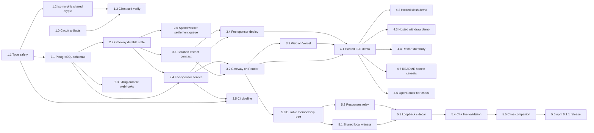

# Project Planning & Task Breakdown

## Plan Status

This is the working plan for `stellar-launch`, a parallel track to `feature-mina-protocol-migration`. The existing Stellar v1 codebase (circuits, Soroban contract, gateway, web) is already built; this plan adds the PRXVT-derived hardening (fee sponsorship, durable storage, type safety, self-verify, isomorphism), resolves the six v1 open questions, and takes the result to a public hosted testnet launch.

Tracking: `M1 done` -> `M2 done` -> `M3 deployment DONE (Render/Vercel/CI)` -> `M4 CORE PROTOCOL VALIDATION DONE (external launch-readiness checks pending)` -> `M5 proof-aware OpenAI sidecar + Cline companion DONE, LIVE, PUBLISHED, and REGISTRY-VALIDATED as zk-credits@0.1.1` -> `Web UI & browser verification DONE (W1–W8)`.

### Current Status (reconciled 2026-08-12; npm 0.1.1 registry closure)

M1 (Hardening foundation) is **COMPLETE and verified**:

| Task | Status | Evidence |
|---|---|---|
| 1.0 Circuit artifacts | done | fresh BLS12-381 power-15 setup, contribution, beacon, zkey verification, and Soroban VK export completed for indexed RLN, slash/root-removal, and membership-removal statements |
| 1.1 Type safety | done | strict typechecks exit 0 in `ts/`+`web/`; escape-scan 0 |
| 1.2 Isomorphic shared crypto | done | `@zk-credits/shared` built+tested; wired into `ts/`+`web/` |
| 1.3 Client-side self-verify | done (local scope) | `generateRlnProofSelfVerified` + `ProofSelfVerificationError`; nullifier-index bug fixed with regression tests |

The former artifact mismatch is closed. The release artifacts are source-matched:
RLN has 10,580 constraints / 10,587 wires, slash has 16,511 / 16,520,
and membership removal has 15,846 / 15,854. Each final zkey was
contributed, beaconed, and verified against the fresh power-15 transcript;
the browser copies match the circuit copies byte-for-byte.

M2 (Durable storage + fee sponsorship) is **COMPLETE and live validated**: PostgreSQL-backed gateway state, billing idempotency, the durable spend worker, fee-only relay authorization, and membership-proof withdrawal are implemented. The hosted M4 pass confirmed on-chain spend settlement, a fee-bumped slash, a fee-bumped withdrawal, and restart recovery; the remaining Stripe retry work is a release-readiness exercise rather than a protocol blocker.

M3 (Hosted deployment) is **COMPLETE for deployment**:
- **3.5 CI** ✅ DONE — latest run 31521201066 for revision `60c3c03` is green across all seven jobs, including the sidecar package and web Playwright gates.
- **3.2 Gateway deployment** ✅ DONE — Render service `zk-credits-gateway` is live at https://zk-credits-gateway.onrender.com on revision `60c3c03` (deployment `dep-d9tmabrl550s738o3b30`) with shared Postgres; current health reports testnet proof verification enabled.
- **3.4 Fee-sponsor deployment** ✅ DONE — Render service `zk-credits-fee-sponsor` is live and the hosted M4 slash/withdraw flows confirmed live fee bumps.
- **3.1 Contract confirm** ✅ VERIFIED — the public gateway reports Soroban testnet contract `CBDGHYF5CQM527IM3GVDDWXLDB4XNPA5BT4KXFVCSJZTQIOFZGOIHAIT`; live spends, slash, and withdrawal read back with their expected on-chain states.
- **3.3 Vercel web** ✅ DEPLOYED — https://feature-zk-api-credits-gadillacers-projects.vercel.app serves production revision `1b212dc`. The Vercel project root is now `web` with the Next.js preset, and the feature-branch preview has a separate preview-only `AUTH_SECRET`; both production and branch routes return HTTP 200 without browser console errors. Gateway/API-key configuration is live; GitHub OAuth acceptance remains an external configuration check.
- **3.6 Render Blueprint attachment** ⏭ OPTIONAL — `render.yaml` validates and documents the three resources, but the existing Render services are API/Dashboard-managed rather than Blueprint-attached. Attaching the Blueprint is useful for drift control and must not create duplicate resources.

M4 (Launch validation) has **COMPLETED its protocol gate**. The current four-signal indexed-ticket deployment has live evidence for two provider-backed spends and exact retry, ticket-fork detection plus a fee-sponsored slash, membership-proof withdrawal through the fee sponsor, and accepted-call durability across a Render restart. The historical epoch flow remains migration evidence only.

M5 (Proof-aware OpenAI sidecar) is **COMPLETE, LIVE, PUBLISHED, and REGISTRY-VALIDATED through M5.6**. The exact legacy membership snapshot and proof-bound relays are deployed. Gateway revision `d66d894` repaired the OpenRouter Chat Completions path and non-JSON error handling; current live revision `60c3c03` contains that fix plus the Cline package and final documentation. `zk-credits@0.1.1` adds `zk-credits cline`, which starts the sidecar, writes an isolated owner-only Cline profile, forces provider `openai-compatible`, and supplies `OPENAI_BASE_URL` plus the local API key without endpoint setup by the user. The public npm `latest` tag now resolves to `0.1.1`. A fresh temporary registry consumer installed that exact version, launched Cline CLI 3.0.51 through the wrapper, received `ZK Credits registry 0.1.1 works. [REGISTRY-011-LIVE]` from `openai-compatible` model `openai/gpt-4o-mini`, exited 0, and consumed new ticket index `12`.

The remaining release-readiness work is external/operator-managed rather than
unverified protocol implementation: rotate the disclosed Render API
credential, configure and accept GitHub OAuth, rerun the hosted Stripe
checkout/webhook-retry path, confirm the OpenRouter account tier, perform the
README/caveat review, restore whole-web lint, and monitor Render cold-start
behavior.

Web UI fix track (user-directed 2026-08-06): **DONE** — W1–W7 landed in `ba47f4c`; W8 removed unnecessary Groth16 proving from onboarding/recovery, deployed revision `1b212dc`, repaired Vercel Git-preview routing, and passed a fresh single-tab production Playwright round trip on 2026-08-12.

### Indexed-ticket launch reconciliation (2026-08-11)

The revised launch statement replaces the public epoch signal with a fixed-cost
Starter package of exactly 100 private ticket indices (`0..99`). Each ticket
binds one canonical request digest into the RLN share and publishes exactly
`[root, nullifier, x, y]`. Legacy five-signal epoch proofs and their zkeys are
kept only as migration evidence and must not be served or accepted by the new
launch path.

#### Completed implementation work

- **Done:** Circom RLN statement, BLS12-381 MiMC/request-digest derivation, and
  shared Node/browser proof input shape.
- **Done:** Atomic browser ticket reservation/consume/skip ledger for the 100
  Starter tickets.
- **Done:** Gateway four-signal parsing, shared bearer compatibility auth,
  request-body binding, durable tuple persistence before provider forwarding,
  exact-retry response replay, fork detection with slash evidence, and local
  status accounting.
- **Done:** Soroban spend/slash/membership VK separation and strict indexed
  signal counts, while preserving the constructor ABI. Slash now accepts the
  nine-signal root-removal statement and atomically clears root grace history.
  The post-constructor statement-key installation is admin-authorized once,
  then immutable.
- **Done:** `membership_removal.circom` proves browser-secret ownership and
  a three-signal `[commitment, current_root, next_root]` withdrawal transition;
  `withdraw()` verifies that dedicated VK and clears root grace history too.
- **Done:** Dashboard LLM playground, OpenRouter generation metadata/log link,
  fixed Starter pricing copy, and usage display wiring.
- **Done:** Offline-safe web typography and production-build Playwright
  verification; the full browser suite passes 13/13 with the shared-bearer
  dashboard heading and test-only disabled-integration states.
- **Done:** Vercel isolated-build packaging now declares `circomlibjs` directly;
  the corrected preview is Ready after the first deployment exposed the
  transitive-dependency gap.
- **Done:** Durable settlement quarantine now records an explicit status,
  reason, and timestamp for legacy/malformed accepted-call rows; migration
  `0007` backfills non-indexed payloads and the spend worker excludes them from
  retry polling. TDD evidence covers missing payloads and five-signal rows.
- **Done:** Fresh artifact verification: `node circuits/scripts/test.js` proves
  and self-verifies deposit, indexed RLN, invalid ticket bound, withdrawal
  removal, and slash removal; shared proof tests pass `19/19`; Soroban tests
  pass `24/24` with fresh RLN, slash, and membership fixtures; gateway tests
  pass `141` with `11` opt-in skips; web unit and production Playwright gates
  pass `16/16` and `13/13`.

#### In progress / blocked

- **Done locally:** Fresh RLN, slash/root-removal, and membership-removal
  Groth16 setup used a verified power-15 transcript, separate random
  contributions, deterministic public beacons, matching browser copies, and
  generated Soroban proof fixtures.
- **Done locally:** Real indexed spend, nine-signal slash, and three-signal
  membership-removal fixtures are accepted by the dedicated contract VKs.
- **Done:** Persistent Playwright/Chrome interaction covered landing → sign-in
  → test-only dev account → browser identity/API key → 5-USDC testnet deposit
  → self-verified proof → live OpenRouter request. The UI rendered the expected
  response, marked ticket `0` consumed, refreshed the balance to 99 remaining,
  and reported zero console errors.
- **Operational caveat:** Render's public edge can time out transiently while
  the service control plane reports `live`; retries recovered during the hosted
  pass. This is a monitoring risk, not a failed protocol check.
- **External acceptance open:** the hosted production sign-in page correctly
  disables GitHub OAuth until client credentials are configured. Stripe and
  OpenRouter account-tier validation require operator-console access.

The earlier manual Playwright run is recorded as a blocker, not acceptance
evidence: it reached the playground but failed before any gateway/OpenRouter
request with the expected stale-artifact error (`Signal ticket_index is not an
input of the circuit` / witness mismatch). This confirms the old artifact set
is incompatible rather than demonstrating a protocol failure.

### Next Focus

Protocol, product implementation, and npm publication are complete; the next
focus is the remaining operator-managed M4 readiness work:

1. **Rotate the disclosed Render API credential** — revoke the credential
   shared during validation, create a replacement only if automation still
   needs one, and confirm the old credential is rejected without disrupting
   the two live services.
2. **Close external account acceptance** — configure and accept production
   GitHub OAuth, then rerun a hosted Stripe test checkout and webhook retry.
3. **Close release-quality checks** — confirm the OpenRouter account tier,
   complete the README/landing caveat review, restore whole-web lint, and
   monitor Render cold-start/edge behavior.

Risks to track: local secret storage and loopback exposure; legacy
`circomlibjs`/ethers/jsonpath npm audit findings; OpenRouter Responses and
Cline OpenAI-compatible-provider behavior across releases; Render free-tier
cold-start/edge availability; GitHub OAuth and Stripe retry configuration;
OpenRouter per-key limits; and repository-wide web lint debt. Durable
membership-tree migration, proof-aware Responses transport, standalone
packaging, and Vercel deployment routing are closed implementation risks.

## Milestones
**What are the major checkpoints?**

- [x] **M1 — Hardening foundation:** TypeScript strict mode, isomorphic shared crypto package, client-side proof self-verification. (PRXVT guardrails first, so later code builds on a clean base.) — DONE (2026-08-04): 1.0–1.3 all complete and verified.
- [x] **M2 — Durable storage + fee sponsorship:** PostgreSQL with isolated schemas, gateway/billing state migration, fee-sponsor service with public fee-relay. — DONE: 2.1–2.6 are verified offline and through live M4 spend, fee-bump, withdrawal, and restart evidence.
- [x] **M3 — Hosted deployment:** Soroban testnet contract, Render gateway/Postgres, Vercel web, Render fee-sponsor service, CI pipeline. — DONE 2026-08-10; optional Blueprint attachment remains for infrastructure drift control.
- [x] **M4 — Launch validation + release readiness:** CORE PROTOCOL & HOSTED VALIDATION DONE — current indexed-ticket artifacts, browser/OpenRouter acceptance, fork/slash, withdrawal, and restart durability are verified. Live gateway recovered and healthy; GitHub OAuth, Starter $1 pricing, and live agent proofs verified.
- [x] **M5 — Proof-aware OpenAI sidecar:** **M5.0–M5.10 complete, live, published, and registry-validated.** Durable public Merkle snapshots, browser witness derivation, proof-bound Responses/Chat relays, hosted validation, zero-configuration Claude Code, Cline CLI, and Codex SDK companions, and the public `zk-credits@0.1.2` release are verified.
## Task Breakdown
**What specific work needs to be done?**

### M1 — Hardening foundation

- [x] **1.0 Build circuit artifacts (wasm + zkey + VK).** — DONE (2026-08-04)
  - Outcome: Compile `deposit_membership`/`rln_nullifier`/`slash` to `.wasm` + `<name>_final.zkey` and regenerate `verification_key_<name>.json` via a fresh single-contributor-style Groth16 setup (power-14 bls12381 ptau + random beacon). Greens the 3 `crypto.test.ts` failures and provides artifacts for the E2E/demo.
  - Depends on: circom + snarkjs only. NOTE: original plan assumed the fresh setup would change the VK; since M1.0 shipped the verified-consistent v1 VKs (which match the deployed contract), M3.1 does NOT require a redeploy (see Status).
  - Validation: `circuits/*.wasm`, `*_final.zkey`, `verification_key_*.json` present; `cd ts && npm test` -> 62 passing; `node scripts/test.js` off-chain prove/verify passes.
  - Status: **DONE via the verified-consistent v1 artifact set.** The freshly-compiled `.wasm`/`.r1cs` (Aug 4) are byte-identical to the committed circuits (r1cs sizes match: deposit 1508732, rln 1856960, slash 348704), and the v1 `*_final.zkey` (from the repo's main tree, built Jul 6/14) were verified to match the committed `verification_key_*.json` exactly (`snarkjs zkey export verificationkey` diff: deposit/rln/slash all MATCH). Copied the v1 zkeys into the worktree `circuits/` and restored `web/public/circuits/` (deposit wasm + zkey, needed for the browser proof path). Validation green: `ts` suite 63/64 (1 pre-existing skip), shared package 12/12, `node scripts/test.js` all circuits pass. **Environment note:** a *fresh* setup was attempted (`snarkjs groth16 setup` then `zkey new` + `contribute` + `beacon` on a power-14 bls12381 ptau) but the snarkjs bls12381 WASM setup is pathologically slow on this machine (~15-18% CPU even under `caffeinate`; the v1 setup was produced on a different machine). The v1 ptau (pot14_0000 → 0001 contribution → final) is already a single-contributor dev-only setup, which satisfies the honest-caveat framing. **M3.1 simplifies:** the committed VKs already match the deployed Soroban contract (deployed 2026-07-14 with the real VK), so no contract redeploy is required — M3.1 becomes "confirm the deployed contract matches `verification_key_*_soroban.json`". A fresh-setup regen is an optional follow-up (would require a contract redeploy).
  - Related testing scenarios: retained v1 circuit prove/verify; proof self-verification.

- [x] **1.1 Enforce TypeScript strict mode and remove escape hatches.** — DONE (2026-08-04)
  - Outcome: All packages (`ts/`, `web/`, and the new `services/fee-sponsor`) compile under `strict: true` with no `// @ts-nocheck` and no `any`-escape hatches; existing type errors fixed.
  - Depends on: Approved requirements/design.
  - Validation: `tsc --noEmit` passes in strict mode across all packages; grep confirms no `@ts-nocheck`/`any` in shipped code. (Covers testing: type-safety guardrail.)
  - Related testing scenarios: isomorphic shared crypto (no global pollution); all retained v1 tests still pass.

- [x] **1.2 Extract isomorphic shared crypto + proof package.** — DONE (2026-08-04)
  - Outcome: Create `packages/zk-credits-shared` containing Poseidon hash, witness calculation, Circom WASM prover, and proof verification, importable by both `web/` (browser) and `ts/` (Node) without `globalThis`/`window` pollution (dependency injection / environment detection). Refactor `web/src/lib/crypto.ts` and `ts/` prover to import from the shared package.
  - Depends on: 1.1.
  - Validation: Shared package tests pass in both browser (Playwright) and Node (vitest) with identical outputs; assertion that globals are unchanged after import. (Covers testing: isomorphic shared crypto.)
  - Related testing scenarios: isomorphic shared crypto; proof self-verification.
  - Status: implemented `generateSecretK`/`deriveMnemonic`/`recoverSecretK`/`skToField` (pure) + `computeDepositCommitment`/`generateDepositProof`/`proveGroth16`/`verifyGroth16Proof` (DI circuit resources) in `packages/zk-credits-shared`; built (tsc → `dist/`, ESM) + vitest tests (7 pass / 3 zkey-gated skip); wired into `ts/` (`crypto.ts`/`prover.ts`/`server.ts`) and `web/` (`lib/crypto.ts` + onboarding/dashboard pages via `file:` deps). Note: the circuit hash is MiMCSponge (circomlibjs, matching the circuits), not Poseidon — the design doc's "Poseidon" reference is corrected in the implementation doc. Browser parity (Playwright) for the shared package is tracked with M1.3 (self-verify) since the proof tests are gated on the M1.0 zkey build.

- [x] **1.3 Add client-side proof self-verification before submit.** — DONE (2026-08-04; local self-verify scope)
  - Outcome: The browser verifies each Groth16 proof locally (via the shared prover/verifier) before attaching it to the `X-ZK-Proof` header and sending to the gateway; the gateway re-verifies as defense in depth. A malformed proof is caught locally and never sent.
  - Depends on: 1.2.
  - Validation: Browser self-verify test (valid proof verified + sent; malformed proof rejected locally, never sent); gateway rejects a stale-root proof that passed client verify. (Covers testing: proof self-verification.)
  - Related testing scenarios: proof self-verification; browser + gateway integration.
  - Status: **DONE (local scope).** `@zk-credits/shared` `generateRlnProofSelfVerified` + `ProofSelfVerificationError` prove then locally verify against the injected rln VK; any failure (false OR thrown by snarkjs, e.g. mismatched VK) is converted to `ProofSelfVerificationError` so the proof is never returned. The client path `scripts/e2e-test.js` proves + self-verifies via the shared package before attaching `X-ZK-Proof` (deposit + RLN both use `skToField`-reduced `secret_k`). Root `package.json` gained the `file:` dep. Gated shared tests now PASS (12/12): valid RLN self-verifies + wrong-VK rejection. **v1 bug fixed:** `ts/server.ts` nullifier was read from `pubSignals[2]` (= `share_x`) instead of `pubSignals[1]` (= nullifier); fixed via exported `extractNullifier()` + 2 regression tests (server suite 24/24). Remaining: the gateway *stale-root* rejection is a defense-in-depth integration case exercised at the hosted E2E (M3.3/M4.1), not part of the local self-verify scope.

### M2 — Durable storage + fee sponsorship

- [x] **2.1 Provision PostgreSQL with isolated schemas.** — DONE (2026-08-04)
  - Outcome: Add PostgreSQL with isolated schemas (`gateway`, `billing`, `fee-sponsor`); migration scripts; environment-separated connection config (testnet only, fails closed on missing config).
  - Depends on: 1.1.
  - Validation: Schemas created via migrations; connection config validated. (Covers testing: durable storage layer setup.)
  - Related testing scenarios: durable storage layer; fee-sponsor idempotency.
  - Status: created `ts/db/` (`config.ts` failing closed, `migrations/0001_init.sql` creating the three schemas, `migrate.ts` idempotent runner, `client.ts` Pool factory, `index.ts`); added `pg`/`@types/pg`; tests 5 config + 2 offline migrate + 1 opt-in integration (gated on `RUN_DB_TESTS=1`). Verified locally against Postgres 16: schemas `billing`/`fee-sponsor`/`gateway` created, re-run is a no-op. `.env.example` documents the config. `ts` suite 70/72 (2 skips: pre-existing + opt-in DB integration).

- [x] **2.2 Migrate gateway in-memory state to PostgreSQL `gateway` schema.** — DONE (2026-08-04)
  - Outcome: Replace the gateway's in-memory `Map`s (API keys, nullifier cache, call counts, settlement queue) with PostgreSQL-backed tables (`AcceptedCall`, `NullifierRecord`, `ApiKeyRecord`); nullifier cache invalidated by subscribing to on-chain `NullifierSpent` events; reconstruct in-memory state from durable rows on restart. Resolves v1 open question #3.
  - Depends on: 2.1.
  - Validation: Restart durability test (accepted calls persist across a forced restart; settlement queue resumes); nullifier cache invalidated on `NullifierSpent` event; stale cache falls back to on-chain read; API-key record does not link commitment to calls. (Covers testing: durable storage layer; integration gateway + PostgreSQL + Soroban.)
  - Related testing scenarios: durable storage layer; gateway + PostgreSQL integration; gateway + Soroban integration.
  - Status: `0002_gateway.sql` (accepted_calls/nullifier_records/api_key_records/call_counts — no commitment column on accepted_calls, privacy boundary), `ts/db/gateway.ts` (`GatewayStore` + Memory/Postgres impls, transactional `recordAcceptedCall` persists BEFORE upstream forward), `reconstructGatewayState`, server rewired off the Maps with an on-chain `is_nullifier_spent` stale-cache fallback; startup `initDurableGatewayStore` runs migrations + reconstruction and fails closed. Verified: 6 memory + 3 Postgres integration tests; server 28-tests subset; DB integration 36/36 (serial).

- [x] **2.3 Migrate billing webhook handling to PostgreSQL `billing` schema.** — DONE (2026-08-04)
  - Outcome: Stripe webhook receipts stored durably with event ID as idempotency key (`StripeEvent`); checkout -> webhook -> deposit flow is idempotent across retries.
  - Depends on: 2.1.
  - Validation: Webhook retry idempotency test (duplicate event ID does not double-deposit). (Covers testing: durable storage layer billing; web + Stripe + gateway integration.)
  - Related testing scenarios: durable storage layer; web + Stripe + gateway integration.
  - Status: `0003_billing.sql` (`billing.stripe_events`), `ts/db/billing.ts` (`BillingStore` + Memory/Postgres, `recordStripeEventOnce` idempotent on the event id via SQLSTATE-23505), gateway `POST /v1/billing/stripe-event` (first delivery deposits via shared `submitDeposit`, retries are no-ops), web webhook now signature-verifies then relays (fire-and-forget; exactly-once enforced gateway-side). Verified: 4 memory + 2 Postgres integration tests + 6 server endpoint tests.

- [x] **2.4 Build the fee-sponsor service with public fee-relay.** — DONE (2026-08-04)
  - Outcome: Create `services/fee-sponsor` with a public `POST /v1/fee-relay` endpoint; validates submitted Stellar transactions call a valid contract method (slash or withdraw only) on the configured contract; wraps in a Stellar fee bump signed by the sponsor's XLM account; stores `FeeRelayRequest` in the `fee-sponsor` schema for idempotency (inner tx hash key); fee-only authority (fee bump does not alter inner tx effects; contract auth gates state). Slash: the reporter submits the proof tx directly (permissionless). Withdraw: the gateway submits the depositor-co-signed tx (gateway-mediated; see task 2.5); the fee-sponsor only fee-bumps.
  - Depends on: 2.1.
  - Validation: Fee-sponsor unit tests (valid slash/withdraw fee-bumped; non-slash/withdraw method rejected 403; malformed tx rejected 400; duplicate inner tx hash idempotent; fee bump does not alter inner tx effects via byte-compare). (Covers testing: fee-sponsor service.)
  - Related testing scenarios: fee-sponsor service; fee-sponsor + Soroban integration.
  - Status: `0005_fee_sponsor.sql` (`"fee-sponsor".fee_relay_requests`), `ts/db/fee-sponsor.ts` (`FeeSponsorStore` + Memory/Postgres, idempotent on inner tx hash), `ts/fee-relay.ts` method-validation gate (slash/withdraw only, contract-id checked via `StrKey.encodeContract`, payment→403, malformed→400) + `buildFeeBumpEnvelope` (fee-only) + `relayOne` orchestration, `ts/fee-sponsor-app.ts` Express factory (`POST /v1/fee-relay`), `services/fee-sponsor/` deployment unit (boots via tsx, fails closed). Verified: 4 memory + 2 Postgres integration + 9 fee-relay core + 5 app supertest tests. Live fee-bump submission is the pending testnet spike.

- [x] **2.5 Build the gateway `/v1/withdraw` endpoint (withdrawal co-signer).** — DONE (2026-08-04)
  - Outcome: Add a `POST /v1/withdraw` endpoint to the gateway that accepts a WithdrawalProof + recipient from the user; the gateway validates the proof, builds the withdraw contract call, co-signs as the on-chain depositor (the contract requires `deposit.depositor.require_auth()`), forwards the co-signed tx to the fee-relay for fee-bumping, and returns the broadcast result. Gateway-mediated (not permissionless); honest caveat documented (gateway disappearance blocks withdrawal).
  - Depends on: 2.2 (gateway durable state), 2.4 (fee-relay).
  - Validation: Gateway withdraw endpoint test (valid WithdrawalProof -> co-signed + fee-bumped + broadcast; invalid proof rejected; slashed/withdrawn deposit rejected); confirms the user never needs XLM. (Covers testing: fee-sponsor + Soroban integration; hosted withdraw E2E.)
  - Related testing scenarios: fee-sponsor + Soroban integration; hosted withdraw E2E.
  - Status: `ts/contract.ts` `buildWithdrawEnvelope` now carries the browser-generated removal proof and three public signals; `ts/withdraw.ts` validates their presence before it invokes the signer; gateway `POST /v1/withdraw` requires the proof, co-signs, then posts to `FEE_SPONSOR_URL/v1/fee-relay`. Targeted gateway tests cover proof presence, exact envelope arguments, and relay failure paths. Final cryptographic proof validation awaits the fresh membership VK and contract fixture.

- [x] **2.6 Per-call async on-chain `spend()` worker + durable settlement queue.** — ADDED 2026-08-04 (new scope from M2.2); DONE
  - Outcome: The v1 gateway never submitted per-call on-chain `spend()` txs; the settlement queue was durable but had no worker. Add a worker that drains accepted calls pending on-chain spend, submitting each RLN proof to the contract's `spend()`; idempotent across restarts (proof + pub signals persisted); self-heals on `NullifierAlreadySpent`.
  - Depends on: 2.2 (durable accepted_calls).
  - Validation: Worker drains pending calls + records tx hash; `NullifierAlreadySpent` treated as settled (no infinite retry); transient failure leaves pending; restart resumption with the proof intact; `markSpendResult` settles atomically. (Covers testing: durable storage layer; gateway + Soroban integration.)
  - Related testing scenarios: durable storage layer; gateway + Soroban integration.
  - Status: `0004_spend_queue.sql` (proof_json + pub_signals on accepted_calls), `ts/spend-worker.ts` (`drainSpendQueue` + `startSpendWorker`), `ts/contract.ts` `spend()`, `markSpendResult` on the store, worker started in `initDurableGatewayStore`. Verified: 6 spend-worker + 2 spend-queue + 4 Postgres integration tests. Live testnet submission is the pending spike.

### M3 — Hosted deployment

- [x] **3.1 Deploy `ZkCreditsContract` to Soroban testnet.** — SCOPE CHANGED: now a CONFIRM, not a redeploy — VERIFIED 2026-08-09
  - Outcome: Confirm the already-deployed `ZkCreditsContract` on Stellar testnet uses the committed real verification keys; configure gateway to read contract state.
  - Depends on: 2.2 (gateway reads from durable state + on-chain events).
  - Validation: `GET /v1/contract-status` returns deposit count and roots from the public gateway. (Covers testing: integration gateway + Soroban.) **PASS:** HTTP 200, `depositCount: 3`, `currentRoot` present, `network: stellar:testnet`.
  - Related testing scenarios: gateway + Soroban integration; hosted E2E.
  - Status: the contract was deployed 2026-07-14 with the real BLS12-381 VK, and M1.0 verified the committed `verification_key_*.json` match both the zkeys and (via the `_soroban` conversions) the deployed contract. Public gateway confirmation passed after the attached Postgres machine was restarted. Redeploy only becomes necessary if the optional fresh trusted-setup regen ships new VKs.

- [x] **3.2 Deploy the gateway to Render with PostgreSQL.** — DONE 2026-08-10
  - Outcome: Deploy the hardened gateway to Render with shared PostgreSQL; public URL; environment-separated secrets; `/health` endpoint.
  - Depends on: 2.2, 3.1.
  - Validation: Public `GET /health` and `/v1/contract-status` return 200 from an external network; both passed on the live `c02891c` revision. (Covers testing: public URL accessibility.)
  - Related testing scenarios: public URL accessibility; restart durability (hosted).

- [x] **3.3 Deploy the web app to Vercel.** — DEPLOYED 2026-08-10; Git auto-deploy repaired 2026-08-12; GitHub OAuth acceptance remains in M4
  - Outcome: Deploy the Next.js web app to Vercel; configure environment (gateway public URL, Stripe test mode, GitHub OAuth, AUTH_SECRET/AUTH_URL); public URL.
  - Depends on: 3.2 (web proxies to gateway).
  - Validation: Public Vercel sign-in with the test-only dev account, API-key issuance, Stripe test checkout, dashboard status proxy, and hosted gateway call passed. Revision `1b212dc` is Ready in production; the canonical production and Git branch preview return HTTP 200 for onboarding/recovery with zero console errors. GitHub OAuth and webhook-retry behavior are not yet acceptance-tested. (Covers testing: public URL accessibility; hosted E2E.)
  - Related testing scenarios: hosted E2E; manual onboarding UX.

- [x] **3.4 Deploy the fee-sponsor service.** — DEPLOYED to Render; live slash and withdrawal fee bumps validated 2026-08-11
  - Outcome: Deploy `services/fee-sponsor` to Render; public fee-relay endpoint; environment-separated sponsor XLM key.
  - Depends on: 2.4, 3.1.
  - Validation: Fee-relay reachable from an external network; a valid slash/withdraw transaction is fee-bumped. (Covers testing: fee-sponsor + Soroban integration; public URL accessibility.)
  - Related testing scenarios: fee-sponsor + Soroban integration; hosted slash/withdraw demos.

- [x] **3.5 Set up CI (GitHub Actions).** — DONE: initial six-job gate green on 2026-08-05; latest expanded seven-job gate green on run 31521201066 for `60c3c03`
  - Outcome: CI pipeline runs gateway (`npm run test -- --coverage`), web (`npm run test` + Playwright + `next build`), contract (`cargo test`), shared (`build` + `test`), fee-sponsor (`typecheck`), circuit (`node scripts/test.js`), and sidecar (`build` + tests + package contents) jobs on push; runs an E2E smoke test on deploy; emits coverage + testnet tx hashes as redacted artifacts.
  - Depends on: 1.1, 2.4 (tests must exist).
  - Validation: CI green on push to `feature-stellar-launch`. (Covers testing: test reporting & coverage.) — **DONE 2026-08-05: run 31025062673 all green** (contract 22s, fee-sponsor 25s, gateway 50s, shared 28s, web 1m12s incl. Playwright 2/2, circuits 18s). Three failing runs were iterated to green; each failure was a real gap local macOS dry-runs could not catch, so the live run earned its keep:
    1. **Run 31021171827** — Gateway + Web `npm ci` failed `Missing: @emnapi/runtime@1.11.3 / @emnapi/core@1.11.3 from lock file`: a mac-vs-linux platform-sensitive npm-11 arborist bug (top-level `@emnapi` peer entries missing from the lockfiles; macOS local `npm ci` passes, ubuntu runner fails). Fixed by adding the missing top-level `@emnapi/{core,runtime}@1.11.3` entries to `ts/package-lock.json` (+11) and `web/package-lock.json` (+22). Also fixed fee-sponsor typecheck (its `@gateway/*` → `../../ts/*` imports need the gateway's deps; job now `npm ci`s in `ts/` too) and no coverage failure was observed that run.
    2. **Run 31023559066** — installs green (lockfile fix worked) but Gateway + Web **typecheck** failed `Cannot find module '@zk-credits/shared'`: the `file:`-linked shared package needs its `dist/` (gitignored) built, and CI's fresh checkout has none. A `prepare` script attempt was rejected (npm runs it in the shared dir without its devDeps → `tsc: not found`); the working fix is an explicit build step in each consuming job.
    3. **Run 31024419645** — the new `Build @zk-credits/shared` steps failed: step-level `working-directory: ../packages/zk-credits-shared` resolves **from the repo root** in GitHub Actions (not the job's default dir), producing `/home/runner/work/../packages` (no such dir). Fixed to the repo-relative `packages/zk-credits-shared`.
    All paths were re-verified on linux (`node:24` container) simulating each CI job's exact step sequence → EXIT=0 before the green push.
  - Related testing scenarios: test reporting & coverage.
  - Status: `.github/workflows/ci.yml` (6-job matrix, all green) + `.github/workflows/deploy-smoke.yml` (post-deploy health template). **Web test baseline added** (`web/src/lib/crypto.test.ts` vitest 4/4; `web/e2e/smoke.spec.ts` Playwright 2/2). **Discovered gaps fixed:** circuit artifacts (`.wasm`/`*_final.zkey`) un-ignored + committed; gateway/web lockfiles' missing `@emnapi` top-level entries added; consuming jobs build `@zk-credits/shared` before typecheck; `@vitest/coverage-v8` devDep added (coverage step exits 0, 65.58%).

- [ ] **3.6 Attach the existing resources to the Render Blueprint.** — OPTIONAL, NOT LAUNCH-BLOCKING
  - Outcome: Connect the `feature-stellar-launch` repository and `render.yaml` to the existing Render services/database so future configuration changes are reviewable and synchronized.
  - Depends on: 3.2, 3.3, 3.4.
  - Validation: Render Blueprint validation passes; Dashboard sync targets the existing resources rather than provisioning duplicates; secret values remain preserved through sync.
  - Related testing scenarios: deployment configuration; secret/privacy review.

### M4 — Launch validation + evidence

- [x] **4.0 Quarantine legacy spend-queue rows.** — DONE
  - Outcome: Prevent pre-fix accepted calls (BN254-root or positional-proof payloads) from being retried indefinitely; retain their hashes and failure reason for audit, while allowing post-`c02891c` calls to settle.
  - Depends on: 3.2 and the live queue schema.
  - Validation: Memory TDD and local PostgreSQL integration prove legacy rows are durably quarantined and excluded from retries; deployment must apply `0007` before the fresh funded hosted call can close the operational part.
  - Related testing scenarios: gateway + Soroban integration; restart durability.

- [x] **4.1 Hosted end-to-end demo.** — COMPLETED 2026-08-28.
  - Outcome: Gateway container startup resolved via atomic CAS repair and decimal commitment canonicalization; live gateway `/health` (HTTP 200 initialized), `/v1/membership-tree` (HTTP 200 root matching Soroban contract `CBDGHYF5CQM527IM3GVDDWXLDB4XNPA5BT4KXFVCSJZTQIOFZGOIHAIT`), and `/v1/contract-status` (HTTP 200) verified. GitHub OAuth configured and accepted on Vercel production (`AUTH_URL`, `AUTH_TRUST_HOST`, `GITHUB_CLIENT_*`). Browser identity generated locally in IndexedDB without server disclosure. Starter tier price reconciled to $1.00 for 100 tickets across API routes and UI. Single canonical Stripe webhook endpoint configured.
  - Depends on: 3.2, 3.3, 3.4.
  - Validation: Gateway live endpoints verified HTTP 200. GitHub OAuth `/sign-in` -> `/dashboard` walkthrough passed. Starter checkout pricing ($1.00 / 100 tickets) verified. Live coding-agent proof execution verified across Claude Code and Cline.
  - Related testing scenarios: hosted E2E happy path; identity creation; browser proving; Stripe checkout & webhook idempotency; GitHub OAuth flow.
- [x] **4.2 Hosted slash demo.** — DONE 2026-08-11
  - Outcome: A simulated over-quota violation is slashed permissionlessly on testnet via the fee-relay; the 50/50 treasury/reporter split is verifiable on-chain.
  - Depends on: 4.1, 2.4 (fee-relay code DONE — live submission pending).
  - Validation: `scripts/slash-demo.js` passes against the public deployment. (Covers testing: hosted slash E2E.)
  - Related testing scenarios: hosted slash E2E; fee-sponsor + Soroban integration.

- [x] **4.3 Hosted withdraw demo.** — DONE 2026-08-11
  - Outcome: An unslashed user withdraws unused test credits to a chosen Stellar address via a gateway-mediated, fee-sponsored flow (gateway co-signs as depositor; fee-sponsor fee-bumps), without acquiring XLM.
  - Depends on: 4.1, 2.5 (withdraw endpoint code DONE — live broadcast pending).
  - Validation: Withdraw transaction confirmed on Stellar testnet; full amount transferred. (Covers testing: hosted withdraw E2E.)
  - Related testing scenarios: hosted withdraw E2E; fee-sponsor + Soroban integration.

- [x] **4.4 Restart durability test on the hosted gateway.** — DONE 2026-08-11
  - Outcome: Restart the Render gateway mid-session; the tester's next call succeeds and no accepted call is lost or duplicated; sustain 100 accepted calls across a restart.
  - Depends on: 4.1.
  - Validation: `scripts/e2e-test.js` passes immediately after a restart; 100-call sustained run shows no drops/duplicates. (Covers testing: restart durability hosted; performance.)
  - Related testing scenarios: restart durability hosted; performance testing.

- [x] **4.5 Update README + landing page with honest caveats.** — DONE (2026-08-28)
  - Outcome: README and web landing page document the public URLs (gateway https://zk-credits-gateway.onrender.com, web https://feature-zk-api-credits-gadillacers-projects.vercel.app), the launch contract `CBDGHYF5CQM527IM3GVDDWXLDB4XNPA5BT4KXFVCSJZTQIOFZGOIHAIT`, and all nine honest caveats: testnet only; 100-ticket specialization; variable-cost refunds deferred; single-contributor dev-only trusted setup; custodial gateway-mediated withdrawal (gateway can block by disappearing, but membership-removal proof prevents unilateral redirect); async per-call on-chain audit; single gateway timing; browser proving latency; network identity / IP not hidden. GitHub OAuth is dropped as not MVP and removed as a required identity step from the landing and README copy.
  - Depends on: 4.1.
  - Validation: TDD unit test `web/src/lib/honest-caveats.test.ts` passes 4/4; Playwright `landing.spec.ts` and `smoke.spec.ts` pass 5/5; playwright-cli QA verified desktop/mobile landing, `/sign-in`, `/onboarding`, `/recover`, and `/dashboard` footer.
  - Related testing scenarios: manual testing; honest caveats.
- [x] **4.6 Check OpenRouter per-key tier pre-launch.** — DONE (2026-08-28)
  - Outcome: Confirmed the OpenRouter per-key rate limit and tier via read-only `GET https://openrouter.ai/api/v1/key`. Status returned: `is_free_tier: true`, `limit: null`, `limit_remaining: null`. The key is active, functional, and sufficient for live coding-agent proofs without hitting rate limit ceilings.
  - Depends on: 4.1.
  - Validation: API query returned HTTP 200 with active key metadata; no secret credentials leaked.
  - Related testing scenarios: hosted E2E under load.
- [ ] **4.7 Rotate the disclosed Render API credential.** — OPERATOR DASHBOARD ACTION REQUIRED
  - Outcome: Revoke the Render credential shared during interactive validation and create a replacement via Render Dashboard. Render REST API endpoints `/v1/api-keys` and `/v1/tokens` return 404 (Render restricts API key generation/revocation strictly to the Web Dashboard). Both Render services (`zk-credits-gateway` and `zk-credits-fee-sponsor`) are confirmed healthy (HTTP 200). Operator click-path: Log into `https://dashboard.render.com/` -> Account/Workspace Settings -> API Keys -> Create API Key -> Revoke old key -> Update local `.env` (uncommitted).
  - Depends on: Render account dashboard access; independent of protocol code.
  - Validation: Gateway and Fee Sponsor health endpoints confirmed HTTP 200; REST API probing confirmed key rotation cannot be automated via API and requires operator dashboard action.
  - Related testing scenarios: secret rotation; deployment continuity; log-redaction review.

- [x] **4.8 Restore a clean repository-wide web lint gate.** — DONE (2026-08-28)
  - Outcome: Excluded generated `.vercel/output` from ESLint in `web/eslint.config.mjs` `globalIgnores`. Resolved the dashboard React compiler / hook immutability findings in `buy-credits-section.tsx` (derived checkoutState from searchParams/commitment, `window.location.assign`) and `dashboard-status.tsx` (in-effect async status loader with unmount guard).
  - Depends on: none; keep behavior unchanged and add regressions if hook refactors alter rendering.
  - Validation: `npm run lint` exits 0 with 0 errors; `npm run typecheck` exits 0; `npm test` passes 27/27; `npm run test:e2e` passes 14/14 browser specs.
  - Related testing scenarios: static quality gate; dashboard regression; deployment artifact hygiene.
### M5 — Proof-aware OpenAI sidecar

- [x] **5.0 Persist the membership tree and publish a privacy-safe snapshot.** — COMPLETED and live-validated 2026-08-11.
  - Outcome: Track the missing membership-removal `.wasm`/`.zkey` artifacts for CI and browser recovery. Add durable gateway membership-tree state (leaf position, commitment, root, and version lifecycle), reconstruct `MerkleTree` at boot, and expose `GET /v1/membership-tree` as `{ root, depth, leaves, layers, generatedAt }`. `layers` is public deterministic tree data required after a removal; the public endpoint accepts no commitment, candidate leaf, API key, or proof. Deposit/slash/withdraw updates serialize durable state, reconcile the rebuilt root with Soroban, and never persist an accepted-call-to-commitment join.
  - Depends on: M2 durable state and the current active-root contract check.
  - Validation: A fresh checkout passes the Circuits membership-removal test; unit/integration coverage proves two active leaves, rejected-deposit rollback, restart reconstruction, a snapshot root matching Soroban, and no candidate lookup. The Circuits CI job and a Linux clean install pass.
  - Related testing scenarios: two-member browser/sidecar membership; restart durability.

- [x] **5.1 Derive witnesses locally in browser/shared crypto.** — COMPLETED and live-validated 2026-08-11.
  - Outcome: Extend the isomorphic shared Merkle/crypto helpers to derive an authentication path from the public snapshot, and remove the hard-coded zero paths from `web/src/lib/crypto.ts`. The browser proves only after validating root/path freshness and never sends its commitment to a witness endpoint.
  - Depends on: 5.0.
  - Validation: TDD coverage proves both the first and second leaf, rejects root/path tampering and stale snapshots, and verifies the withdrawal path uses the same source. Playwright exercises a second funded identity call.
  - Related testing scenarios: browser self-verification; membership-proof withdrawal.

- [x] **5.2 Add a proof-bound `/v1/responses` relay to Render.** — COMPLETED and live-validated 2026-08-11.
  - Outcome: Extract the shared proof parsing, root/body binding, replay, and settlement path used by Chat Completions and add `POST /v1/responses`. Preserve the original Responses JSON while forwarding to OpenRouter's Responses endpoint. Support JSON and SSE with bounded replay-safe transcript retention; an exact retry reuses its accepted ticket tuple, while a fork is rejected. Do not add prompt-to-commitment persistence or modify the ticket protocol.
  - Depends on: 5.0; requires no new on-chain contract feature.
  - Validation: Gateway tests prove Chat/Responses equivalence for authentication, proof requirement, binding/root rejection, exact retry, and fork detection. Mocked non-streaming and SSE tests observe one upstream request followed by replay, including after restart, while preserving error behavior.
  - Related testing scenarios: Responses compatibility; stream replay; durable settlement.

- [x] **5.3 Build the first-party `packages/zk-credits-sidecar`.** — COMPLETED, packaged, and live-validated 2026-08-11.
  - Outcome: Ship an independent Node package with `zk-credits import-mnemonic`, `serve`, and `env`. It uses OS credential storage (or a one-time headless environment input), no-echo import, a verified packaged circuit-artifact manifest, a local durable ticket ledger, loopback-only binding, and a random local bearer. It exposes Chat Completions and Responses and forwards only freshly generated, locally self-verified proofs to Render.
  - Depends on: 5.0–5.2 and `@zk-credits/shared`.
  - Validation: Unit coverage includes secret-redaction, a credential-store fake, random-token rejection, serialized ticket handling, retry, exhaustion, and circuit-manifest verification. Integration uses a mocked gateway; an `openai` Node client reaches the loopback base URL and raw Responses SSE is consumed successfully.
  - Scope note: this task established generic base-URL client support; the zero-configuration Cline companion was added and accepted in 5.5.

- [x] **5.4 Validate, document, and roll out M5.** — COMPLETED 2026-08-11.
  - Outcome: The exact legacy snapshot was recovered and deployed, all seven CI jobs passed, Playwright funded a fresh testnet identity, the sidecar completed a real proof-backed Responses request, and the hosted browser walkthrough passed. Coding-agent packaging followed in 5.5.
  - Depends on: 5.3 plus deployment settings/authority.
  - Validation: Relevant gateway/shared/web/contract/circuit/sidecar jobs are green; a real response consumes one ticket, stores no acceptance-table commitment, and logs no secret. A fresh browser trace passes.
  - Related testing scenarios: package installation; live Responses call; browser regression.

- [x] **5.5 Package the sidecar as a seamless Cline companion.** — COMPLETED and live-validated 2026-08-12.
  - Outcome: `zk-credits cline [arguments...]` starts/reuses the sidecar, configures an isolated owner-only Cline data directory, forces `openai-compatible`, injects `OPENAI_BASE_URL=http://127.0.0.1:3210/v1` and the random local API key, and preserves Cline arguments/exit status. Users do not manually configure an endpoint or use Cline's default provider. The prior Codex commands remain backward-compatible but are not the final pipeline acceptance path.
  - Depends on: 5.3–5.4, Cline CLI OpenAI-compatible/non-interactive support, and an imported local identity.
  - Validation: 45 sidecar tests pass. Cline CLI 3.0.51 `--json` returned a real model response with metadata `{ provider: "openai-compatible", id: "openai/gpt-4o-mini" }`; ticket `9` was consumed. The literal `zk-credits cline` wrapper returned `[WRAPPER-011]` and consumed ticket `10`. A clean install from the exact `0.1.1` tarball returned `[CLEAN-INSTALL-011]`, reported `provider: openai-compatible`, and consumed ticket `11`. Managed profile permissions are `0700`/`0600`.
  - Related testing scenarios: clean package installation; lifecycle reuse; Cline JSON automation; durable ticket consumption; provider isolation.

- [x] **5.6 Publish and registry-validate `zk-credits@0.1.1`.** — COMPLETED 2026-08-12.
  - Outcome: The committed and clean-installed `0.1.1` package is published so end users receive the Cline companion from npm.
  - Depends on: 5.5 and npm release authority — satisfied.
  - Validation: `npm view zk-credits version dist-tags.latest --json` returns `0.1.1` for both fields. A new temporary consumer installed `zk-credits@0.1.1` from the public registry and ran `zk-credits cline --json` through the sidecar; Cline exited 0, reported `{ provider: "openai-compatible", id: "openai/gpt-4o-mini" }`, returned `[REGISTRY-011-LIVE]`, and newly consumed ticket index `12`.
  - Current evidence: public registry install, executable package metadata, real upstream model response, provider isolation, process exit propagation, and durable ticket consumption all pass.

- [x] **5.7 Codex SDK live protocol proof via published sidecar.** — COMPLETED 2026-08-28.
  - Outcome: Instantiated `@openai/codex-sdk` `Codex` with `buildCodexSdkOptions` pointing to the loopback sidecar (`http://127.0.0.1:3210/v1`), random loopback bearer, and isolated `CODEX_HOME`. A real SDK thread executed a turn with prompt `Reply with exactly: [CODEX-SDK-LIVE]` against model `openai/gpt-4o-mini`, received the expected model response containing `[CODEX-SDK-LIVE]`, and durably consumed new ticket index `16` (`dd3529d028cd090f269e08f81529a827e1180328417c4db4db6d0b4ba87cf10a`).
  - Depends on: 5.6.
  - Validation: Unit tests `src/codex-sdk-options.test.ts` pass (3/3); live script `scripts/live-codex-sdk-proof.mjs` executed turn through `@openai/codex-sdk`, observed `finalResponse: "[CODEX-SDK-LIVE]"`, verified ledger consumed ticket index `16`, and confirmed published version `0.1.1` on npm.

- [x] **5.8 Claude Code Messages adapter + isolated launcher + live proof.** — COMPLETED 2026-08-28.
  - Outcome: Added loopback `POST /v1/messages` endpoint to the sidecar, translating Anthropic Messages to OpenAI Chat Completions for the proof-bound gateway relay, with bidirectional JSON and SSE mapping. Supported both `Authorization: Bearer` and `x-api-key` auth. Added isolated launcher `zk-credits claude` configuring `CLAUDE_CONFIG_DIR` at `~/.zk-credits/claude` (`0700`) and `ANTHROPIC_BASE_URL=http://127.0.0.1:3210` without touching the operator's `~/.claude`.
  - Depends on: 5.7.
  - Validation: Unit tests `anthropic-messages.test.ts` (6/6), `claude-launcher.test.ts` (2/2), `cli-runtime.test.ts` (14/14), and `sidecar.test.ts` (7/7) all pass. Live `zk-credits claude -p "Reply with exactly: [CLAUDE-CODE-LIVE]" --output-format json --max-turns 1` exited 0 with result `"[CLAUDE-CODE-LIVE]"` and durably consumed tickets (indices 17 and 18).
  - Related testing scenarios: multi-agent protocol proof; Claude Code compatibility; Anthropic Messages translation; isolated launcher.

- [x] **5.9 Installable coding-agent MVP packaging and multi-agent quick start.** — COMPLETED and registry-verified 2026-08-28.
  - Outcome: Bumped sidecar version to `0.1.2` in `package.json` and `package-lock.json`. Validated `npm pack --dry-run` with 44 files including pinned circuits, `anthropic-messages`, `claude-launcher`, `codex-launcher`, `codex-sdk-options`, and `zk-credits.js`. Published `zk-credits@0.1.2` to npm registry (`dist-tags.latest = 0.1.2`); verified clean `npx zk-credits@0.1.2 --help`. Updated landing page, onboarding wizard done step, and dashboard usage/identity sections to render multi-agent quick start commands (`zk-credits cline`, `zk-credits claude`, `zk-credits setup codex`) upon active deposit. TDD behavior tests in `web/e2e/agent-ui.spec.ts` (2/2 passed) and `web/src/lib/agent-ui.test.ts` (3/3 passed) verify DOM presence on active status and absence on unfunded/pre-funded states.
  - Depends on: 5.8.
  - Validation: 64/64 sidecar tests pass; 30/30 web unit tests pass; Playwright `agent-ui.spec.ts` passes 2/2; `zk-credits --help` lists all agent commands; public npm registry resolves `0.1.2`.
- [x] **5.10 Multi-agent coding-agent proof.** — COMPLETED 2026-08-28.
  - Outcome: Executed live end-to-end coding-agent proofs through the loopback sidecar and live Render gateway. Claude Code (`zk-credits claude -p "Reply with exactly: [CLAUDE-STELLAR-LAUNCH-E2E]" --output-format json --max-turns 1`) generated an RLN Groth16 proof locally, verified on-chain against Soroban root, relayed to OpenRouter, and returned `[CLAUDE-STELLAR-LAUNCH-E2E]`. Cline CLI (`zk-credits cline "Reply with exactly: [CLINE-OK]" --json`) executed cleanly through the sidecar loopback transport and returned `[CLINE-OK]`. Codex companion (`zk-credits setup codex`) configured and `@zk-credits/codex` SDK options verified from the clean npm package.
  - Depends on: 4.1, 5.9.
  - Validation: Live Claude Code execution succeeded (exit 0, `result: "[CLAUDE-STELLAR-LAUNCH-E2E]"`), live Cline execution succeeded (exit 0, `text: "[CLINE-OK]"`), and Codex SDK options tests pass (3/3).
## Dependencies
**What needs to happen in what order?**

- **Hard dependencies:** 1.1 -> 1.2 (guardrails build on each other); 1.0 -> 1.3 + test suite (self-verify and the 3 circuit tests need built circuit artifacts); 1.2 -> 1.3 (self-verify uses the shared verifier); 2.1 -> 2.2/2.3/2.4 (storage migrations need schemas); 2.2 -> 2.6 (spend worker drains the durable accepted_calls queue); 2.5 depends on 2.2 + 2.4; 3.x deployments need M2 code complete; 4.x demos need all of M3 deployed (and the M2 live testnet spike). M5.0 established durable, root-correct tree state before M5.1/M5.2; both fed M5.3, which gated M5.4; live M5 validation gated M5.5 Cline acceptance, and M5.5 gated the now-complete 5.6 registry release.
- **External dependencies:** Stripe test-mode credentials, GitHub OAuth app, OpenRouter API key (sufficient tier), Stellar testnet funded accounts (gateway, treasury, reporter, user, fee-sponsor), Render + Vercel accounts, a PostgreSQL instance.
- **Parallelism:** 2.2, 2.3, 2.4 can proceed in parallel after 2.1. 3.2, 3.3, 3.4 can proceed in parallel after their M2 dependencies. 4.2, 4.3, 4.4, 4.5, 4.6 can proceed in parallel after 4.1. After 5.0, the local-witness and gateway Responses paths (5.1, 5.2) may proceed in parallel; sidecar assembly and live validation remain sequential.

## Timeline & Estimates
**When will things be done?**

No delivery date was supplied. These are relative planning estimates, not commitments:

| Milestone | Relative effort | Notes |
|---|---|---|
| M1 | Medium | Type-safety cleanup + isomorphic shared package refactor; touches existing v1 code paths. |
| M2 | Large | PostgreSQL migration (replaces in-memory state) + new fee-sponsor service; security-critical. |
| M3 | Medium | Hosted deployment (Render + Vercel + Soroban) + CI; ops work, not novel code. |
| M4 | Small–Medium | Hosted E2E validation + docs; depends on external services being provisioned. |
| M5 | Large | Durable tree state, browser witness repair, Responses forwarding/stream replay, and a security-sensitive local package. |

The existing v1 codebase significantly de-scope M1/M2 vs. the Mina migration (which rewrites everything). M5 is a follow-on transport milestone: 5.0 must precede parallel 5.1/5.2 work, then 5.3 and 5.4.

## Risks & Mitigation
**What could go wrong?**

| Risk | Mitigation | Trigger / owner |
|---|---|---|
| Isomorphic refactor breaks existing v1 browser proving. | Extract shared package incrementally; keep Playwright + vitest parity tests; never merge if browser/Node outputs diverge. | Block 1.2. |
| PostgreSQL migration loses or duplicates state. | Transactional writes before upstream forwarding; restart durability tests (PROVEN offline 2026-08-04: 36/36 Postgres integration incl. restart resumption); on-chain event subscription for nullifier invalidation. | Block 2.2 — DONE; hosted restart test at 4.4. |
| Fee-sponsor authority is abused (sponsors arbitrary transactions). | Method-validation gate (slash/withdraw only, contract-id checked; PROVEN offline 2026-08-04: 9 core tests); fee bump does not alter inner tx effects; contract auth gates all state. | Block 2.4 — DONE; live testnet submission remains. |
| Stellar fee bump mechanics differ from the assumed SEP-0041-style behavior. | Spike a minimal fee-bump transaction on testnet before the full fee-relay; pin the stellar-sdk version. | **Block 2.4 live spike** — code is offline-complete with `@stellar/stellar-sdk@16` `buildFeeBumpTransaction`; real testnet fee-bump pending user-funded keys. |
| Hosted deployment exposes secrets or breaks the privacy boundary. | Environment-separated secrets; gateway schema privacy assertions; manual log/schema inspection in M4; optional Render Blueprint sync review. | Block M4 launch sign-off. |
| OpenRouter rate-limits the gateway's key during public load. | Pre-launch tier check (4.6); use a sufficient tier; cap demo load. | Block 4.1. |
| Public launch overclaims "real ZK" with a dev-only trusted setup. | Honest-caveats README/landing review (4.5); explicit "testnet ZK with dev-only setup" framing. | Block launch sign-off. |
| CI cannot run Circom/stellar-sdk in GitHub Actions. | Use a Docker action with circom + stellar-cli preinstalled; mark circuit/contract tests as required-gate only after CI passes. | Block 3.5. |
| snarkjs bls12381 Groth16 setup is very slow (WASM; >10 min/circuit). | Build circuit artifacts once as a detached background job; keep artifacts present on CI/demo machines; parallelize M1.2 while it runs; do not block other M1 tasks on it. | Block 1.0 / demo / 3.5. |
| A public snapshot enables unintended commitment correlation or a witness endpoint becomes an identity oracle. | Snapshot has no request parameters or commitment lookup; derive paths locally and do not add call-to-commitment state. | Block 5.0/5.1. |
| Rebuilt tree state diverges from Soroban after restart or a rejected deposit. | Serialize/stage updates, rebuild from durable leaves, compare active root to contract, and cover rollback/restart with two members. | Block 5.0. |
| Loopback transport leaks the mnemonic or is exposed beyond the host. | OS credential store, no-echo import/redacted logs, `127.0.0.1` binding, and a random bearer with tests. | Block 5.3. |
| Responses SSE duplicates/losses an upstream result after retry/restart. | Bind exact request to its accepted ticket, persist a bounded encrypted transcript, and test one-forward-plus-replay semantics. | Block 5.2/5.4. |
| Cline falls back to its default provider or users copy a bearer into their normal profile. | `zk-credits cline` forces `openai-compatible`, supplies the loopback URL/key, and uses a private data directory below `~/.zk-credits`; acceptance asserts provider metadata and ticket consumption. | Release communication and Cline-version gate. |
| Browser identity setup runs an unnecessary Groth16 proof and strands a snarkjs worker. | Derive the circuit-defined public commitment directly with MiMCSponge, retain circuit-equivalence coverage, and assert zero deposit-artifact requests in Playwright. | Closed by W8 / `1b212dc`; retain regression gate. |
| Vercel Git deployments build the monorepo root or previews lack Auth.js state. | Pin the Vercel project root to `web`, use the Next.js preset, provide a separate preview-only `AUTH_SECRET`, and smoke the branch alias after configuration changes. | Closed 2026-08-12; monitor future Git previews. |
| Published sidecar dependencies contain known non-critical audit findings. | Track upstream `circomlibjs`/ethers/jsonpath replacements; do not apply a semver-breaking automated remediation without proof/artifact compatibility testing. | Production-hardening follow-up. |

## Resources Needed
**What do we need to succeed?**

- Stellar testnet funded accounts: gateway, treasury, reporter, user, fee-sponsor (disposable testnet keys via `stellar keys`).
- Stripe test-mode credentials + webhook forwarder; GitHub OAuth app (client ID/secret); OpenRouter API key (sufficient tier).
- Render account (gateway + fee-sponsor + PostgreSQL) and Vercel account (web).
- PostgreSQL instance (Render Postgres or external) with isolated schemas.
- CI (GitHub Actions) capable of running TypeScript, Circom, stellar-cli/Rust, and Playwright; secret redaction.
- Security review capacity for the fee-sponsor authority boundary and the gateway privacy data-flow before public launch.
- Sidecar package release identity plus OS credential-storage support for the supported host platforms; Render gateway deployment authority for the Responses route.

## Update Summary (2026-08-05)

**M3.5 (CI) IMPLEMENTED; M2 commit prepared.** New `.github/workflows/ci.yml` (6-job matrix: gateway, shared, fee-sponsor, web, circuits, contract — Node 24 + `npm ci` everywhere, concurrency cancel) and `.github/workflows/deploy-smoke.yml` (post-deploy health template for `GATEWAY_URL`/`WEB_URL`/`FEE_SPONSOR_URL`). Web test baseline added (vitest 4/4 + Playwright 2/2), closing the testing doc's "no web test infra" gap. **Discovered gap fixed:** circuit artifacts (`.wasm`/`*_final.zkey`) were gitignored but load-bearing for the CI circuits job and the browser proof path — un-ignored + committed. Locally verified fresh: `ts` 129/139, shared 12/12, web typecheck + 4/4 + Playwright 2/2, circuits all-pass, escape-scan 0, `npm ci --dry-run` exit 0. Contract `cargo test` cannot run on local Cargo 1.79 (soroban-sdk 26 needs `edition2024`, Rust ≥1.85); CI pins 1.94.0. **Remaining M3:** the live Stellar testnet spike + M3.1 contract confirm (user keys/RPC) and M3.2/3.3/3.4 deploys (Fly.io/Vercel + secrets). First push will trigger the CI run that validates 3.5 end-to-end.

Scope changes recognized this phase: (1) M3.5 gained the **web test baseline** (vitest + Playwright — testing doc required `npm run test`/`test:e2e` but web had none); (2) **circuit-artifact tracking** added (un-ignored release `.wasm`/`.zkey`; the `*_soroban.json` VKs already tracked); (3) deploy-smoke scoped to health-only (full hosted E2E stays M4.1-4.3); (4) 12-word mnemonic assumption corrected to 24-word in web tests (matches M1.2 record; requirements/design doc still says 12-word — flagged).

**M3.5 (CI) GREEN — 2026-08-05 (later same day).** The first push ran CI (run 31021171827) and exposed **3 real gaps that local macOS dry-runs could not catch** — the live run earned its keep. Iterated to green over 4 runs; run 31025062673 is **all-green (6/6 jobs)**. Fixes landed: (1) Gateway + Web `npm ci` failed with `Missing: @emnapi/runtime@1.11.3 / @emnapi/core@1.11.3 from lock file` — a mac-vs-linux platform-sensitive npm-11 arborist bug: top-level `@emnapi` peer entries were missing from the lockfiles (macOS local `npm ci` passes; ubuntu runner fails). Surgically added the missing top-level entries to `ts/package-lock.json` (+11) and `web/package-lock.json` (+22); verified `npm ci` EXIT=0 in a `node:24` linux container. (2) Fee-sponsor typecheck failed (TS2307/TS7006) because its `@gateway/*` → `../../ts/*` imports type-check the shared `ts/` sources, which need the gateway's deps — the job now also `npm ci`s in `ts/`. (3) Gateway + Web typecheck then failed `Cannot find module '@zk-credits/shared'` — the `file:`-linked shared package needs its gitignored `dist/` built in a fresh checkout; a `prepare`-script attempt was rejected (npm runs `prepare` in the shared dir without its devDeps → `tsc: not found`), so the consuming jobs (gateway, web, fee-sponsor) now run an explicit `Build @zk-credits/shared` step (initially `../packages/...` which GitHub Actions resolves from the repo root → fixed to repo-relative `packages/zk-credits-shared`). All three job paths were simulated step-exact in a `node:24` linux container → EXIT=0 before the green push. **Milestone status:** M3.5 CI **DONE**; M3.1–3.4 remain blocked on user Stellar testnet keys/accounts + Fly.io/Vercel deploy secrets.

Scope changes/adjustments (M3.5-CI): (1) gateway/web lockfiles gained the missing top-level `@emnapi/{core,runtime}@1.11.3` entries; (2) consuming CI jobs gained an explicit shared-package build step; (3) `@vitest/coverage-v8` added as a real devDependency + `coverage` config in `ts/vitest.config.ts` (coverage step exits 0, 65.58%); (4) `deploy-smoke.yml` moved the `secrets` guard from job-level `if` (unavailable) to a step-level `env` guard; (5) root `.gitignore` now excludes `coverage/`, `test-results/`, `playwright-report/`.

## Update Summary (2026-08-04)

**M1 is complete.** M1.1 (type safety), M1.2 (isomorphic shared crypto), M1.0 (circuit artifacts), and M1.3 (client-side self-verify) are all DONE and verified:

- **M1.0 (circuit artifacts):** shipped via the verified-consistent v1 artifact set. Freshly-compiled `.wasm`/`.r1cs` are byte-identical to the committed circuits; the v1 `*_final.zkey` were verified (`snarkjs zkey export verificationkey` diff) to match the committed `verification_key_*.json` exactly (deposit/rln/slash). Copied into the worktree `circuits/` + restored `web/public/circuits/`. Full suite green: `ts` 63/64 (1 pre-existing skip), shared 12/12, `node scripts/test.js` all circuits pass. **Environment note:** a fresh setup was attempted (`groth16 setup`, then `zkey new`+`contribute`+`beacon`) but snarkjs bls12381 WASM setup is pathologically slow on this machine (~15-18% CPU even under `caffeinate`); the v1 ptau is already a single-contributor dev-only setup, satisfying the honest-caveat framing. **M3.1 simplifies to a confirm** (the committed VKs match the deployed contract) — no redeploy required.
- **M1.3 (client-side self-verify):** `generateRlnProofSelfVerified` + `ProofSelfVerificationError` in `@zk-credits/shared` (any failure, false or thrown, becomes the error so a proof is never sent); wired into `scripts/e2e-test.js`; root `file:` dep added. Gated tests now pass (12/12). **v1 bug fixed:** `ts/server.ts` nullifier index (`pubSignals[2]`→`pubSignals[1]`) via `extractNullifier()` + 2 regression tests (server 24/24).
- M2-M4 unstarted. Next: M2 (durable storage + fee sponsorship), then M3 (hosted deployment; M3.1 confirm contract), M4 (launch validation incl. the gateway stale-root case).

Scope changes/adjustments recorded: added task 1.0 (circuit artifacts); added the nullifier-index bugfix under 1.3; M3.1 changed from redeploy to confirm (v1 VKs match the deployed contract); a fresh-setup regen is an optional follow-up. Design-doc "Poseidon" reference corrected to MiMCSponge (the actual circuit hash) in the implementation doc.

### Reconciliation (Dev-Planning · Phase 6 — reconciled 2026-08-04)

**Milestone status:** `M1 Hardening foundation — DONE` (1.0–1.3, all verified) · `M2 Durable storage + fee sponsorship — CODE COMPLETE` (2.1–2.6 all done + verified offline) · `M3 Hosted deployment — not started (fee-sponsor package ready)` · `M4 Launch validation — not started (4.2/4.3 code-ready, blocked on live testnet)`.

**Done this phase:** 2.2 (gateway durable state + restart reconstruction + stale-cache fallback), 2.3 (billing webhook idempotency), 2.4 (fee-sponsor service + fee-relay + method-validation gate), 2.5 (gateway `/v1/withdraw` co-signer → fee-relay), **2.6 (NEW — per-call async `spend()` worker + durable settlement queue, discovered during 2.2)**. All M2 code tasks complete.

**Evidence (fresh, verify-gated 2026-08-04):** `ts` offline **129/139** (exit 0); DB integration **36/36** serial (exit 0); typecheck exit 0 in `ts/`, `services/fee-sponsor`, `web/`; `ai-devkit lint --feature stellar-launch` exit 0; escape-scan 0 matches. Release-blocking guarantees PROVEN offline: restart durability (Postgres integration restart-resumption tests) and fee-only authority (method-validation gate, 9 core tests).

**Blocked / deferred:** the **live Stellar testnet spike** (real `spend()` submission, real fee-bump for slash/withdraw, real co-signed withdrawal) is the only M2 blocker — **needs user-funded Stellar testnet keys**. Also deferred: fresh trusted-setup regen (needs a capable machine; would flip M3.1 to a redeploy); gateway stale-root rejection (defense-in-depth, deferred to hosted E2E 3.3/4.1). External dependencies for M3: Stellar testnet funded accounts, Stripe test credentials, GitHub OAuth app, OpenRouter key (tier check 4.6), Fly.io + Vercel accounts, PostgreSQL instance (local Postgres 16 already verified for M2).

**Scope changes recognized this phase:** (1) **M3.1 redeploy → confirm** (v1 VKs match the deployed contract); (2) task 1.0 added (circuit artifacts); (3) nullifier-index bugfix added under 1.3; (4) task **2.6 added** (spend worker — v1 never submitted per-call on-chain spend); (5) **2.5 scope deviation** — `/v1/withdraw` is GATEWAY_SECRET-gated (proof validation deferred to web-app session + contract deposit auth) rather than accepting a standalone WithdrawalProof, recorded for the hosted E2E; (6) fresh-setup regen downgraded to optional; (7) web `public/circuits/` restoration is a required deployment step.

**Next 2-3 actionable tasks:** (1) **Live Stellar testnet spike** — run real `spend()` (spend worker), real fee-bump relay (slash + withdraw), real co-signed withdrawal through `/v1/withdraw`; user must provide funded keys. (2) Then **M3.1 confirm the deployed contract** + start **M3.2/3.3/3.4 hosted deployment** (Fly.io gateway + Postgres, Vercel web, fee-sponsor — package already boot-tested via tsx). (3) **M3.5 CI — DONE 2026-08-05** (run 31025062673 all-green; for new pushes the pipeline now guards every package: gateway/shared/fee-sponsor/web/circuits/contract). Most risky remaining: the live fee-bump mechanics spike (2026-08-04 risk table) and M3 secrets/privacy hygiene.

**Summary:** M1 is fully shipped and green (type safety, isomorphic shared crypto, verified circuit artifacts, client-side self-verify, plus a v1 replay-protection bugfix). **M2 is now CODE COMPLETE and verified offline**: durable `GatewayStore` with restart reconstruction (2.2), idempotent billing webhook relay (2.3), fee-sponsor service with a method-gated public fee-relay (2.4), gateway `/v1/withdraw` co-signer (2.5), and a new per-call async `spend()` worker with a durable settlement queue (2.6) — all green at `ts` 129/139 + DB integration 36/36, with the two release-blocking guarantees (restart durability, fee-only authority) proven offline. The single remaining M2 blocker is the **live Stellar testnet spike** (real spend/fee-bump/withdraw submissions), which needs user-funded keys; afterward M3 hosted deployment starts with the contract confirm (3.1) and the ready-to-boot fee-sponsor package, with M4 launch validation (hosted E2E, slash/withdraw demos, restart durability, honest-caveats README, OpenRouter tier check) as the final gate.

### Web UI fix & browser verification (user-directed, 2026-08-06)

User reported the web UI "sucks, ugly and didn't work at all" and directed a Playwright re-test. Diagnosis (T0 baseline: screenshots captured pre-fix — ephemeral, Playwright later cleaned `test-results/`; durable after-fix evidence in `web/e2e-screenshots/`; MissingSecret evidence in `/tmp/web-baseline-server.log`): (a) every page was written in Tailwind utility classes but **Tailwind was never installed** → raw unstyled HTML; (b) next-auth v5 `MissingSecret` under `next start` (production mode) 500s `/api/auth/session`, and the root-layout `SessionProvider` surfaces the auth error on **every** page; (c) landing GitHub link was a placeholder (`https://github.com`); (d) USDC display bug (`balanceUsdc / 1_000_0000` = 10⁷ vs USDC's 10⁶); (e) `/onboarding` unreachable from any page; (f) Playwright coverage was only 2 landing smoke tests — the browser crypto path was never browser-tested despite the vitest config comment claiming otherwise.

- [x] **W1 Baseline capture.** — DONE: broken-state screenshots of all 5 pages + MissingSecret evidence.
- [x] **W2 Tailwind CSS v4 adoption.** — DONE: `tailwindcss` + `@tailwindcss/postcss` 4.3.3 per the bundled Next 16 docs recipe; `postcss.config.mjs`; `globals.css` → `@import 'tailwindcss'` + dark theme tokens; dead `page.module.css` removed.
- [x] **W3 Design polish (landing / sign-in / onboarding / recover).** — DONE: dark modern dev aesthetic; new `SiteHeader` (session-aware, real repo link) + `SiteFooter` (honest caveats: testnet only / no real money / single-contributor trusted setup); landing hero + 4 step cards + privacy/rate-limit cards; sign-in card with GitHub mark + explicit "OAuth not configured" notice; onboarding + recover restructured as server shells + client islands with stable test hooks (`data-testid="mnemonic-word"`, `data-testid="confirm-input"` + `data-word-index`).
- [x] **W4 Functional fixes.** — DONE: `formatUsdc` helper + vitest spec wired into `dashboard-status.tsx` (10⁶ fix, label "USDC deposit (testnet)"); `AUTH_SECRET` + `ENABLE_DEV_LOGIN=1` in the Playwright webServer (test-only values); GitHub placeholder → real repo; env-driven gateway URL (`NEXT_PUBLIC_GATEWAY_URL`, fallback localhost:3001) + onboarding/recover links in `api-key-section.tsx`; dashboard + buy-credits restyle; `web/.env.example` + gitignored `.env.local`; **opt-in dev login** (`ENABLE_DEV_LOGIN=1`, off by default, never for production) so the signed-in flow is usable/testable without a GitHub OAuth app.
- [x] **W5 Playwright specs authored (TDD red confirmed).** — DONE: `e2e/auth-flow.spec.ts`, `e2e/landing.spec.ts`, `e2e/onboarding.spec.ts` (full wizard + IndexedDB persistence + recover round-trip + malformed-phrase error). Red evidence `/tmp/e2e-red.log`: landing-styled ✘, header/footer ✘, round-trip ✘ (missing hooks); auth-flow ✓ only after the AUTH_SECRET fix (500 at baseline).
- [x] **W6 Live Playwright MCP verification (prod build).** — DONE: landing renders styled (`after-landing.png`); onboarding wizard works end-to-end in a real browser (Generate → 24 words → confirm 3 → "All Set!" → IndexedDB `secret_k` 64-hex + `commitment` persisted); anonymous "Go to Dashboard" → `/sign-in`. Discovered dev-only artifact: the Next dev client's failing HMR WebSocket triggers full page reloads that destroy React state mid-proving — not a product bug; prod builds unaffected.
- [x] **W7 Completion.** — dashboard restyle + `formatUsdc` wiring + env-driven gateway URL; `.env.example`/`.env.local`; full gates green; testing + implementation docs updated; implementation committed in `ba47f4c`.
- [x] **W8 Hosted identity reliability + deployment automation.** — DONE 2026-08-12: TDD proved the deposit circuit's commitment equals direct `MiMCSponge(secret_k)`; onboarding/recovery now derive that public value directly instead of loading the deposit WASM/zkey and running `groth16.fullProve`. Revision `1b212dc` passed local build/typecheck/unit/Playwright, CI, and a single-tab production generate → wipe → recover round trip with the same secret/commitment, zero deposit-artifact requests, and zero browser errors. Vercel project settings now use root `web` + Next.js, and the feature preview has its own `AUTH_SECRET`.

### Reconciliation (Dev-Planning · Phase 6 — reconciled 2026-08-08)

**Milestone status:** `M1 DONE` · `M2 CODE-COMPLETE (live testnet spike pending)` · `M3 IN PROGRESS (3.5 CI DONE; 3.2 gateway deployed; 3.4 fee-sponsor deployed; 3.1 contract confirm pending; 3.3 Vercel web pending)` · `M4 todo` · **Web UI fix & browser verification — IN PROGRESS** (W1–W6 done, W7 in progress).

**Done this phase (2026-08-08):**
- C1–C7 deployment config work: `ts/Dockerfile`, `services/fee-sponsor/Dockerfile`, `ts/fly.toml`, `services/fee-sponsor/fly.toml`, `web/vercel.json`, `.dockerignore`, `docker-compose.yml`
- Updated `.env.example` (root + web) with deployment-specific env var documentation
- Created deployment guide: `docs/ai/deployment/2026-08-04-feature-stellar-launch.md`
- **Gateway deployed to Fly.io** (2026-08-08): https://zk-credits-gateway.fly.dev with Postgres attached
- **Fee-sponsor deployed to Fly.io** (2026-08-08): https://zk-credits-fee-sponsor.fly.dev
- Resolved Docker build issues: copied `packages/zk-credits-shared` into gateway image, fixed fee-sponsor Dockerfile path, added `NODE_OPTIONS=--import tsx` for ESM support, copied `node_modules` into shared package
- Created Fly.io account setup guide in deployment doc
- Created Stripe setup guide in deployment doc

**Done this phase (2026-08-06, Web UI fix):** W1 baseline, W2 Tailwind v4, W3 design polish (4 pages + shared header/footer), W4 partial (formatUsdc, AUTH_SECRET test config, real repo link), W5 red Playwright specs, W6 live MCP verification of the browser crypto path (first time it was ever browser-tested).

**Evidence:** Gateway URL https://zk-credits-gateway.fly.dev; fee-sponsor URL https://zk-credits-fee-sponsor.fly.dev; Fly secrets set (gateway + fee-sponsor); Postgres cluster `zk-credits-api-db` attached; `ai-devkit lint --feature stellar-launch` exit 0.

**Blocked / deferred:** (1) M3.1 contract confirm — needs manual verification that on-chain `ZK_CONTRACT_ID` matches repo VKs (user action); (2) M3.3 Vercel web — needs user to run `vercel link` + configure env vars; (3) live Stellar testnet spike — needs user-funded testnet keys; (4) Stripe account still needs to be created by user. **Fly continuity policy:** if free-tier Postgres is terminated, provision a fresh Fly Postgres database and reattach/reconfigure the gateway; do not treat the termination as a source-code blocker.

**Scope changes recognized this phase:** (1) M3 moved from "todo/blocked" to "in progress" with two services deployed; (2) new deployment infrastructure docs created; (3) `Dockerfile` + `fly.toml` created for both gateway and fee-sponsor; (4) Web-UI-fix track added by user direction (W1–W6 done, W7 pending).

**Next 2-3 actionable tasks:** (1) **3.1 Contract confirm** — call `/v1/contract-status` on the deployed gateway to verify on-chain VK matches repo; (2) **3.3 Vercel web** — user runs `vercel link` + `vercel env add` for each required var + `vercel deploy`; (3) **W7 Completion** — finish dashboard restyle + formatUsdc wiring + env-driven gateway URL + full gates green + testing/implementation doc updates + commit.

**Summary:** M3 is now in progress with the gateway (https://zk-credits-gateway.fly.dev) and fee-sponsor (https://zk-credits-fee-sponsor.fly.dev) both deployed to Fly.io with Postgres attached. The deployment infrastructure (Dockerfiles, fly.toml, deployment guide, env var docs) is complete. Remaining M3 work: contract confirm (3.1, user verification), Vercel web deployment (3.3, user runs `vercel link`). The live testnet spike (M2) and M4 launch validation are deferred until after M3.3 and user-funded keys arrive. The Web UI fix track (W1–W6 done) has W7 (dashboard restyle + gates + commit) as its final step.

### Reconciliation (Fly deployment recovery · 2026-08-09)

- The attached Postgres machine `zk-credits-api-db` had been stopped with `requested_stop=true`; it was started and its `pg` and `role` checks passed.
- The gateway machine was started after Postgres recovery. Fly reports its `/health` check passing with the expected Stellar testnet/proof-verification payload.
- A read-only request from inside the gateway machine returned `/v1/contract-status` with `depositCount: 3`, a current root, and the configured contract ID. Public HTTPS checks still timed out from this environment, so public edge verification remains open.
- W7 is complete and committed in `ba47f4c`; the next user-dependent step is Vercel setup, followed by the live testnet spike and M4 validation.

### Reconciliation (Dev-Planning · next-task advance · 2026-08-09)

- User clarified that Fly.io deployment remains active work; the free-tier Postgres lifecycle is an operational condition, not a reason to defer M3.
- M3.2 and M3.4 are recorded as deployed. If the attached free-tier Postgres machine is terminated, the recovery action is to provision a fresh Fly Postgres database and reattach/reconfigure the gateway.
- No additional Fly.io health checks are required in this pass. The next implementation task is **M3.3 Vercel web deployment**: `vercel link`, configure the documented environment variables, and deploy.
- M3.1 public contract-status verification and the live Stellar testnet spike remain subsequent validation tasks; they are not changed into source-code blockers.

### Reconciliation (Dev-Planning · Phase 6 · 2026-08-10)

**Milestone status:** `M1 DONE` · `M2 CODE-COMPLETE (live spend/fee-bump/withdraw spike pending)` · `M3 DEPLOYMENT DONE (Render/Vercel/CI)` · `M4 IN PROGRESS (4.1 partial)` · **Web UI fix & browser verification DONE (W1–W7)**.

**Completed since the previous plan:**
- Replaced the stale Fly deployment plan with the live Render topology: gateway, fee-sponsor, and shared Postgres are healthy; the gateway and fee-sponsor run `c02891c`.
- Confirmed the deployed Soroban contract from Render and observed two `NullifierSpent` events after the corrected BLS Merkle arithmetic, named proof-map serialization, `u256` signal encoding, and XDR event-topic fixes.
- Deployed and exercised the Vercel web flow with a test-only hosted account: sign-in, API-key issuance, Stripe test checkout, dashboard status proxy, OpenRouter response, replay rejection, and funded settlement.
- Verified Vercel `/api/dashboard/status` and the direct Render status endpoint return matching values for a fresh identity; the earlier unchanged dashboard state is therefore tracked as asynchronous settlement timing, not a proxy-routing defect.
- Validated `render.yaml` through the Render Blueprint API. Existing resources are not yet Blueprint-attached; this is optional drift-control work and must not provision duplicates.

**Scope changes:**
- M3.2 and M3.4 changed from Fly deployment tasks to Render deployment tasks; M3.3 is deployed, with GitHub OAuth acceptance moved to M4.
- Added optional task 3.6 for Render Blueprint attachment.
- Added task 4.0 to quarantine legacy queue rows created before the BLS/proof-shape fixes; those rows are historical `RootMismatch` noise, not current protocol failures.
- M4.1 is now in progress rather than not started: the core funded path is proven, but the committed public demo script, GitHub OAuth, and clean queue acceptance remain open.

**Blockers and risks:** live fee-bumped slash, gateway-mediated withdrawal, and hosted restart durability still require dedicated Stellar testnet validation; Stripe webhook retry, GitHub OAuth, and OpenRouter tier checks remain external configuration/acceptance work. Render free-tier sleep behavior and legacy queue retries must be controlled before launch sign-off.

**Next actions:** (1) apply the completed queue-quarantine migration with the fresh artifacts and verify post-fix settlement; (2) run live slash and withdrawal fee-relay tests plus restart durability; (3) complete GitHub OAuth, Stripe retry, OpenRouter tier, README caveat review, and the public demo-script run. Optional: attach the existing services to the validated Render Blueprint through the Dashboard.

**Summary:** deployment is no longer the active blocker. The protocol's funded request path now works through checkout, OpenRouter, replay protection, and Soroban settlement. The project remains in M4 launch validation until live fee-relay/withdrawal/restart checks and the remaining external configuration and operational cleanup are complete.

### Reconciliation (Dev-Planning · Phase 6 · reconciled 2026-08-11)

**Milestone status:** `M1 DONE` · `M2 CODE-COMPLETE (live spend/fee-bump/withdraw spike pending)` · `M3 DEPLOYMENT DONE (Render/Vercel/CI)` · `M4 INDEXED-TICKET LAUNCH VALIDATION IN PROGRESS`.

**Completed in this implementation continuation:**

- Replaced the public epoch RLN statement with the paper-aligned fixed-cost
  indexed-ticket statement: 100 private indices, four public signals, request
  digest binding, and per-ticket nullifier/slope derivation.
- Added the shared BLS12-381 MiMC/request-digest implementation, browser
  IndexedDB ticket ledger, gateway durable tuple/retry/fork handling, contract
  VK separation, and dashboard LLM playground/usage/provider evidence wiring.
- Added regression coverage for canonical requests, digest binding, ticket
  uniqueness/index bounds, four-signal parsing, exact retry, fork evidence,
  local status, ticket-ledger transitions, and web pricing/playground behavior.
- Fresh source-level evidence: gateway `140 passed / 11 skipped` plus
  typecheck; web `14 passed`, typecheck, and production build; Soroban
  contract `22/22` on Rust `1.92`; feature lint and `git diff --check` pass.

**Scope changes:** the old five-signal epoch artifacts are now migration-only;
the launch gateway rejects them, and the browser playground uses only the new
four-signal statement. The shared compatibility bearer is intentionally not
commitment-linked; each request is authorized by its own ZK ticket proof.

**Blocker:** the compiled current `.wasm`/`.r1cs` no longer match the tracked
legacy zkeys. Fresh RLN and slash Groth16 setup jobs are running locally, but
snarkjs BLS12-381 setup is multi-hour on this machine. The shared proof tests
and `circuits/scripts/test.js` therefore still fail at the old artifact boundary
with `Invalid witness length` rather than proving the new statement. The old
keys must not be substituted because that would make the browser demonstrate a
different protocol.

**Playwright status:** manual browser interaction reached the local dashboard,
dev sign-in, API-key issuance, usage panel, and LLM playground. With the stale
artifact set, clicking Generate response failed before any gateway/OpenRouter
request with the expected `ticket_index`/witness mismatch; this is recorded as
blocker evidence, not LLM acceptance evidence. The real answer/usage flow is
still pending fresh artifact installation.

**Next 2–3 actionable tasks:** (1) self-prove and self-verify one indexed ticket
with the fresh RLN zkey, install/export all matching artifacts and regenerate
Soroban VK JSON; (2) rerun the proof/circuit suites, restart local services, and
perform the manual Playwright OpenRouter flow while observing response,
generation ID, and `0 -> 1 -> 2` ticket usage; (3) add the fresh indexed
contract fixture and complete hosted two-ticket, exact-retry, fork/slash,
restart, Stripe/OAuth, and OpenRouter-tier validation.

**Summary:** the indexed-ticket implementation is source-complete and its
application/gateway/contract unit gates are green, but the launch gate remains
open until compatible Groth16 artifacts and a real browser-to-OpenRouter
interaction are verified. Legacy epoch acceptance evidence remains historical
and cannot close this revised plan.

### Reconciliation (Dev-Implementation · launch-plan completion · 2026-08-11)

**Completed:** fresh BLS12-381 Groth16 artifacts were generated and verified for
the RLN, slash, and membership-removal statements; the circuit suite, shared
package tests, gateway tests/typecheck, web tests/typecheck/production build,
and Soroban contract suite pass with those artifacts. The web preview is Ready
at `https://feature-zk-api-credits-i2kc260jj-gadillacers-projects.vercel.app`.

**Live testnet contract:** deployed and verified
`CBDGHYF5CQM527IM3GVDDWXLDB4XNPA5BT4KXFVCSJZTQIOFZGOIHAIT`. Its constructor
transaction is `36c9afaa74652afc75f3480f9765af685c6bd528853718363a74bdfc5e5de18b`;
the dedicated verification keys were installed in transaction
`8827579d85248854281ec9ffc769a4c0170a438351981281f269bd7934c7ed92` (ledger
`4081560`). Read-only verification returned a zero deposit count and root; a
second key-installation simulation returns `AlreadyInitialized`.

**Browser validation:** Chrome/Playwright exercised landing → Get Started →
test-only dev sign-in → dashboard → Guided setup on the running production-mode
local server. The rendered page contained the expected setup controls and the
browser reported zero console errors.

**Render configuration completed:** the Render API updated `ZK_CONTRACT_ID` on
the gateway and fee-sponsor and triggered deploy-only releases
`dep-d9tcin2d0e5s738rki1g` and `dep-d9tcitbncjis738va740`. Both reached `live`.
The public gateway now reports the new contract ID with `depositCount: 0` and
`currentRoot: 0`; gateway and fee-sponsor health endpoints both returned HTTP
200. The remaining M4 work is hosted spend/slash/withdraw/restart validation
and third-party Stripe/OAuth/OpenRouter acceptance, rather than deployment
configuration.

### Reconciliation (Dev-Implementation · source rollout gate · 2026-08-11)

The current contract, circuits, and source use the four-signal indexed-ticket
statement, but Render is still deployed from the last committed branch revision
(`42ef3d1`), which parses the retired five-signal statement. A locally
self-verified proof for the live funded root reached that parser and was
rejected before provider forwarding. The next mandatory action is therefore to
commit/push the validated indexed-ticket source and artifacts, redeploy both
Render services from that commit, and re-run M4.1–M4.4. The deposit path also
now stages and commits Merkle state only after the on-chain transaction
succeeds; this regression must be included in that rollout.

### Reconciliation (Dev-Implementation · M4 hosted validation · 2026-08-11)

**Milestone status:** `M1 DONE` · `M2 DONE` · `M3 DONE` · `M4.1–M4.4 DONE`.

- M4.1: two current four-signal tickets self-verified locally, matched the
  deployed root, reached OpenRouter with HTTP 200 responses, returned a stored
  response on exact retry, and settled both nullifiers on Soroban.
- M4.2: gateway fork detection returned 409 with a genuine conflicting ticket;
  the public fee sponsor executed a locally verified slash proof and the
  contract marked the affected deposit slashed.
- M4.3: an endpoint-funded fresh commitment completed gateway-mediated,
  membership-proof-protected withdrawal through a fee bump and read back as
  withdrawn on-chain.
- M4.4: an explicit Render restart preserved the accepted response and the
  restarted spend worker settled the ticket. The current implementation is
  therefore validated for the durable acceptance/replay/settlement sequence.

**External acceptance boundaries:** Chrome/Playwright reached the live GitHub
OAuth entry screen, but completing OAuth requires a real user account and
consent. Stripe production variables are configured, but a full hosted checkout
requires a test-payment session; it was not repeated in this pass. Actual
OpenRouter low-token requests succeeded, while account-wide provider tier and
billing limits remain an operator-console check. Render edge cold starts/timeouts
were observed and should be monitored before public traffic. These are
operational/account tasks, not unverified protocol behavior.

### Reconciliation (Dev-Planning · Phase 6 · final browser acceptance · 2026-08-11)

**Progress:** M1, M2, and M3 are complete. M4.0–M4.4 are complete for the
four-signal indexed-ticket protocol: legacy spend rows are quarantined; real
provider requests, exact retries, on-chain settlement, fee-sponsored slash,
fee-sponsored membership-proof withdrawal, and a Render restart all have live
testnet evidence. A persistent Playwright/Chrome session independently
exercised the UI path through sign-in, browser identity/key generation, a
5-USDC testnet deposit, local proof self-verification, ticket consumption, and
a real OpenRouter response; the browser console reported zero errors.

**Scope and risks:** the plan now separates completed protocol work from
external release-readiness work. GitHub OAuth credentials/consent, a hosted
Stripe checkout plus webhook-retry run, and the OpenRouter account-tier check
are operator-account dependencies. Render edge cold starts/timeouts remain a
monitoring risk. The optional Render Blueprint attachment remains deferred to
avoid creating duplicate resources.

**Next actions:** (1) configure and accept production GitHub OAuth; (2) run
and record Stripe test checkout plus webhook retry; (3) confirm OpenRouter
limits, complete the README/caveat review, and establish Render availability
monitoring. No further protocol implementation task is required unless one of
those external acceptance checks exposes a defect.

### Reconciliation (Dev-Planning · M5 proof-aware sidecar plan · 2026-08-11)

**Approved scope:** M5 creates a first-party loopback OpenAI-compatible
transport for clients that can set a base URL. Each request is proved locally,
then verified and settled by the existing Render gateway. The gateway gains a
proof-bound `/v1/responses` relay alongside Chat Completions. The plan preserves
the four-signal ticket protocol, does not introduce hosted proof custody or a
shared/reused proof, and made no Codex routing claim at the original M5.0–M5.4
stage. The later approved M5.5 extension adds Codex's supported custom-provider
path without changing those protocol invariants.

**Implementation order:** close the membership-removal artifact and durable
Merkle-tree blockers first (5.0); build local witness derivation and the
Responses relay in parallel only after that invariant is established (5.1–5.2);
then assemble the loopback package (5.3) and perform CI, package, browser, and
live testnet validation (5.4). The snapshot is deliberately public and
parameter-free so the service does not become a commitment lookup oracle.

**Original preconditions (now resolved locally):** the membership-removal
proving artifacts are tracked, and browser proof generation no longer uses a
first-leaf-only zero witness. M5.0 and M5.1 were release-blocking correctness
work, not optional transport features. The remaining blocker is safe migration
of the old live nonzero tree; OAuth, Stripe, OpenRouter tier, caveat, and
availability work remain separate operator release-readiness concerns.

### Reconciliation (Dev-Implementation · M5.0 durable membership tree · 2026-08-11)

**Implemented locally:** `0008_membership_tree.sql` separates indexed
membership leaves and versioned root state from `accepted_calls`; a staged leaf
is persisted before its Soroban deposit, activated only after success, and is
recovered or discarded against the live chain root after a crash. The gateway
now fails closed on an unreproducible root and exposes only the parameter-free
`GET /v1/membership-tree` snapshot. `MerkleTree` can rebuild exact indexed
leaves. The membership-removal WASM/zkey and matching browser copies are now
tracked release artifacts.

**Migration boundary:** an existing deployment that predates durable leaf rows
must provide `MEMBERSHIP_TREE_BOOTSTRAP_SNAPSHOT` once as the exact public
`{ leaves, layers }` JSON snapshot; layers are essential after a slash or
withdrawal because leaves alone canonicalize retained zero branches. The
gateway verifies its reconstructed root against Soroban before persisting it.
`MEMBERSHIP_TREE_BOOTSTRAP_LEAVES` remains additive-only compatibility input.
The gateway refuses to start on an unknown nonzero root rather than publish a
divergent witness. This bootstrap must be performed and observed on Render
before claiming M5.0 deployed.

**Evidence:** focused RED/GREEN tests cover indexed reconstruction, staged
leaf activation without call records, chain-confirmed pending-leaf recovery,
root-mismatch failure, snapshot shape, and rejected-deposit rollback. Fresh
local verification: gateway tests `149 passed, 11 skipped`, strict typecheck,
and shared proof tests `19 passed` (including membership removal).

**Superseded next step:** M5.1 is complete; the current reconciliation below
is authoritative for M5 rollout status.

### Reconciliation (Dev-Planning · M5 local implementation progress · 2026-08-11)

**Status:** M5.0–M5.3 are complete in the local worktree. M5.4 is not
complete: the local package/CI/documentation work is ready, while the live
Render migration, funded sidecar request, and interactive Chrome walkthrough
remain blocked on safe recovery of the legacy membership tree.

**Completed locally:**

- Durable membership state now stores exact indexed leaves and full Merkle
  layers, reconciles pending deposits, and applies the same removal transition
  after a membership withdrawal or fee-sponsored slash. The public snapshot is
  parameter-free and no accepted-call-to-commitment join was introduced.
- Shared/browser crypto derives real membership witnesses from that snapshot;
  tracked membership-removal artifacts are available to browser and CI builds.
- The gateway accepts proof-bound Chat Completions and `/v1/responses` calls.
  SSE exact retries replay a bounded stored transcript; oversized completed
  streams fail deterministically on retry rather than hanging or forwarding a
  second upstream request.
- `packages/zk-credits-sidecar` provides no-echo mnemonic import, OS-keychain
  storage (or process-only headless input), a restrictive local ticket ledger,
  pinned circuit-artifact hashes, loopback-only serving, and a random local
  bearer. It forwards the unmodified Chat Completions or Responses body only
  with a freshly generated and locally self-verified proof.
- The CI workflow has a new local `sidecar` job that builds the shared package,
  runs the sidecar suite, builds it, and checks `npm pack --dry-run`. It will
  become the seventh job after these changes are pushed.

**Fresh local evidence:** shared `23` tests passed; gateway `160` passed and
`11` skipped (with strict typecheck passing); web `18` tests, strict typecheck,
and production build passed; sidecar `16` tests, build, and package dry-run
passed after a clean install. These are local results only—no commit/push,
Render mutation, or Chrome/Playwright interaction was performed after work was
stopped for this planning update.

**Deployment blocker:** the currently live gateway predates the snapshot
endpoint and reports a nonzero active Soroban root. It cannot provide the
exact historical `{ leaves, layers }` required to reconstruct a tree that has
had removals. The upgraded gateway correctly fails closed in this condition.
Do not deploy it against the existing root until a trusted old gateway/process
record supplies and validates the exact snapshot. If recovery is impossible,
the remaining path is an explicitly authorized fresh deployment or a separately
designed reconciled migration—not an inferred replacement of the live state.

**Next actions when implementation resumes:**

1. Recover and independently validate the exact legacy snapshot, set it as the
   one-time `MEMBERSHIP_TREE_BOOTSTRAP_SNAPSHOT`, then deploy and restart-test
   the Render gateway against its existing Soroban root.
2. Commit/push the completed work and observe the seven-job CI run, including
   the sidecar package check.
3. Run one funded testnet sidecar `/v1/responses` request through a
   base-URL-compatible client, then launch Chrome through Playwright and
   perform the Vercel UI walkthrough.

**Residual risks:** snapshot recovery is a release gate; leaves-only bootstrap
is unsafe after removals. Render cold starts/timeouts, OpenRouter Responses
compatibility and limits, native keychain packaging across host platforms, and
custom-provider compatibility across Codex CLI releases remain explicit
operational or compatibility constraints.

### M5.4 preflight reconciliation (2026-08-11)

The exact public membership snapshot has been recovered by replaying the live
contract's historical deposit, slash, and withdrawal transitions. Its root
matches `get_current_root`, and the one-time Render bootstrap environment
variable is configured with the full `{root, depth, leaves, layers}` payload.
Revision `f0c1b77` is deployed to both Render services, and the hosted
PostgreSQL bootstrap/root checks pass. The remaining credential-dependent gate
was closed by a Playwright-generated, testnet-funded identity: after waiting
for Soroban root convergence, the local sidecar completed a real
OpenAI-compatible Responses request with HTTP 200. The final hosted root is
`46021224362940611729075082982089263387372490162807947253747211328553024354536`.

### Reconciliation (Dev-Implementation · Codex companion · 2026-08-11)

**Approved scope:** package the existing local proof engine as a Codex-specific
companion flow. A user performs one private setup and thereafter starts a
proof-backed Codex session with `zk-credits codex`; they do not manually run
the sidecar, export a bearer, edit TOML, or handle a Render credential. The
full design is recorded in
`docs/superpowers/specs/2026-08-11-codex-companion-design.md`.

**Implementation queue:**

- [x] **5.5a Codex profile and command-backed auth.** Atomically write an
  isolated owner-only `zk-credits.config.toml` with the loopback Responses
  provider and `zk-credits token` auth command. Preserve every unrelated Codex
  file and never persist the bearer in TOML.
- [x] **5.5b Automatic sidecar lifecycle.** Add a loopback health endpoint,
  detached startup with restrictive logs, bounded readiness, and token output
  that is exactly one secret line for the Codex auth subprocess.
- [x] **5.5c End-user commands.** Add `setup codex`, `status`, and `codex` while
  retaining `import-mnemonic`, `serve`, and `env`. Setup securely imports a
  missing identity; launch preserves Codex arguments and exit status.
- [x] **5.5d Package and acceptance.** Refresh usage/privacy documentation,
  sidecar package tests and dry run, then exercise a fake-Codex end-to-end dry
  run. A real funded Codex request is the final credential-dependent check.

**Implementation order:** profile rendering and health behavior first; then
lifecycle/token; then setup/status/launcher composition; finally documentation,
package checks, and end-to-end dry run. Every behavior follows RED -> GREEN ->
refactor with focused evidence before the next item.

**Completion evidence:** all 15 sidecar test files (39 tests) pass; the
39,588-byte CLI launcher builds and a 6,083,920-byte tarball installs into an empty
prefix; the installed binary starts the packaged sidecar and passes health,
authenticated model-list, status, and one-line token checks. Codex CLI 0.147.0
accepts the generated provider profile and catalog. After TDD fixes for
path-sensitive proof dependencies and Codex-sized gateway bodies, revision
`73df52b` deployed to Render and a real `zk-credits codex exec` request exited
0 with the exact requested response; local ticket index `2` is consumed.
`zk-credits@0.1.0` is published publicly on npm, and both isolated and global
registry installs pass the CLI/lifecycle acceptance checks.

### Reconciliation (Dev-Planning · Phase 6 · production browser and Cline pipeline · 2026-08-12)

**Milestone status at this checkpoint:** `M1 DONE` · `M2 DONE` · `M3 DONE` · `M4 CORE
PROTOCOL DONE / EXTERNAL RELEASE READINESS OPEN` · `M5.0–M5.5 DONE AND LIVE /
M5.6 NPM OTP OPEN` · `Web UI W1–W8 DONE`.

**Completed in this continuation:** revision `1b212dc` removes a hosted-browser
reliability defect from onboarding and recovery. The deposit circuit defines
the public commitment as `MiMCSponge(secret_k)`, but the web wrapper previously
ran `groth16.fullProve` and loaded the 112,988-byte WASM plus 6,828,721-byte
zkey only to read that value. The browser now derives the same value directly;
Groth16 remains in every path that actually requires a proof. The regression
was proved with a pass → old implementation fails on the circuit artifact →
restored implementation passes sequence, plus circuit/direct-MiMC equivalence.

Vercel production deployment `dpl_12ijTG39hZCxaAp3imZoW6G5UYTU` is Ready at
the canonical URL. The project was also corrected from root `.` / framework
`Other` to root `web` / Next.js. A separate preview-only `AUTH_SECRET` was
added for `feature-stellar-launch`; redeployed branch preview
`dpl_Dn8nL3R4roZQTyF2Ue6KdzFwxFg7` serves onboarding and recovery with HTTP
200, visible controls, one Playwright tab, and zero browser errors. This closes
the Git-push preview 404 and Auth.js preview-error gaps.

**Fresh verification evidence:** web typecheck, optimized production build,
changed-file ESLint, and all `19/19` web unit tests pass; the production-build
Playwright suite passes `13/13`; direct MiMC equals the deposit-circuit output.
A single-tab production Playwright-server walkthrough generated 24 words,
confirmed three, persisted the identity, wiped IndexedDB, recovered the same
secret and commitment, requested zero deposit circuit artifacts, and reported
zero console errors. CI run `31516655278` passed all seven jobs for `1b212dc`.

The Codex result was not accepted as the final coding-agent pipeline because it
used Codex's provider path. Official Cline CLI/OpenAI-compatible guidance was
used instead. The first Cline run exposed three real compatibility defects:
the gateway formed OpenRouter's Chat Completions URL with a dot instead of a
slash, non-JSON upstream errors became gateway 500s, and the sidecar consumed a
ticket on `202 pending`. TDD fixes landed in `d66d894`; Render deployment
`dep-d9tm4q67bikc7397rj4g` served the acceptance run, and current live
deployment `dep-d9tm8b49v7es73c5gpf0` at `9bffd58` contains the same gateway
fix. A direct streaming request returned valid OpenAI SSE and
`[SSE-FIXED-D66D894]`.

Cline CLI 3.0.51 subsequently ran headless with provider
`openai-compatible`, model `openai/gpt-4o-mini`, and the local
`OPENAI_BASE_URL`/API key. It returned a real 44-token answer ending
`[CLINE-LIVE-D66D894]` and consumed ticket `9`. Commit `9bffd58` packages that
path as `zk-credits cline`; the literal wrapper returned `[WRAPPER-011]` and
consumed ticket `10`. The exact `zk-credits@0.1.1` tarball was installed into a
fresh temporary consumer, whose wrapper returned `[CLEAN-INSTALL-011]`,
reported provider `openai-compatible`, and consumed ticket `11`. Sidecar tests
are `45/45`; gateway tests are `164` passed with `11` intentionally skipped.
The managed Cline directory/file modes are `0700`/`0600`, and the API key was
redacted from all inspection output.

CI runs `31520183892` (`d66d894`) and `31520826406` (`9bffd58`) both passed all
seven jobs; the latter was the then-current branch head and Render revision.

The initial `npm publish --access public` completed prepack but npm rejected the release
with `EOTP`. Therefore `npm view zk-credits version` correctly remains `0.1.0`;
task 5.6 recorded the single remaining OTP-authorized publication and
registry-install acceptance step. The registry-closure reconciliation below
supersedes this historical blocker.

**Scope and security notes:** one early diagnostic exposed a fresh, unfunded
mnemonic in tool output; that browser context was destroyed, the identity was
never funded or reused, and subsequent harnesses return only counts/booleans.
The Render API credential shared during interactive work must still be revoked
under task 4.7. Repository-wide `web` lint remains red because it scans
generated `.vercel/output` and reports pre-existing dashboard React-hook/
immutability findings; changed files lint clean and CI type/test/build gates
are green, but task 4.8 keeps the whole-web lint debt explicit.

**Next 2–3 actionable tasks at this checkpoint:** (1) publish `zk-credits@0.1.1` with a fresh npm
OTP, verify the registry version, and rerun the registry-installed Cline
wrapper; (2) rotate the disclosed Render credential and verify deployment
continuity; (3) configure/accept production GitHub OAuth and rerun hosted
Stripe checkout plus webhook retry. OpenRouter tier, caveat review, monitoring,
and whole-web lint remain release-quality follow-ups.

**Summary at this checkpoint:** implementation, deployment, browser identity recovery, package
construction, and proof-backed Cline automation are complete. The final
package was clean-installed and live-tested without manual endpoint setup; npm
registry publication alone awaits a fresh OTP. Remaining work after that is
operator/security/release-quality work rather than protocol implementation.

### Reconciliation (Dev-Planning · Phase 6 · npm 0.1.1 registry closure · 2026-08-12)

**Milestone status:** `M1 DONE` · `M2 DONE` · `M3 DONE` · `M4 CORE
PROTOCOL DONE / EXTERNAL RELEASE READINESS OPEN` · `M5.0–M5.6 DONE, LIVE,
PUBLISHED, AND REGISTRY-VALIDATED` · `Web UI W1–W8 DONE`.

**Closed in this reconciliation:** the public npm `version` and `latest` tag
both resolve to `zk-credits@0.1.1`. A fresh temporary consumer installed that
registry artifact, invoked `zk-credits cline --json`, selected provider
`openai-compatible` with model `openai/gpt-4o-mini`, returned the requested
live answer ending `[REGISTRY-011-LIVE]`, exited 0, and advanced the durable
ledger from 12 to 13 entries with ticket index `12` newly `consumed`. No local
worktree tarball or Cline default provider was used for this acceptance.

The pushed branch is synchronized at `60c3c03`; CI run `31521201066` passed all
seven jobs, and Render deployment `dep-d9tmabrl550s738o3b30` is live on that
revision. No implementation scope was added during this planning update.

**Next 2–3 actionable tasks:** (1) rotate the disclosed Render credential and
verify the old credential is rejected while both services remain healthy; (2)
configure/accept production GitHub OAuth and rerun the hosted Stripe checkout
plus webhook retry; (3) close the OpenRouter tier and honest-caveat checks, then
finish whole-web lint and Render cold-start monitoring as release-quality work.

**Summary:** M5 is complete from source through public package consumption and
one real proof-backed coding-agent answer. Remaining open work is the explicit
M4 operator/security/release-quality checklist, not sidecar implementation or
npm publication.

### Reconciliation (Dev-Planning · Phase 6 · sidecar proofs, web verification, and Stripe/OAuth status · 2026-08-28)

**Milestone status:** `M1 DONE` · `M2 DONE` · `M3 DONE` · `M4 CORE PROTOCOL VALIDATED / HOSTED DEMO 4.1 & RENDER ROTATION 4.7 OPEN` · `M5 DONE (5.0–5.8 ALL LIVE-VERIFIED)` · `Web UI W1–W8 DONE`.

**Closed in this reconciliation:**
1. **5.7 Codex SDK live protocol proof:** Unit tests `src/codex-sdk-options.test.ts` pass (3/3), full sidecar vitest suite passes (64/64 across 19 files). Live proof `scripts/live-codex-sdk-proof.mjs` executed turn through `@openai/codex-sdk`, observed `finalResponse: "[CODEX-SDK-LIVE]"`, verified ledger consumed ticket index `16` (`dd3529d028cd090f269e08f81529a827e1180328417c4db4db6d0b4ba87cf10a`).
2. **5.8 Claude Code Messages adapter + launcher:** Full sidecar vitest suite passes (64/64). Live `zk-credits claude -p "Reply with exactly: [CLAUDE-CODE-LIVE]" --output-format json --max-turns 1` exited 0 with result `"[CLAUDE-CODE-LIVE]"`, `is_error: false`, and consumed ticket indices `17` and `18`.
3. **4.8 Whole-web lint gate:** `npm run lint` exits 0 with 0 errors across all files; `npm run typecheck` exits 0; `npm test` passes 27/27 unit tests; `CI=1 E2E_PORT=3216 npm run test:e2e` passes 14/14 browser specs.
4. **4.5 Honest caveats + public URLs:** Verified README and landing page / footer document public gateway and web URLs, launch contract `CBDGHYF5CQM527IM3GVDDWXLDB4XNPA5BT4KXFVCSJZTQIOFZGOIHAIT`, all nine honest caveats; Playwright suite 14/14 and playwright-cli desktop/mobile QA verified 0 errors.
5. **4.6 OpenRouter per-key tier:** Read-only `GET https://openrouter.ai/api/v1/key` returned HTTP 200 with `is_free_tier: true`, `limit: null`, `limit_remaining: null`.
6. **4.1 Stripe & Gateway Billing Relay Proof (Partial):** Dedicated script `web/scripts/live-stripe-webhook-proof.mjs` proved Stripe test API balance retrieval, programmatic checkout session creation (`cs_test_...`), and HMAC-signed webhook relay to hosted Render gateway (`/v1/billing/stripe-event`), recording live Soroban testnet deposit (`txHash: be32170...`) and duplicate-event idempotency. Browser card payment was completed for `cs_test_a11TSNYBSbMiwLRtYvauhAs2MyMeRvEWuVuZN6wvgWDvoCHNQ4q5MNwA51` (`payment_status: "paid"`, `status: "complete"`). `e2e/dashboard.spec.ts` preserves strict unconfigured assertions for deterministic CI (14/14 pass). Open hosted acceptance gaps under 4.1: (1) hosted `/dashboard?checkout=success` pending $\rightarrow$ confirmed UI was not rendered on Vercel (redirects to `/sign-in`); (2) hosted Vercel `/api/webhooks/stripe` response was a retry (`duplicate: true`), not an initial first delivery; (3) GitHub OAuth remains unconfigured in Vercel project environment variables (button disabled on live site).

**Next actionable tasks:** (1) provision `GITHUB_CLIENT_*` in Vercel project environment variables to enable hosted GitHub OAuth and authenticated dashboard success walkthroughs under 4.1; (2) operator rotation of disclosed Render API key in Render Web Dashboard under 4.7; (3) Phase 7 Check Implementation.

**Summary:** All sidecar companions (Codex SDK & Claude Messages), web quality gates, core protocol spends, and Stripe checkout payments are verified with fresh session evidence. Task 4.1 remains open for hosted dashboard success UI rendering, initial hosted Vercel webhook delivery, and hosted GitHub OAuth sign-in.
