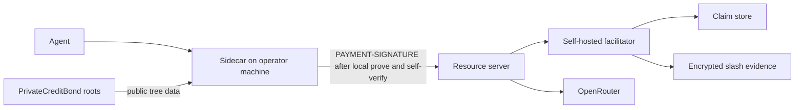

# Choose the pilot prover topology and operational SLOs

Type: grilling  
Status: resolved  
Assignee: grok  
Claimed: 2026-09-20  
Resolved: 2026-09-20  
Blocked by: ticket 03 (closed)

## Question

Where is a spend proof generated for the paid Base Sepolia pilot, which
latency and failure SLOs do design partners accept in advance, and what
operational limits follow from the frozen proof statement and 250-credit
SKU?

## Recommended answer

Prove only on the local sidecar / operator machine for the pilot. Do not
introduce a remote proving service, a shared prover pool, or browser-side
proving as a supported path.

Publish a numeric p95 proving-latency limit before onboarding, because the
map's continuation gate requires p95 to stay within the limit each partner
accepted in advance. Treat proof generation failure as a cancelled claim:
no credit consumed, no slash evidence.

Keep proving keys as Sepolia development artifacts until the paid-traffic
gate on [Freeze the pilot proof and authorization boundary](03-proof-and-authorization-boundary.md)
passes. Do not run a ceremony in this map.

## Decision evidence required

- A topology diagram covering sidecar, gateway, facilitator, and (if any)
  proving helper.
- A p50/p95 proving-latency budget and how it is measured on partner
  hardware classes.
- Failure, timeout, and retry rules that stay consistent with success-only
  charging and at-most-two upstream dispatches.
- Capacity notes for 250 slots per bundle and the three-partner
  continuation gate.

## Downstream consequences

This decision feeds the reconciled design, load and proof-latency
benchmarks, partner contracts, and the telemetry required by
[Define pilot activation and continuation evidence](04-validation-evidence.md).

## Comments

### Round 1 (2026-09-20)

User accepted all recommended answers:

1. Prove only in the sidecar process on the operator machine. No remote
   proving service, shared pool, browser proving, or same-host proving
   helper as a supported path.
2. A prove miss or failed self-verify is a proof failure, not a claim: no
   reservation, no credit, no slash evidence, slot unused. Counted only in
   the sidecar proof-failure metric.
3. Continuation p50/p95 use hot prove time only (witness, request signal,
   and `issuedAt` in hand through `fullProve` plus local self-verify). Cold
   start, 402 fetch, Merkle sync, gateway HTTP, and provider time are
   excluded.

### Round 2 (2026-09-20)

User accepted all recommended answers:

4. One published p95 cap; judged on the partner's sidecar host by a dry-run
   before the first paid claim. Fail the cap → not activated. No lab
   substitution, remote prove, or loosened cap.
5. Development WASM and zkey are installed out of band and hash-pinned in
   a sidecar manifest. Control plane never serves proving keys at runtime.
   Mismatch is a proof failure (refuse to prove).
6. Retry proving on the same in-flight request (same slot, same signal,
   same `issuedAt`) until success or the spend window cannot fit another
   attempt. Each miss is a proof failure. Upstream dispatch retries stay
   the ticket 01 budget of two and start only after reserve.
7. Local Groth16 self-verify is required before attaching
   `PAYMENT-SIGNATURE`. Verify mismatch is a proof failure; do not send.
8. Sidecar computes its own Merkle path from public tree data. Gateway
   publishes roots and never serves a path for a named leaf or commitment.
9. Partner-facing contract is the published proving SLO only. Gateway
   verify and reserve are internal budgets, not continuation lines.

### Round 3 (2026-09-20)

User accepted all recommended answers:

10. Published proving SLO is p50 ≤ 1.5s and p95 ≤ 3.0s hot prove time.
    Per-attempt prove abort is 10s. Do not start another attempt unless
    remaining `issuedAt` window > 10s. Founder benchmark on frozen
    development artifacts must show p95 ≤ 2.0s on a normal laptop before
    any partner dry-run; miss → fix proving, do not loosen the cap or add
    a helper.
11. Pre-activation dry-run is local and unpaid: one discarded cold start,
    then 20 hot prove+self-verify cycles on pinned artifacts against a
    fixture challenge, nothing submitted to the live gateway. p50/p95 of
    those 20 must be ≤ written accepted proving latency and ≤ the
    published SLO. Fail → not activated.
12. No shared prove pool. One `fullProve` at a time per sidecar process.
    Two-agent concurrency is two processes. Gateway verifies only.
    Evidence vault is 250 first-transcripts per bundle through expiry
    plus seven days; 1,000 real calls still need at least four live SKUs,
    all proved locally.

### Round 4 (2026-09-20)

User confirmed the shared understanding. Ticket closed.

## Answer

Spend proofs for the paid Base Sepolia pilot are generated only in the
partner sidecar process on the operator machine. There is no remote proving
service, shared prover pool, browser proving path, or same-host proving
helper.

The sidecar holds the credential, computes the Merkle path from public tree
data, runs Groth16 `fullProve`, self-verifies with the pinned verification
key, then attaches `PAYMENT-SIGNATURE`. The resource server and self-hosted
facilitator verify and settle only. They never prove, never serve a path for
a named leaf or commitment, and never host WASM or proving keys at runtime.

Development WASM and zkey are installed out of band and hash-pinned in the
sidecar manifest. Hash mismatch is a proof failure; the sidecar refuses to
prove. Keys remain Sepolia development artifacts until the paid-traffic gate
on [Freeze the pilot proof and authorization boundary](03-proof-and-authorization-boundary.md).
No ceremony in this map.

### Failure and retry

A prove miss, 10s abort, or failed self-verify is a **proof failure**: not a
claim, not a cancellation, not slash evidence. The slot stays unused. It is
counted only in the sidecar proof-failure metric.

The sidecar retries proving on the same in-flight request (same slot, same
request signal, same `issuedAt`) until success or the remaining spend window
is ≤ 10s. Each miss is a proof failure. Upstream dispatch retries remain the
at-most-two budget from [Define the pilot credit unit and economic safety envelope](01-credit-unit-and-economics.md)
and start only after reserve.

### Latency

Hot prove time is wall time from membership witness, request signal, and
gateway `issuedAt` in hand through `fullProve` and local self-verify. Cold
start, 402 fetch, Merkle sync, gateway HTTP, and provider time are excluded.

| Item | Rule |
| --- | --- |
| Published proving SLO | p50 ≤ 1.5s, p95 ≤ 3.0s hot prove time |
| Accepted proving latency | Partner-written p95 on their sidecar host, not looser than 3.0s, before first paid claim |
| Per-attempt abort | 10s; no new attempt unless remaining `issuedAt` window > 10s |
| Founder gate | Frozen development artifacts, normal laptop, p95 ≤ 2.0s before any partner dry-run. Miss → fix proving; do not loosen 3s; do not add a helper |
| Dry-run | Local, unpaid: discard one cold start, 20 hot prove+self-verify cycles on pinned artifacts against a fixture challenge, nothing submitted to the live gateway. p50/p95 of those 20 must be ≤ written accepted proving latency and ≤ the published SLO. Fail → not activated |
| Continuation | Soak p95 hot prove time ≤ that partner's written number, per [Define pilot activation and continuation evidence](04-validation-evidence.md) |
| Partner-facing | Published proving SLO only. Gateway verify and reserve are internal budgets, not continuation lines |

Hardware class is the partner's own sidecar host. No lab substitution, remote
prove, or loosened cap.

### Capacity

No shared prove pool. One `fullProve` at a time per sidecar process;
concurrent requests on the same sidecar queue locally. Two-agent concurrency
is two processes with two credentials. The gateway verifies only and is sized
for three partners (up to six sidecars). Each bundle has 250 slots; 1,000 real
calls still require at least four live SKUs, all proved locally. The evidence
vault holds at most 250 first-transcripts per bundle through expiry plus seven
days.

Glossary terms used here are in [CONTEXT.md](../CONTEXT.md).
